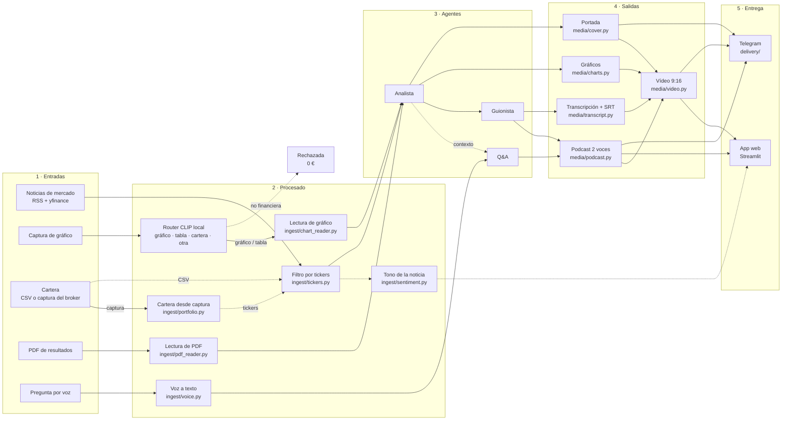
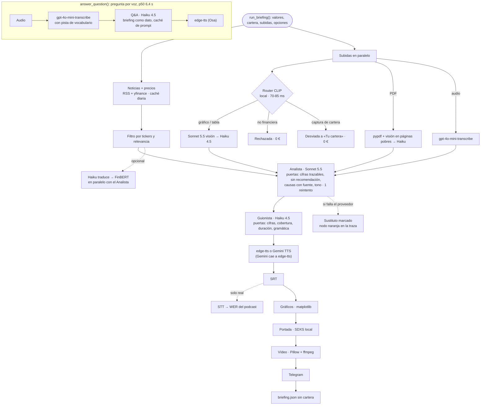
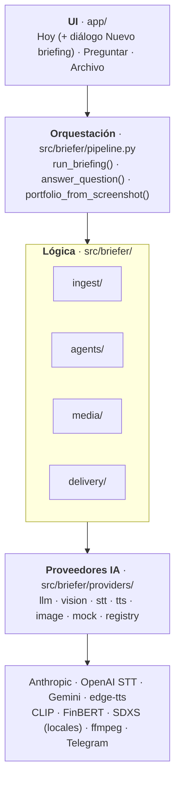

# Briefly

[](https://github.com/Romequinco/multimodal-market-briefer/actions/workflows/tests.yml)
[](https://github.com/Romequinco/multimodal-market-briefer/tree/v1.0)
[](pyproject.toml)
[](requirements.txt)
[](https://multimodal-market-briefer-production.up.railway.app/)

**El cierre del día, mientras vuelves a casa.**

Briefly recoge al cierre las noticias de los valores que sigues, las interpreta y te las cuenta en un podcast de
unos cuatro minutos a dos voces, Toro y Osa (voces sintéticas). Lee también tus PDFs de resultados, tus
capturas de gráficos y la captura de tu broker, y responde a lo que le preguntes hablando. Es el MVP de una
startup FinTech de IA multimodal: práctica MIAX, taller B5-T4.

> ### Pruébalo ahora
>
> **https://multimodal-market-briefer-production.up.railway.app/**
>
> - Abre en **Demo · voces reales**: no hacen falta claves. «Hoy» enseña un briefing real ya generado (podcast,
>   vídeo, portada, transcripción, gráficos y traza) y puedes generar briefings de demostración y preguntar.
>   Lo que generes en Demo usa **datos de ejemplo y modelos simulados**: el contenido es básico y ficticio, y
>   no cuesta nada.
> - El modo **Real** (noticias de hoy, modelos reales; ≈ 0,03-0,15 € por briefing según las opciones) pide
>   contraseña (`BRIEFER_REAL_MODE_PASSWORD`). El equipo se la facilita al profesor aparte.
> - Desplegado en Railway desde la rama `entrega-v1`. La versión entregada es la etiqueta `v1.0`.

Pitch técnico: [pitch/pitch_briefly.pdf](pitch/pitch_briefly.pdf) · Arranque local: [2 comandos](#arranque) ·
Estado y registro de jornadas: [docs/06](docs/06_estado_actual.md)

---

## Índice

1. [Qué resuelve](#qué-resuelve)
2. [Capturas](#capturas)
3. [Cómo se usa en 1 minuto](#cómo-se-usa-en-1-minuto)
4. [Modalidades y cadena de modelos](#modalidades-y-cadena-de-modelos)
5. [Arquitectura](#arquitectura)
6. [Comparativas y mediciones](#comparativas-y-mediciones)
7. [Viabilidad y monetización](#viabilidad-y-monetización)
8. [Compliance y privacidad](#compliance-y-privacidad)
9. [Arranque](#arranque)
10. [Estructura del repositorio](#estructura-del-repositorio)
11. [Documentación y pitch](#documentación-y-pitch)
12. [Checklist del enunciado](#checklist-del-enunciado)
13. [Equipo y aviso legal](#equipo)

---

## Qué resuelve

| | |
| --- | --- |
| **Problema** | El inversor minorista recibe la información de mercado dispersa y en formatos distintos: titulares, PDFs de resultados de 40 páginas, gráficos de velas. No da tiempo a leerlo todo cada día y los resúmenes genéricos no hablan de *su* cartera. |
| **Público** | **B2C**: inversor minorista hispanohablante con cartera propia (acciones y ETFs) que escucha el resumen de vuelta a casa. **B2B2C** (el negocio): neobancos, brokers y newsletters que lo ofrecen con su marca. |
| **Propuesta** | Un briefing diario filtrado por tu cartera, al cierre, que se **escucha** (podcast), se **lee** (transcripción), se **ve** (gráficos, vídeo 9:16, portada), llega por **Telegram** y se **pregunta por voz**. |
| **Por qué multimodal** | Las fuentes ya llegan en varios formatos (texto, PDF, imagen, captura del broker, voz) y el consumo también (audio, vídeo, texto). Un solo modelo de chat no cubre ese ciclo; una cadena de modelos especializados sí, y cada uno hace lo que mejor hace al menor coste. |

Detalle de producto en [docs/01](docs/01_producto_y_propuesta_valor.md).

---

## Capturas

Capturas reales de la app tras el rediseño del 07-oct (1440 × 900, tema oscuro «Noticiero nocturno»).

| | |
| --- | --- |
|  |  |
| **Hoy.** El briefing del día sin pulsar nada: portada, titular, reproductor, locutores y cinta de cotizaciones. Arriba, las tres vistas y el chip del modo. | **Puntos clave.** Cada noticia con su fuente enlazada y el tono de la noticia (FinBERT). Pestañas de transcripción, gráficos, vídeo y «Cómo se hizo». |
|  |  |
| **Vídeo 9:16.** Diapositivas alineadas con el audio, subtítulos por locutor y rótulo de voces sintéticas. | **Preguntar.** Chat con Toro y Osa; voz y texto en la misma barra. La respuesta cita fuentes y se lee en voz alta. |
|  |  |
| **Nuevo briefing.** Valores (buscador de 169 activos y búsqueda en Yahoo Finance), documentos con su tipo detectado y opciones de vídeo, portada y Telegram. | **Tu cartera.** CSV, captura del broker o ejemplo. Vive solo en la sesión: no se escribe en disco. |
|  |  |
| **Archivo.** Briefings guardados con búsqueda y filtros; abrir, borrar y «Privacidad y datos» (RGPD). | **Quiénes somos.** Diálogo del menú ⚙ con la historia (ficticia) de la startup y sus locutores. |

---

## Cómo se usa en 1 minuto

La app tiene tres vistas en la barra superior. El chip de arriba a la derecha cambia el modo.

| Vista | Qué haces |
| --- | --- |
| **Hoy** | Escuchas el último briefing (o el pregenerado). Pestañas: Puntos clave · Transcripción · Gráficos · Vídeo · Cómo se hizo. **Nuevo briefing** abre un diálogo con cuatro secciones: *valores* (buscador de 169 activos validados del IBEX 35, Europa, EE. UU., índices, materias primas, cripto y divisas, más búsqueda libre en Yahoo Finance), *tu cartera* (CSV, captura del broker o ejemplo), *documentos* (PDF, gráficos, notas de voz) y *opciones* (vídeo, portada con IA, Telegram). |
| **Preguntar** | En Real escribes o grabas una pregunta; el agente responde con fuentes y Osa puede leerla. En demo consultas los puntos y fuentes del briefing mediante una demo guiada, sin micrófono ni conversación libre. |
| **Archivo** | Buscas, filtras (todos, con audio, demo), abres o borras briefings. «Privacidad y datos» borra todo lo guardado. |

### Tres modos

La web permite preguntar desde cada punto clave, buscar palabras en la transcripción y descargarla en TXT.
«Nuevo briefing» muestra una vista previa de las imágenes y el tamaño de los documentos, pliega las secciones
opcionales y permite elegir la duración aproximada (2–10 minutos, en Real; la demo mantiene su episodio corto).
«Repetir selección», en Hoy y Archivo, recupera valores y opciones sin generar nada hasta que pulses Generar;
la cartera y los documentos se añaden de nuevo. En Preguntar puedes solicitar la voz después de leer una respuesta,
y el historial se reinicia al cambiar de briefing o de modo.

| | **Real** | **Demo · voces reales** (por defecto) | **Demo offline** |
| --- | --- | --- | --- |
| Datos | Noticias (RSS + yfinance) y precios del día, con caché diaria | Noticias de ejemplo y precios sintéticos | Ídem |
| IA | Claude Sonnet 5.5 / Haiku 4.5, visión, STT de OpenAI, modelos locales | Simulada (mock) | Simulada (mock) |
| Voces | edge-tts o Gemini TTS | edge-tts real | WAV mudo |
| Coste | Por briefing: ≈ 0,03-0,04 € básico · ≈ 0,07 € completo con edge-tts · ≈ 0,11-0,15 € con voz Gemini. Por pregunta: ≈ 0,005 € (≈ 0,0013 € con caché de prompt) | 0 € | 0 € |
| Necesita | `ANTHROPIC_API_KEY` (+ `OPENAI_API_KEY` para la voz) y red; en Railway, contraseña | Red | Nada |
| CLI | `python scripts/demo.py` | `python scripts/demo.py --demo-voices` | `python scripts/demo.py --mock` |

Si un proveedor real falla en un paso núcleo, el briefing termina con un sustituto **marcado** en la UI y en la
traza (nodo naranja en «Cómo se hizo»). Los pasos opcionales que fallan se omiten.

---

## Modalidades y cadena de modelos

«Activo en la demo»: **real** = con claves (modo Real) · **demo** = Demo · voces reales, sin claves ·
**offline** = todo mock. Todas las filas están verificadas en real ([docs/06](docs/06_estado_actual.md#qué-funciona)).

| # | Modalidad | Uso | Modelo / herramienta | Activo en la demo |
| --- | --- | --- | --- | --- |
| 1 | Texto → texto | Noticias filtradas → análisis (Agente Analista) con puerta de *grounding* de cifras | Claude Sonnet 5.5 | real |
| 2 | Texto → texto | Análisis → diálogo Toro/Osa (Agente Guionista) con puertas de cifras, cobertura, duración y gramática | Claude Haiku 4.5 | real |
| 3 | Texto → texto | Preguntas sobre el briefing (Agente Q&A) | Claude Haiku 4.5 | real |
| 4 | Imagen → texto | Captura de gráfico → descripción y cifras | Sonnet 5.5 visión → Haiku (estructura) | real |
| 5 | Imagen → datos | Captura del broker → tickers y pesos, solo en memoria | Sonnet 5.5 visión → Haiku → mapeo determinista | real (botón «Usar captura de ejemplo») |
| 6 | Documento → texto | PDF de resultados → cifras clave | `pypdf` + visión en páginas con poco texto + Haiku | real |
| 7 | Imagen → etiqueta | Router de imágenes: gráfico/tabla → visión; no financiera → rechazada sin pagar visión; cartera → desviada | CLIP `clip-vit-base-patch32` local, CPU | real (con `clip`) |
| 8 | Audio → texto | Pregunta por voz y notas de voz subidas | OpenAI `gpt-4o-mini-transcribe` | real; marcada `[MOCK]` en demo |
| 9 | Texto → audio | Podcast a dos voces y respuesta hablada | edge-tts (gratis) · Gemini 3.8 TTS multi-locutor (premium) | real y demo |
| 10 | Texto → etiqueta | Tono de cada noticia (▲ ▼ ●), nunca agregado por valor | Haiku traduce → FinBERT local | real (en el pregenerado) |
| 11 | Datos → imagen | Gráficos del día (variación, cotización por valor, cartera solo en sesión) | matplotlib | real, demo y offline |
| 12 | Audio → texto | Transcripción y SRT; control de calidad: el STT escucha el podcast y mide el WER | tiempos del TTS · STT de OpenAI | real (WER); SRT en todos |
| 13 | Texto → imagen | Portada del episodio según el tono del día, sin cifras ni empresas, placa «Imagen generada por IA» | SDXS `IDKiro/sdxs-512-dreamshaper` local · Gemini imagen (de pago) | real (con `local`) |
| 14 | Imagen + audio → vídeo | Vídeo 9:16 del episodio con subtítulos por locutor | Pillow + ffmpeg (`imageio-ffmpeg`) | real, demo y offline |
| 15 | Briefing → mensajería | Resumen HTML con fuentes y aviso legal + audio + portada + vídeo | Telegram Bot API | real |

### Flujo de datos multimodal


El mismo flujo con el módulo que implementa cada caja:



### Cadena de modelos en un briefing

Lo que ejecuta `pipeline.run_briefing()`. Cada paso deja un `StepMetric` (proveedor, modelo, latencia, coste,
decisión de las puertas) que la app pinta en «Cómo se hizo».



Portada, vídeo y Telegram son opcionales: se activan en «Opciones» del diálogo. El valor está en el
encadenamiento: imagen, PDF y voz pasan a texto estructurado, luego a análisis, guion, audio y vídeo, con
contratos Pydantic entre cada paso ([docs/03](docs/03_contratos_modulos.md)). El router CLIP aplica la misma idea
en la entrada: un modelo local y gratis decide si merece la pena llamar al de pago. El cuaderno
[00 · recorrido del pipeline](notebooks/00_recorrido_pipeline.ipynb) ejecuta los 15 pasos uno a uno, sin red ni
claves (13 s).

---

## Arquitectura



| Capa | Carpeta | Hace | No hace |
| --- | --- | --- | --- |
| UI | `app/` (`main.py`, `views/`, `components/`) | Vistas, diálogo «Nuevo briefing», reproductores, traza, CSS por área | Llamar a modelos: solo usa `briefer.pipeline` y `storage` |
| Orquestación | `src/briefer/pipeline.py` | Resolver proveedores según el modo, paralelizar ingesta y subidas, medir latencia y coste, tolerar fallos | Prompts ni formato |
| Lógica | `ingest/`, `agents/`, `media/`, `delivery/` | Transformar datos entre contratos de `schemas.py`; reciben el proveedor por parámetro | Saber qué proveedor hay detrás |
| Proveedores | `providers/` | Una interfaz por familia (`base.py`), implementación real y **mock** para cada una, elegida por `.env` | Lógica de negocio |

Por qué así, en decisiones registradas ([docs/decisiones/](docs/decisiones/README.md)):

| ADR | Decisión |
| --- | --- |
| [001](docs/decisiones/ADR-001-stack-mvp.md) | Stack del MVP: Streamlit, Claude, OpenAI STT, edge-tts, matplotlib |
| [002](docs/decisiones/ADR-002-proveedores-intercambiables.md) | Proveedores intercambiables por configuración y mock obligatorio: tests sin red y demo sin claves |
| [003](docs/decisiones/ADR-003-tolerancia-fallos-y-contratos-v02.md) | Pasos núcleo (sustituto marcado) y opcionales (se omiten) |
| [004](docs/decisiones/ADR-004-salida-estructurada-json-schema.md) | Salida estructurada con JSON Schema |
| [005](docs/decisiones/ADR-005-privacidad-cartera-no-persistida.md) | La cartera no se escribe en disco |
| [006](docs/decisiones/ADR-006-guionista-haiku-puertas-deterministas.md) | Guionista en Haiku con puertas deterministas |
| [007](docs/decisiones/ADR-007-modelos-por-agente.md) | Modelo por agente elegido con juez ciego |

Contratos e interfaces en [docs/03](docs/03_contratos_modulos.md); diagramas de secuencia en
[docs/02](docs/02_arquitectura_y_flujo_datos.md).

---

## Comparativas y mediciones

Todo lo que no lleva la marca *estimación* está medido: tokens reales de cada llamada por la tarifa pública de
`costs.py` (1 $ ≈ 0,86 €), latencia con `perf_counter`. Método en
[docs/04](docs/04_viabilidad_costes_latencia_compliance.md#método-de-medición).

### Briefing y pregunta

**Briefing básico.** Evaluación de **N = 6 briefings reales** (06-oct; 3 carteras y 3 listas de valores, una con
PDF + gráfico; edge-tts, sin portada ni verificación; [`notebooks/eval/resumen.md`](notebooks/eval/resumen.md)).

| Métrica | p50 | p95 |
| --- | --- | --- |
| Latencia del briefing básico (pared) | **52,7 s** | **68,2 s** |
| Coste del briefing básico | **0,034 €** | **0,062 €** (0,069 € con PDF + gráfico) |
| Pregunta por voz de punta a punta (audio → STT → Haiku → voz), en frío | **6,4 s** (rango 5,7-14,4 s) | — |
| Ídem, en caliente | **6,0 s** | — |
| Coste por pregunta | ≈ 0,005 € (Haiku con el briefing como contexto) · ≈ 0,0013-0,0014 € con caché de prompt | — |

Calidad en los 6: 0 fallos, 0 sustitutos, **232/232** cifras trazables a una fuente, **0** frases con
recomendación, 35/35 puntos clave con fuente, podcasts de 3,2-3,7 min. Juez Sonnet (1-5): fidelidad 3,3 ·
claridad 4,0 · sin consejo 4,2 · utilidad 3,3. Lo que marcó el juez (causas demasiado firmes, tono valorativo)
se corrigió después con puertas nuevas.

**Medido en producción (07-oct).** Briefings completos en la app de Railway (modo Real), leídos de la traza
«Cómo se hizo» de cada uno; el pregenerado se generó en local el 06-oct.

| Briefing (07-oct, traza «Cómo se hizo») | Opciones | Coste | Suma de pasos | Lo que más pesa |
| --- | --- | --- | --- | --- |
| Micron, AMD, Repsol… (5 valores) | Sin subidas · voz Gemini TTS · portada local · vídeo · verificación STT | **0,113 €** | 146 s (12 pasos) | Gemini TTS 0,0556 € (24,7 s) · Analista 0,0261 € (15,9 s) · Guionista 0,0202 € (28,5 s, 1 reintento) · verificación 0,0111 € · portada 53,3 s y 0 € |
| Gogoro y otros (5 valores + 1 gráfico) | Voz Gemini · portada · vídeo · Telegram | **0,151 €** | 173 s (14 pasos) | Analista 0,0605 € (31,8 s, con reintento) · Gemini TTS 0,0491 € · Guionista 0,0187 € · gráfico 0,0134 € · verificación 0,0098 € |
| Santander / Ibex (6 valores + 1 gráfico) | Voz edge-tts (gratis) · portada · vídeo · Telegram | **0,068 €** | 165 s (14 pasos) | Analista 0,0281 € · Guionista 0,0187 € · gráfico 0,0122 € · verificación 0,0087 € · TTS 0 € |
| Pregenerado de «Hoy» (06-oct, local) | PDF + gráfico · voz Gemini · FinBERT · portada · vídeo · verificación | **0,141 €** | 259 s (177 s de pared) | — |

El coste depende sobre todo de las opciones: **básico** (solo valores o cartera, edge-tts, sin portada ni
verificación) ≈ 0,03-0,04 €; **completo con voces gratis** ≈ 0,07 €; **completo con voz premium Gemini**
≈ 0,11-0,15 €. La voz premium es el paso más caro (≈ 0,05 €), seguida del Analista (0,026-0,06 € según
reintentos), el Guionista (≈ 0,02 €), la visión por subida (≈ 0,013 €) y la verificación STT (≈ 0,01 €). La
portada local no cuesta dinero, pero añade ≈ 50 s. «Suma de pasos» no es tiempo de pared: varios pasos van en
paralelo.

<details>
<summary><b>Coste y latencia por paso</b> (p50 de los 6 briefings y pasos opcionales medidos aparte)</summary>

| Paso | Proveedor | Latencia | Coste |
| --- | --- | --- | --- |
| Noticias | yfinance + RSS | 5,6 s (p95 8,4 s) | 0 € |
| Precios | yfinance | 1,8 s (p95 17,4 s) | 0 € |
| Analista | Claude Sonnet 5.5 | 14,2 s | 0,0246 € |
| Guionista | Claude Haiku 4.5 | 11,6 s | 0,0084 € |
| Podcast | edge-tts | 17,1 s | 0 € |
| Gráficos | matplotlib | 1,5 s | 0 € |
| Lectura de PDF (si se sube) | Sonnet visión + Haiku | 18,4 s | 0,0197 € |
| Lectura de gráfico (si se sube) | Sonnet visión + Haiku | 15,7 s | 0,0147 € |
| Router de imágenes | CLIP local | 70-85 ms por imagen | 0 € (y ahorra ≈ 0,016 € por imagen descartada) |
| Cartera desde captura | Sonnet visión + Haiku | 8,5 s (5/5 posiciones) | 0,0054 € |
| Tono de las noticias | Haiku + FinBERT | 32,1 s, en paralelo con el Analista | 0,0082 € |
| Verificación del podcast | `whisper-1` | en paralelo con gráficos | 0,0187 € (WER 0,5-1,4 %) |
| Portada | SDXS local, CPU | 4-7 s (1.ª del proceso 23-36 s) | 0 € |
| Vídeo 9:16 | Pillow + ffmpeg | 6-9 s por episodio | 0 € |
| Telegram | Bot API | 8,5 s (mensaje, audio, imagen y vídeo) | 0 € |

En el briefing básico el Analista es el paso caro (≈ 70 % del coste de texto); visión, cuando hay subidas. Con
voz Gemini, la voz pasa a ser el paso más caro (≈ 0,05 €; ver la tabla de producción). Otros briefings medidos:
dentro de Docker con gráfico, vídeo, portada y Telegram, 0,061 € y 114 s; con Gemini 2.5 Flash como LLM,
0,021 € y 67,7 s.

</details>

### Modelo por agente

Comparativa con juez ciego (Sonnet, salidas anónimas en dos órdenes) sobre los mismos contextos congelados
([ADR-007](docs/decisiones/ADR-007-modelos-por-agente.md),
[cuaderno 02](notebooks/02_comparativa_modelos.ipynb); gasto 0,55 €). Las tarifas de Gemini son estimación.

| Agente | Modelo | Coste | Latencia | Reintentos de puertas | Juez: fidelidad / claridad / sin consejo |
| --- | --- | --- | --- | --- | --- |
| Analista | **Sonnet 5.5** (elegido) | 0,0264 € | 15,0 s | 0 | **4,5** / 4,5 / 4,25 |
| Analista | Haiku 4.5 | 0,0096 € | 16,9 s | 0 | 2,0 / 4,0 / 3,25 |
| Analista | Gemini 2.5 Flash | 0,0148 € | 32,9 s | 2 | 3,0 / 4,0 / 4,0 |
| Guionista | Sonnet 5.5 | 0,0349 € | 21,1 s | 1 | 4,25 / 4,5 / 5,0 |
| Guionista | **Haiku 4.5** (elegido) | 0,0109 € | 14,9 s | 1 | 3,5 / 4,0 / 4,25 |
| Guionista | Gemini 2.5 Flash | 0,0074 € | 15,5 s | 3 (guion > 5 min) | 4,0 / 4,0 / 4,25 |
| Q&A | Sonnet 5.5 | 0,0110 € | 2,5 s | — | 0 recomendaciones |
| Q&A | **Haiku 4.5** (elegido) | 0,0044 € | 3,8 s | — | 0 recomendaciones |
| Q&A | Gemini 2.5 Flash | 0,0018 € | 3,1 s | — | 0 recomendaciones |

Haiku como Analista añade hechos sin respaldo que ninguna puerta detecta (fidelidad 2,0): por eso el Analista
sigue en Sonnet. En el Guionista, Sonnet puntúa algo mejor pero cuesta 3,2 veces más; las puertas deterministas
cubren lo que se le escapa a Haiku. Gemini queda como plan B de proveedor (`BRIEFER_LLM_PROVIDER=gemini`, cadena
completa ≈ 0,021 € frente a ≈ 0,037 €).

### Voz, portada y voz a texto

| Comparativa | Opción A | Opción B | Elección |
| --- | --- | --- | --- |
| **Voces del podcast** | **edge-tts** (Álvaro + Ximena, +10 %): 0 €, 17,1 s p50 para 3,2-3,7 min de audio, 158 palabras/min, WER 1,1 %, SRT exacto | **Gemini 3.8 TTS** multi-locutor: ≈ 0,047 € (*estimación*, tarifa sin verificar) y 24,7 s para 3:38, ≈ 163 palabras/min, WER 1,4 %, SRT aproximado | edge-tts por defecto; Gemini premium para la demo y el pregenerado. El Q&A habla siempre con edge-tts para quedar < 10 s |
| **Portada** | **SDXS local** en CPU: 0 €, 4-7 s (1.ª 23-36 s), ~1,8 GB de modelo, OpenRAIL++ con uso comercial | **Gemini imagen** `gemini-3.1-flash-lite-image`: ≈ 0,029 € por portada (tarifa oficial; **no medida**: exige facturación activa) | Local |
| **Voz a texto** | **`gpt-4o-mini-transcribe`**: 1,28 s, WER 0, 0,003 $/min | `whisper-1`: 2,55 s, WER 0, 0,006 $/min | `gpt-4o-mini-transcribe` |

Las voces se eligieron en una cata a ciegas de 6 opciones con el mismo guion; OpenAI `gpt-4o-mini-tts` se
descartó por latencia (309 s para 6 líneas ese día). En producción edge-tts se sustituiría por un TTS con
contrato: Azure ≈ 0,049 € por episodio (*estimación* sobre tarifa pública).

---

## Viabilidad y monetización

Resumen de [docs/04 §6](docs/04_viabilidad_costes_latencia_compliance.md#6-monetización). Costes de IA medidos;
fijos y precios, *estimaciones* o tarifas públicas (marcadas allí una a una). Sin salarios.

| | |
| --- | --- |
| **Coste variable** | IA 0,034 € por briefing básico (medido; el completo, 0,07-0,15 € según la voz) + voz con contrato ≈ 0,049 € (*estimación*). Usuario Pro con episodio propio ≈ 2,1 €/mes; con segmentos por valor compartidos entre usuarios, ≈ 0,75 €/mes (*estimación*) |
| **Costes fijos** | ≈ 1.070 €/mes en lanzamiento B2C · ≈ 3.700 €/mes listo para B2B2C (datos y noticias con licencia, nube en la UE, cumplimiento) |
| **Planes** | Free (3 valores de un catálogo compartido) · **Pro 6,99 €/mes** (cartera, voz, subidas, vídeo) · **Marca blanca**: alta 15.000 € + 1.500 €/mes + 0,30 €/MAU |
| **Punto de equilibrio** | B2C: ≈ 9.200 registrados con un 4 % de conversión · B2B2C: **un** cliente de ≈ 10.000 MAU cubre el fijo |
| **Latencia** | El briefing se prepara al cierre en segundo plano (≈ 1 min el básico; el completo, 146-173 s de suma de pasos); la pregunta por voz, ≈ 6 s |
| **Conclusión** | El B2B2C es el motor: un contrato cubre el fijo y la distribución la pone el banco o broker. El B2C es escaparate y laboratorio |

---

## Compliance y privacidad

El producto informa, no asesora. Cada control está en el código y tiene tests; tabla completa en
[docs/04 §5](docs/04_viabilidad_costes_latencia_compliance.md#5-marco-regulatorio).

| Riesgo | Control | Dónde |
| --- | --- | --- |
| Recomendación de compra/venta (MiFID II) | Prohibida en los prompts; detección determinista con reintento y recorte; el Q&A reconduce «¿compro?»; red-team de 31 casos | `agents/guardrails.py`, `tests/test_agents_redteam.py` |
| Cifras inventadas | Toda cifra del análisis y del guion debe estar en las fuentes; si no, reintento y se quita la frase | `guardrails.untraceable_figures` |
| *Prompt injection* en noticias, PDF o gráfico | Contenido de terceros delimitado y declarado dato; fuentes con forma de orden señaladas al Analista | `guardrails.looks_like_injection`, `analyst.py` |
| Tono de la noticia leído como señal (MAR) | Tono por noticia junto a su fuente, nunca agregado por valor | `ingest/sentiment.py` |
| Voces sintéticas e imagen IA (AI Act art. 50) | Aviso hablado al cierre, metadatos ID3 y MP4, rótulo fijo en el vídeo, placa «Imagen generada por IA» en la portada, pie en Telegram | `media/podcast.py`, `media/video.py`, `media/cover.py` |
| Cartera del usuario (RGPD) | Nunca a disco: `briefing.json` con `portfolio: null`, sin gráfico de cartera en `data/`; al LLM solo tickers y pesos; la captura se procesa en memoria | [ADR-005](docs/decisiones/ADR-005-privacidad-cartera-no-persistida.md), `pipeline.py`, `storage.py` |
| Audio y ficheros subidos | Subidas en carpeta temporal única que se borra; el audio de la pregunta se borra tras transcribirlo; «Borrar mis datos» en Archivo | `storage.delete_user_data` |
| Derechos de autor | Solo titular, extracto ≤ 200 caracteres, fuente y enlace; respeta `robots.txt` | `ingest/news.py`, `ingest/article_meta.py` |
| Secretos | Claves y tokens redactados en errores, métricas, logs y UI; modo Real con contraseña en la URL pública | `logging_utils.redact_secrets`, `components/shell.py` |
| Datos simulados tomados por reales | Sustitutos marcados en la UI y la traza; precios sintéticos rotulados | `logging_utils.step_fell_back`, `components/trace.py` |

Disclaimer visible en la app, dicho por Osa al final del podcast, en el vídeo y en Telegram. Transferencias
internacionales por proveedor (Anthropic, OpenAI, Google, Telegram) en
[docs/04](docs/04_viabilidad_costes_latencia_compliance.md#rgpd--transferencias-internacionales).

---

## Arranque

Requisitos: **Python 3.11+** (o solo Docker). ffmpeg viene con `imageio-ffmpeg`.

```bash
git clone https://github.com/Romequinco/multimodal-market-briefer.git && cd multimodal-market-briefer
```

| Sistema | Comando | Abre |
| --- | --- | --- |
| Windows (PowerShell) | `powershell -ExecutionPolicy Bypass -File scripts\run.ps1` | http://localhost:8501 |
| Linux / macOS | `bash scripts/run.sh` | http://localhost:8501 |
| Docker (Compose ≥ 2.24) | `docker compose up --build` | http://localhost:8501 |
| Nube | Railway con el mismo `Dockerfile` y `railway.json`: [docs/09](docs/09_despliegue_railway.md) | URL pública |

Los scripts crean `.venv`, instalan dependencias solo si han cambiado, copian `.env.example` a `.env` y lanzan
Streamlit en `localhost`. Sin claves la app abre en Demo · voces reales. Para el modo Real, pon
`ANTHROPIC_API_KEY` (y `OPENAI_API_KEY` para la voz) en `.env`. Opciones: `-Local` / `--local` instala los
modelos locales (CLIP, FinBERT, SDXS), `-Expose` / `--expose` abre la app a la red local, `-Port N` / `--port N`.

Verificado: clon limpio en Windows con `run.ps1` (app en 220 s); Docker con modelos locales (imagen de
3,37 GB, *healthy* en 10 s, briefing real dentro en 114 s); Railway con `$PORT` y contraseña del modo Real.
`run.sh` no se pudo completar en un clon limpio de Linux por red lenta (llegó a instalar sin errores).

<details>
<summary><b>Variables de entorno principales</b> (plantilla completa y comentada en <code>.env.example</code>)</summary>

En el código, sin `.env`, todos los proveedores son `mock`; `.env.example` propone el stack real.

| Variable | `.env.example` | Opciones / para qué |
| --- | --- | --- |
| `ANTHROPIC_API_KEY` · `OPENAI_API_KEY` · `GEMINI_API_KEY` | vacío | Claude (agentes y visión) · STT · Gemini (LLM, TTS premium, imagen) |
| `TELEGRAM_BOT_TOKEN` · `TELEGRAM_CHAT_ID` | vacío | Entrega por Telegram; `python scripts/telegram_setup.py --write --test` |
| `BRIEFER_REAL_MODE_PASSWORD` | vacío | Si tiene valor, el modo Real pide contraseña (5 intentos por sesión) |
| `BRIEFER_LLM_PROVIDER` | `anthropic` | `anthropic` · `gemini` · `mock` |
| `BRIEFER_VISION_PROVIDER` | `claude` | `claude` · `mock` |
| `BRIEFER_STT_PROVIDER` | `whisper_api` | `whisper_api` · `mock` |
| `BRIEFER_TTS_PROVIDER` | `edge` | `edge` (gratis) · `gemini` (premium, cae a edge) · `mock` |
| `BRIEFER_IMAGE_GEN_PROVIDER` | `none` | `local` (SDXS, gratis) · `gemini` (de pago) · `none` · `mock` |
| `BRIEFER_IMAGE_CLASSIFIER_PROVIDER` | `none` | `clip` (local) · `none` · `mock` |
| `BRIEFER_FINBERT` | `false` | Tono de cada noticia (necesita `requirements-local.txt`) |
| `BRIEFER_LLM_MODEL` · `BRIEFER_LLM_MODEL_CHEAP` | `claude-sonnet-5-5` · `claude-haiku-4-5-20251001` | Analista y visión · Guionista, Q&A y estructurado |
| `BRIEFER_SCRIPTWRITER_MODEL` | vacío (= barato) | Otro modelo para el Guionista |
| `BRIEFER_WHISPER_API_MODEL` | `gpt-4o-mini-transcribe` | o `whisper-1` |
| `BRIEFER_VOICE_A` · `BRIEFER_VOICE_B` | `es-ES-AlvaroNeural` · `es-ES-XimenaNeural` | Voces edge-tts de Toro y Osa |
| `BRIEFER_VERIFY_PODCAST` | `true` | El STT escucha el podcast y mide el WER (solo modo real) |
| `BRIEFER_DEFAULT_TICKERS` | `SAN.MC,ITX.MC,IBE.MC,AAPL,NVDA` | Valores por defecto (formato Yahoo) |
| `BRIEFER_FALLBACK_TO_MOCK` | `true` | Si falta una clave o librería, mock con aviso |
| `BRIEFER_OUTPUT_DIR` | `data/outputs` | En Railway, `/data/outputs` sobre un volumen |

</details>

<details>
<summary><b>Comandos útiles</b></summary>

```bash
python scripts/demo.py --mock                       # briefing de punta a punta por CLI, todo mock, sin red
python scripts/demo.py --demo-voices                # sin claves, con voces reales (≈ 6 s, 0 €)
python scripts/demo.py --tickers SAN.MC AAPL --upload data/samples/resultados_ejemplo.pdf data/samples/grafico_ejemplo.png --video --cover
python scripts/demo.py --question "¿Qué dice el PDF?" --briefing pregenerado --warmup
python scripts/demo.py --mock --strict              # sale con 3 si algún paso usó un sustituto
python scripts/smoke_real.py                        # una llamada real mínima por proveedor (< 0,01 €)
python scripts/telegram_setup.py --write --test     # configura el chat de Telegram
python scripts/metrics_report.py --include-demo     # p50/p95 de latencia y coste de los briefings guardados
python scripts/evaluar_briefings.py                 # evaluación de briefings (--real genera y juzga; gasta)
python scripts/measure_qa_voice.py                  # cadena de voz del Q&A en frío y en caliente
python scripts/build_pitch.py                       # regenera pitch/pitch_briefly.pdf
```

Códigos de salida de `demo.py`: 0 bien · 1 falló un paso núcleo · 2 entrada inválida · 3 sustituto con
`--strict` · 130 interrumpido.

</details>

### Tests

```bash
python -m pytest -q                     # 1301 tests sin red (red bloqueada en conftest.py)
python -m pytest -q -m live             # 13 tests con red, claves y coste real
ruff check src app scripts tests && mypy
```

**1301 tests sin red** con proveedores mock y fixtures, más 13 «live» excluidos por defecto. La CI
([`tests.yml`](.github/workflows/tests.yml)) pasa ruff + mypy y pytest en Python 3.11 y 3.13.

---

## Estructura del repositorio

```text
app/                    UI Streamlit: solo presentación, llama a briefer.pipeline
  main.py               arranca el armazón (components/shell.py)
  views/                hoy.py · preguntar.py · archivo.py
  components/           shell (barra superior, chip del modo, menú ⚙) · briefing_view · new_briefing
                        · qa_view · players · theme · trace · styles/*.css
src/briefer/            paquete (nombre técnico interno; la marca visible es Briefly)
  schemas.py            contratos Pydantic entre módulos
  pipeline.py           run_briefing() · answer_question() · portfolio_from_screenshot()
  brand.py              textos de marca: fuente única
  config.py · costs.py · storage.py · logging_utils.py
  providers/            base.py · registry.py · mock.py · llm/ vision/ stt/ tts/ image/
  ingest/               noticias, precios, tickers (+ catálogo de 169 activos), PDF, gráfico, cartera, voz, FinBERT
  agents/               analista, guionista, Q&A, guardarraíles, marco horario + prompts/*.md
  media/                gráficos, podcast, normalización para voz, transcripción, vídeo, portada
  delivery/             Telegram
tests/                  tests sin red (mock y fixtures) + 13 «live»
scripts/                run.ps1 · run.sh · demo.py · smoke_real.py · métricas, evaluación y pitch
notebooks/              00 recorrido del pipeline · 01 evaluación · 02 comparativa de modelos (resultados en eval/)
data/samples/           ejemplos versionados + demo_briefing/ (briefing real pregenerado de «Hoy»)
docs/                   documentación (índice abajo), marca y capturas en docs/assets/
pitch/                  pitch_briefly.pdf (+ fuente HTML) y guion de la demo
Dockerfile · docker-compose.yml · railway.json · requirements*.txt · pyproject.toml · .env.example
```

`data/cache/`, `data/outputs/`, `.env` y `docs/raw/` no se versionan.

---

## Documentación y pitch

| Documento | Contenido |
| --- | --- |
| [00 · Enunciado](docs/00_enunciado.md) | Enunciado estructurado y checklist de rúbrica |
| [01 · Producto](docs/01_producto_y_propuesta_valor.md) | Problema, público, propuesta de valor, métricas |
| [02 · Arquitectura](docs/02_arquitectura_y_flujo_datos.md) | Capas, componentes, secuencias, cadena de modelos |
| [03 · Contratos](docs/03_contratos_modulos.md) | Schemas, interfaces y registro de cambios |
| [04 · Viabilidad](docs/04_viabilidad_costes_latencia_compliance.md) | Costes, latencias, compliance, monetización |
| [05 · Roadmap](docs/05_roadmap_TODO.md) | Plan por fases |
| [06 · Estado actual](docs/06_estado_actual.md) | Qué funciona, mediciones, riesgos, registro de jornadas |
| [07 · Revisión crítica](docs/07_revision_critica.md) | Revisión del plan y prioridades |
| [08 · Identidad de marca](docs/08_identidad_marca.md) | Logo, paleta, tipografía, tono, locutores |
| [09 · Despliegue en Railway](docs/09_despliegue_railway.md) | Publicar la app paso a paso, modo Real con contraseña |
| [Decisiones (ADR)](docs/decisiones/README.md) | ADR-001 a ADR-007 |
| [Cuadernos](notebooks/README.md) | Recorrido del pipeline, evaluación, comparativa de modelos |
| [Índice de docs](docs/README.md) | Ruta de lectura |

**Pitch técnico:** [pitch/pitch_briefly.pdf](pitch/pitch_briefly.pdf), 7 diapositivas (la mitad de la presentación
es la demo en vivo): portada y equipo, problema, qué es Briefly, cadena de modelos, viabilidad medida y
cumplimiento en código, capturas de la app y demo en vivo con QR. Fuente en
[pitch/pitch_briefly.html](pitch/pitch_briefly.html) ([cómo regenerarlo](pitch/README.md)).

**Demo:** la app desplegada en [Railway](https://multimodal-market-briefer-production.up.railway.app/). Recorrido
sugerido en [pitch/demo_guion.md](pitch/demo_guion.md).

---

## Checklist del enunciado

Criterios de [docs/00](docs/00_enunciado.md).

| Criterio | Dónde | Estado |
| --- | --- | --- |
| Esquema del producto, problema, público, valor multimodal | [Qué resuelve](#qué-resuelve), [docs/01](docs/01_producto_y_propuesta_valor.md), pitch | Hecho |
| Costes de inferencia y latencias | [Comparativas](#comparativas-y-mediciones), [docs/04](docs/04_viabilidad_costes_latencia_compliance.md), `costs.py`, traza por paso | Medido |
| Compliance y privacidad | [Compliance](#compliance-y-privacidad), `agents/guardrails.py`, ADR-005 | Hecho |
| Monetización | [Viabilidad](#viabilidad-y-monetización), [docs/04 §6](docs/04_viabilidad_costes_latencia_compliance.md#6-monetización) | Hecho |
| Diversidad de modalidades | [15 modalidades](#modalidades-y-cadena-de-modelos), todas verificadas en real | Hecho |
| Orquestación multimodelo | `pipeline.py`, [cadena de modelos](#cadena-de-modelos-en-un-briefing), «Cómo se hizo», ADR-007 | Hecho |
| MVP ejecutable y usable | `app/` (3 vistas), [Railway](https://multimodal-market-briefer-production.up.railway.app/), modos real / demo / offline | Hecho |
| Plug-and-play | `scripts/run.ps1`, `scripts/run.sh`, `requirements.txt`, `Dockerfile`, `railway.json` | Hecho (`run.sh` sin clon limpio completo en Linux) |
| README con capturas, flujo multimodal y arquitectura | Este fichero | Hecho |
| Pitch deck técnico | [pitch/pitch_briefly.pdf](pitch/pitch_briefly.pdf) | Hecho |
| Separación modelos / lógica / UI | `providers/` · `ingest/ agents/ media/ delivery/` · `app/`; tests sin red, ruff + mypy | Hecho |
| Demostración funcional | App desplegada en la nube (Railway) | Hecho |

---

## Equipo

- Óscar Romero Quincoces
- Daniel García López
- Fernando Dapena Tauste

El trabajo se repartió en tres carriles paralelos contra los mocks de `providers/mock.py` y los contratos de
`schemas.py`: **A** entradas y procesado, **B** agentes y orquestación, **C** salidas, entrega y UI.

Máster MIAX · Taller B5-T4 · Entrega 8-oct-2026. Nombres internos: la marca es Briefly; el código conserva el
paquete `briefer`, el repositorio `multimodal-market-briefer` y las variables `BRIEFER_*`. Identidad completa en
[docs/08](docs/08_identidad_marca.md).

### Aviso legal

Briefly genera **información financiera genérica con fines educativos**. No es asesoramiento en materia de
inversión en el sentido de MiFID II, no tiene en cuenta la situación personal del usuario y **no emite
recomendaciones de compra o venta**. Las voces del podcast son **sintéticas** y la portada está generada por IA.
Los modelos pueden equivocarse o interpretar mal una noticia; los derechos de las noticias pertenecen a sus
editores. Briefly es un proyecto académico y una startup ficticia; el nombre no está registrado como marca.

**Te contamos el mercado; tú decides.**
