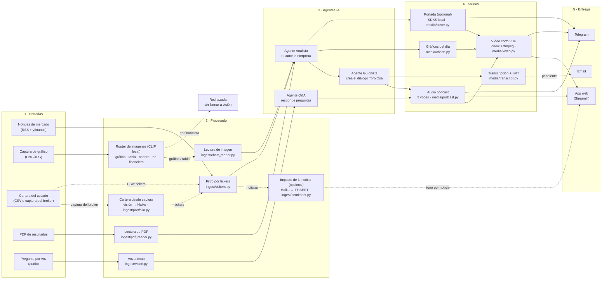
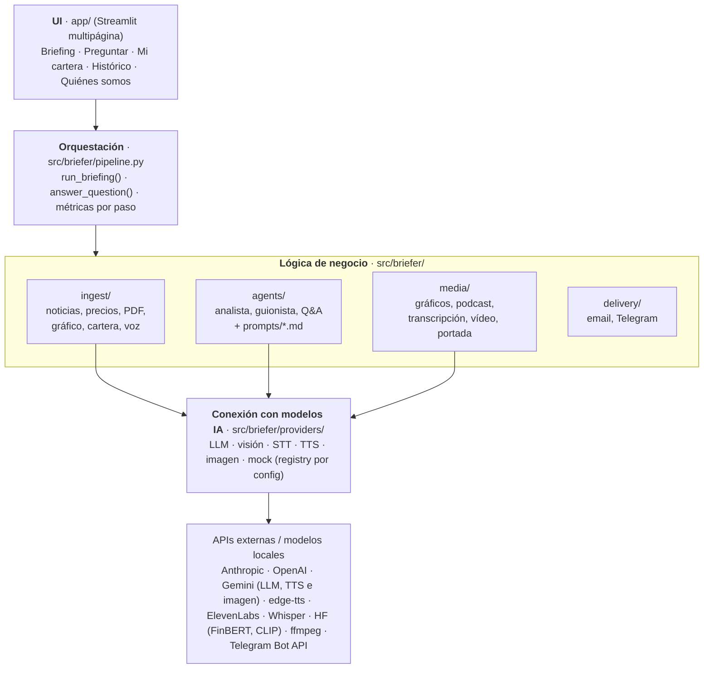

# Briefly

[](https://github.com/Romequinco/multimodal-market-briefer/actions/workflows/tests.yml)

**El cierre del día, mientras vuelves a casa.** Lo que ha movido tu cartera hoy, contado a dos voces en unos
cuatro minutos.

Briefly es el MVP de una startup FinTech de IA multimodal (práctica MIAX, taller B5-T4). Cada tarde, al cierre
de la sesión, recoge las noticias de mercado relevantes para los tickers que sigue el usuario, las interpreta y
genera un **podcast explicativo a dos voces** (Toro y Osa) con su transcripción, los gráficos del día y,
opcionalmente, un **vídeo corto** vertical y una **portada** generada con IA, y puede enviarlo por **Telegram**. El
usuario puede además subir una captura de gráfico o un PDF de resultados para que entren en el análisis, cargar
su cartera desde una **captura de su broker**, y **preguntar por voz** sobre el briefing a un agente que le
responde también por voz.

> **Estado (05-oct-2026 · Fases 0 y 1 cerradas, revisadas y reforzadas; FinBERT y voces integrados):** el producto funciona **de punta a punta con datos
> y modelos reales**: noticias de Google News, Bing News, Yahoo Finance, Expansión y Europa Press (con enlace al
> medio y extracto breve) + precios de yfinance, con caché → lectura de PDF y gráfico con Claude visión → Agente
> Analista (Claude Sonnet 5.5, con puerta de *grounding* de cifras) → Agente Guionista (Claude Haiku 4.5, con
> puertas de calidad deterministas) → podcast a dos voces (edge-tts gratis por defecto; **Gemini TTS
> multi-locutor** de pago para la demo) → transcripción SRT → gráficos → `briefing.json`, con un paso opcional
> de **«impacto de la noticia»** (Claude Haiku traduce → **FinBERT** clasifica el tono, en paralelo con el
> Analista), más el Agente Q&A **por texto o por voz** (Whisper API → Claude → respuesta hablada).
> **Medido:** 0,066 € y 83 s por briefing con PDF + gráfico (sin caché); 0,053 € y 62 s sin subidas, con el
> podcast **verificado por STT** (WER 1,1 %); pregunta al Q&A ≈ 0,001-0,006 € (caché de prompt) y **≈ 6 s con voz**
> de punta a punta incluso la primera del proceso. El pregenerado de la portada (voz Gemini + FinBERT, con PDF y
> gráfico, noticias de la caché del día) costó ≈ 0,18 € estimados y 110 s, WER 1,4 %.
> La app abre con un **briefing real pregenerado** y funciona también **sin claves**.
>
> **Fase 1 cerrada (mar 6-oct-2026):** **vídeo corto** vertical 9:16 con subtítulos por locutor (Pillow + ffmpeg,
> 0 €, ≈ 6-9 s), **router de imágenes con CLIP** local (rechaza lo no financiero sin gastar en visión, 0 €),
> **cartera desde una captura del broker** (visión + Haiku, ≈ 0,005 €; briefing real con la cartera leída: 5/5
> posiciones, vídeo de 4:11, ≈ 0,039 € en total), **portada local y gratuita** con SDXS en CPU (0 €, 4-7 s por
> portada) y **envío por Telegram**. Briefing real de verificación con vídeo y tres subidas: **0,057 € y 82 s**.
> 1149 tests sin red (+ 13 «live») y ruff + mypy en la CI. Telegram está implementado y probado sin red, pero
> **sin prueba real** (falta crear el bot).
> Pendiente: Telegram en real, email, la *build* de Docker y `run.sh`, limpieza de *stubs*, capturas, demo grabada y pitch. Plan en
> [docs/05_roadmap_TODO.md](docs/05_roadmap_TODO.md) (*feature freeze* mié 7 a las 22:00 · **jue 8** capturas,
> demo grabada y pitch, entrega 16:30). Estado vivo en [docs/06_estado_actual.md](docs/06_estado_actual.md).

> **Nombres internos.** La marca visible es **Briefly**; el código conserva su nombre técnico: paquete
> `briefer`, repositorio `multimodal-market-briefer`, variables `BRIEFER_*` y servicio de Docker. Los comandos
> y rutas de este README no cambian.

> **Aviso legal.** Briefly genera **información financiera genérica con fines educativos**. No es
> asesoramiento en materia de inversión en el sentido de MiFID II, no tiene en cuenta la situación personal
> del usuario y **no emite recomendaciones de compra o venta**. Las voces del podcast son **sintéticas**,
> generadas por IA. Ver [viabilidad y compliance](docs/04_viabilidad_costes_latencia_compliance.md).

---

## Índice

1. [Problema y propuesta de valor](#problema-y-propuesta-de-valor)
2. [Identidad](#identidad)
3. [Flujo de datos multimodal](#flujo-de-datos-multimodal)
4. [Modalidades y modelos](#modalidades-y-modelos)
5. [Arquitectura por capas](#arquitectura-por-capas)
6. [Estructura del repositorio](#estructura-del-repositorio)
7. [Arranque rápido](#arranque-rápido)
8. [Configuración](#configuración)
9. [Capturas](#capturas)
10. [Demo](#demo)
11. [Documentación](#documentación)
12. [Equipo](#equipo)

---

## Problema y propuesta de valor

| | |
| --- | --- |
| **Problema** | El inversor minorista recibe la información de mercado dispersa y en formatos heterogéneos: titulares, notas de prensa, PDFs de resultados de 40 páginas, gráficos de velas. Leerlo todo cada día no es realista, y los resúmenes genéricos no hablan de *su* cartera. |
| **Público** | **B2C (cara visible):** inversor minorista hispanohablante con cartera propia (acciones y ETFs) que escucha el resumen en el trayecto de vuelta. **B2B2C (negocio):** neobancos, brokers y newsletters financieras que quieren ofrecer el briefing con su marca (marca blanca). |
| **Propuesta** | Un briefing diario **personalizado por cartera**, en **edición de noche** (al cierre), que se **escucha** (de vuelta a casa), se **lee** (transcripción), se **ve** (gráficos y vídeo corto) y se **interroga por voz**. La edición de mañana, antes de la apertura, queda en el roadmap. |
| **Por qué multimodal** | Las fuentes ya son multimodales (texto, PDF, imagen de gráfico, voz del usuario) y el consumo también (audio, vídeo, texto, gráficos). Un solo modelo de chat no cubre ese ciclo; una cadena de modelos especializados sí. |

Detalle en [docs/01_producto_y_propuesta_valor.md](docs/01_producto_y_propuesta_valor.md).

---

## Identidad

| | |
| --- | --- |
| **Nombre** | **Briefly** (la marca y el programa se llaman igual) |
| **Eslogan** | «El cierre del día, mientras vuelves a casa» |
| **Tono** | Radio nocturna: serio y preciso con los datos, cercano en la conversación. Lema: «Te contamos el mercado; tú decides.» |
| **Locutores** | **Toro** (voz A, el optimista que abre y se fija en lo que sube) y **Osa** (voz B, la prudente que pone el contexto y los riesgos y cierra con el aviso legal). Guiño a *bull & bear*; las dos voces son **sintéticas** (edge-tts Álvaro / Ximena por defecto; Gemini TTS Puck / Kore en la demo) |
| **Edición** | De noche, al cierre de la sesión; la de mañana, en el roadmap |
| **Paleta** | «Noticiero nocturno»: fondo `#12151B`, superficie `#1C2129`, texto `#D6DEE8`, acento `#C0502A` / `#F0997B`, sube `#5DCAA5`, baja `#F09595` (contrastes WCAG AA validados en los tests) |
| **Tipografía** | Source Serif 4 (marca y titulares) · Inter (texto) · JetBrains Mono (datos y rótulos) |
| **Logo** | Cuatro velas japonesas que hacen de barras de ecualizador + «briefly» en minúscula. Variantes en [`docs/assets/marca/`](docs/assets/marca/) |

Los textos de marca (nombre, eslogan, locutores, edición) viven en un único sitio, `src/briefer/brand.py`, y de
ahí los leen la app, el guion, la transcripción, los gráficos y los metadatos del audio. La app tiene además una
página «Quiénes somos» con la (falsa) historia de la startup. Guía completa: logo, colores, tipografía, tono y
locutores en [docs/08_identidad_marca.md](docs/08_identidad_marca.md).

---

## Flujo de datos multimodal


El mismo flujo en Mermaid, con el módulo del repo que implementa cada caja:



> Como en el diagrama original, la cartera puede entrar por **imagen** (captura de la pantalla de posiciones del
> broker, página «Mi cartera»: visión transcribe, Haiku estructura y un mapeo determinista da los tickers) o como
> CSV; en ambos casos sus tickers alimentan el filtro de noticias. Si la captura de cartera se sube junto a las de
> gráficos en «Generar briefing», el router CLIP la desvía (sin gastar en visión) con el aviso de subirla en «Mi
> cartera»; sin CLIP, el propio prompt de visión la reconoce y se desvía igual, sin estructurarla ni guardar
> nada (una llamada de visión, ≈ 0,016 €). El agente Q&A usa como contexto el briefing ya generado. El email sigue pendiente.

Arquitectura completa, diagramas de secuencia y mapeo caja → módulo en
[docs/02_arquitectura_y_flujo_datos.md](docs/02_arquitectura_y_flujo_datos.md).

---

## Modalidades y modelos

La columna **«Activo en la demo»** dice con honestidad qué se ve funcionar hoy (mar 6-oct, al cierre de la fase 1)
y en qué modo: **real** = con claves y red · **sin claves** = demo con voces reales · **offline** = todo mock.
«Implementado; requiere…» = el código está hecho y probado sin red, pero falta la prueba real por una dependencia
externa.

| # | Modalidad | Dirección | Uso en la app | Modelo / herramienta por defecto | Alternativas (por config) | Activo en la demo |
| --- | --- | --- | --- | --- | --- | --- |
| 1 | Texto → texto | Entrada → razonamiento | Noticias filtradas → análisis (Agente Analista) con puerta de *grounding* de cifras | Claude Sonnet 5.5 (`BRIEFER_LLM_MODEL`) | Gemini, `mock` | **Sí** (real); simulado en sin claves/offline |
| 2 | Texto → texto | Razonamiento → guion | Análisis → diálogo a dos voces (Agente Guionista) con puertas de cifras, cobertura, duración y gramática | Claude Haiku 4.5 (`BRIEFER_LLM_MODEL_CHEAP`; `BRIEFER_SCRIPTWRITER_MODEL` para cambiarlo) | Sonnet 5.5, Gemini, `mock` | **Sí** (real); simulado en sin claves/offline |
| 3 | Texto → texto | Conversación | Preguntas sobre el briefing (Agente Q&A) | Claude Haiku 4.5 | Gemini, `mock` | **Sí** (real, por texto y por voz); simulado en sin claves/offline |
| 4 | Imagen → texto | Entrada | Captura de gráfico de cotización → descripción y cifras | Claude Sonnet 5.5 visión + Haiku (estructura) | Qwen2.5-VL-3B local *(stub)*, `mock` | **Sí** (real) |
| 4b | Imagen → datos | Entrada | **Cartera desde una captura del broker** (página «Mi cartera»): visión transcribe la tabla de posiciones → Haiku la estructura → mapeo determinista a tickers y pesos; nada a disco | Claude Sonnet 5.5 visión + Claude Haiku 4.5 | `mock` (transcripción de la captura de ejemplo) | **Sí** (real: 5/5 posiciones de `data/samples/cartera_ejemplo.png`, 8,5 s, ≈ 0,005 €; botón «Usar captura de ejemplo») |
| 5 | Documento → texto | Entrada | PDF de resultados → cifras clave y resumen | `pypdf` + Claude visión en páginas con poco texto + Claude Haiku | Qwen2.5-VL local *(stub)* | **Sí** (real) |
| 6 | Imagen → etiqueta | Enrutado | Router de las imágenes subidas (zero-shot): gráfico de velas o líneas / tabla → visión con la etiqueta como pista; no financiera → rechazada **sin llamar a visión**; captura de cartera → «súbela en Mi cartera» | CLIP `openai/clip-vit-base-patch32` local en CPU (`BRIEFER_IMAGE_CLASSIFIER_PROVIDER=clip`, `requirements-local.txt`), 0 € | `none`, `mock` | **Sí** (con `clip`; 5/5 imágenes de prueba bien clasificadas; 70-85 ms por imagen tras la primera) |
| 7 | Audio → texto | Entrada | Pregunta por voz del usuario y notas de voz subidas | OpenAI `gpt-4o-mini-transcribe` (`BRIEFER_WHISPER_API_MODEL`) | `whisper-1`, `faster-whisper` local *(stub)*, `mock` | **Sí** (real, con `OPENAI_API_KEY`); en sin claves/offline la transcripción es simulada y lleva `[MOCK]` |
| 8 | Texto → audio | Salida | Podcast a dos voces (Toro y Osa) y respuesta hablada del Q&A | `edge-tts` (gratis, por defecto: Álvaro / Ximena a +10 %, pausas variables) + normalización para locución | **Gemini TTS multi-locutor** (`gemini-3.8-flash-tts`, de pago, premium: diálogo entero por tramos; si falla, cae a edge-tts; el Q&A habla siempre con edge-tts por latencia), ElevenLabs *(stub)*, `mock` | **Sí** (real y sin claves; el pregenerado suena con Gemini); silencio en offline |
| 8b | Texto → etiqueta | Enriquecimiento | «Impacto de la noticia»: tono de cada noticia (▲ positiva · ▼ negativa · ● neutral) junto a su fuente en «Puntos clave»; tono de la noticia, no recomendación ni agregado por valor | Claude Haiku 4.5 (traduce al inglés, una llamada) → **FinBERT** (`ProsusAI/finbert`, modelo abierto, CPU local) | Opcional: `BRIEFER_FINBERT=true` (por defecto, desactivado) | **Sí** (real, en el pregenerado: 19 noticias). Aportación de Daniel (PR #1) |
| 9 | Datos → imagen | Salida | Gráficos del día (variación con bloque «Índices de referencia», cotización por ticker, reparto de la cartera solo en la sesión) con fecha y fuente | matplotlib | — | **Sí** (todos los modos; «precios sintéticos (demo)» en la demo) |
| 10 | Audio → texto (subtítulos) | Salida | Transcripción y fichero SRT sincronizado | Derivado del guion + tiempos reales del TTS (con Gemini, tiempos por línea aproximados dentro de cada tramo) | — | **Sí** (todos los modos) |
| 10b | Audio → texto (control de calidad) | Bucle | El STT escucha el podcast generado y mide el WER contra el guion (`media.verify`; peores líneas en la traza) | OpenAI `gpt-4o-mini-transcribe` / `whisper-1` | `BRIEFER_VERIFY_PODCAST=false` | **Sí** (real; medido WER 1,1 % con edge-tts y 1,4 % con Gemini en el pregenerado) |
| 11 | Texto → imagen | Salida | Portada del episodio *(opcional)*: ilustración según el tono del día (sin cifras ni empresas), con el titular superpuesto por Pillow y la placa «Imagen generada por IA» | SDXS local `IDKiro/sdxs-512-dreamshaper` en CPU (`BRIEFER_IMAGE_GEN_PROVIDER=local`, diffusers, 1 paso, licencia CreativeML OpenRAIL++ con uso comercial; 0 €, 4-7 s por portada) | Gemini imagen `gemini-3.1-flash-lite-image` (`gemini`, ≈ 0,029 € por imagen, requiere facturación), `none`, `mock` | **Sí** (con `local`; verificada en real sobre el pregenerado: titular y placa «Imagen generada por IA»). Gemini, sin prueba real (sin facturación) |
| 12 | Imagen + audio → vídeo | Salida | Vídeo corto vertical 9:16 del episodio completo: una diapositiva por imagen (portada o gráfico general primero; cada gráfico entra cuando el audio nombra su empresa), subtítulos quemados con el locutor y rótulo «Voces sintéticas generadas con IA» | Pillow + ffmpeg (`imageio-ffmpeg`, libx264), sin moviepy; 720×1280, 12 fps, 0 € | — | **Sí** (todos los modos; casilla «Vídeo corto». Medido: 8,5 s y 4,5 MB para los 217,8 s del pregenerado) |
| 13 | Briefing → mensajería | Entrega | Envío por **Telegram**: resumen HTML + audio + portada o gráfico general + vídeo | Bot API (`requests`) | — | **Sí** (verificado en real el 06-oct (bot @BrieflyMiaxBot: mensaje, audio, imagen y vídeo en 8,5 s); configuración en [Telegram](#telegram)) |

Proveedores por defecto según `.env.example`; en el código, sin `.env`, todo es `mock`. Si un proveedor real
falla durante un briefing, el paso se completa con un sustituto (mock o datos de ejemplo) **marcado** en la UI y
en la traza.

La gracia no está en cada modelo por separado sino en **encadenarlos**: imagen/PDF/voz → texto estructurado →
análisis → guion → audio → vídeo, con contratos tipados entre cada paso. El router CLIP muestra la idea también
en la entrada: un modelo local y gratis decide antes si merece la pena llamar al de visión, que es de pago.

---

## Arquitectura por capas



| Capa | Ubicación | Responsabilidad | No hace |
| --- | --- | --- | --- |
| UI | `app/` | Formularios, reproductores, histórico, subida de ficheros | Llamar a modelos o APIs directamente |
| Orquestación | `src/briefer/pipeline.py` | Resolver proveedores según el modo, encadenar pasos (ingesta y subidas en paralelo), medir latencia y coste, tolerar fallos (opcional → se omite; núcleo → sustituto marcado) | Lógica de prompts o de formato |
| Negocio | `ingest/`, `agents/`, `media/`, `delivery/` | Transformar datos entre contratos (`schemas.py`); reciben el proveedor por parámetro | Conocer qué proveedor concreto hay detrás |
| Proveedores | `providers/` | Hablar con cada API/modelo detrás de una interfaz común | Lógica de negocio |

Contratos (schemas Pydantic e interfaces) en [docs/03_contratos_modulos.md](docs/03_contratos_modulos.md).

---

## Estructura del repositorio

```text
.
├── app/                         # UI Streamlit (solo presentación; llama a briefer.pipeline / storage)
│   ├── main.py                  # portada (propuesta de valor + briefing destacado) y navegación
│   ├── pages/                   # 1_Briefing.py · 2_Preguntar.py · 3_Mi_cartera.py · 4_Historico.py · 5_Quienes_somos.py
│   └── components/              # __init__.py (añade src/ al path) · theme.py (tema «Noticiero nocturno») · players.py (modos, insignias, reproductores) · trace.py («Cómo se hizo»)
├── src/briefer/                 # paquete con el nombre técnico interno (la marca visible es Briefly)
│   ├── brand.py                 # identidad: nombre, eslogan, edición, locutores Toro y Osa (fuente única)
│   ├── config.py                # Settings desde .env (pydantic-settings)
│   ├── schemas.py               # contratos de datos (Pydantic v2, v0.3) + DISCLAIMER_ES
│   ├── pipeline.py              # run_briefing() y answer_question() (modos real / mock / demo_voices)
│   ├── costs.py                 # coste estimado por paso (tarifas Anthropic verificadas 05-oct)
│   ├── logging_utils.py         # logger, track_step() → StepMetric, step_fell_back(), redact_secrets()
│   ├── storage.py               # guardar (sin cartera)/cargar/exportar (ZIP) briefings; briefing destacado
│   ├── providers/               # base.py · registry.py · mock.py · llm/ · vision/ · stt/ · tts/ · image/
│   ├── ingest/                  # news, article_meta, cache, tickers, prices, pdf_reader, chart_reader, portfolio, voice, sentiment (FinBERT)
│   ├── agents/                  # analyst, scriptwriter, qa, guardrails + prompts/{analyst,scriptwriter,qa}.md
│   ├── media/                   # charts, podcast, speech (normalización para TTS), transcript, video, cover
│   └── delivery/                # email_sender, telegram_sender
├── tests/                       # 1149 tests sin red (mock y fixtures; red bloqueada) + 13 «live» (-m live)
├── scripts/                     # run.ps1 · run.sh · demo.py · smoke_real.py · telegram_setup.py
├── .github/workflows/tests.yml  # CI: pytest en modo mock (Python 3.11 y 3.13) en cada push a main y PR
├── .streamlit/config.toml       # tema, subida máxima 50 MB, sin telemetría
├── data/samples/                # ejemplos versionados (CSV, JSON, PDF, PNG; cartera_ejemplo.png = captura de broker ficticia) + demo_briefing/
├── data/cache/ data/outputs/    # generados en ejecución (ignorados por git)
├── notebooks/                   # pruebas exploratorias de modelos (README con ideas)
├── pitch/                       # pitch deck técnico (README con el contenido previsto)
├── docs/                        # documentación del proyecto (ver índice); activos de marca en docs/assets/marca/
├── Dockerfile  docker-compose.yml  .dockerignore
├── requirements.txt             # dependencias del MVP
├── requirements-local.txt       # opcional: modelos locales (torch, transformers, faster-whisper…)
├── pyproject.toml  .env.example  .gitignore
├── CLAUDE.md                    # contexto para agentes IA
└── README.md
```

---

## Arranque rápido

Requisitos: **Python 3.11+**. ffmpeg no hace falta instalarlo: lo trae `imageio-ffmpeg` (dependencia del
proyecto). Con Docker no hace falta nada más.

### Windows (PowerShell)

```powershell
powershell -ExecutionPolicy Bypass -File scripts\run.ps1          # MVP en http://localhost:8501
powershell -ExecutionPolicy Bypass -File scripts\run.ps1 -Local   # + modelos locales (requirements-local.txt)
powershell -ExecutionPolicy Bypass -File scripts\run.ps1 -Expose  # visible desde otros equipos de la red
```

### Linux / macOS

```bash
bash scripts/run.sh            # MVP en http://localhost:8501
bash scripts/run.sh --local    # + modelos locales (requirements-local.txt)
bash scripts/run.sh --expose   # visible desde otros equipos de la red
```

Ambos scripts buscan un **Python ≥ 3.11** (en Windows también el lanzador `py`), crean `.venv`, instalan
`requirements.txt` (y `requirements-local.txt` con `-Local` / `--local`) **solo si los requirements han cambiado**
desde la última instalación (así se puede relanzar sin red el día de la demo), **se detienen con un mensaje claro
si `pip` falla**, copian `.env.example` a `.env` si no existe, fijan `PYTHONPATH=src` y lanzan
`streamlit run app/main.py`. Por defecto la app escucha **solo en `localhost`**, para no exponer tus claves de API
en la red de clase; `-Expose` / `--expose` la abre a la red local (con aviso). Otras opciones: `-Port N` /
`--port N` (8501 por defecto) y `-Reinstall` / `--reinstall` (fuerza `pip install`). `run.ps1` está probado en
Windows; `run.sh`, pendiente de probar en Linux/macOS.

Manualmente: `pip install -r requirements.txt` (o `pip install -e .`, y `pip install -e .[local]` para los
modelos locales) y `streamlit run app/main.py` (`app/components` añade `src/` al path).

### Docker

```bash
docker compose up --build      # http://localhost:8501
```

Requiere **Docker Compose ≥ 2.24** (usa `env_file` con `required: false`: si no hay `.env`, arranca en modo
mock). La imagen (Python 3.11, usuario **no root** con UID 1000, `TZ=Europe/Madrid`, *healthcheck* en
`/_stcore/health`) incluye ffmpeg y, por defecto (`ARG LOCAL_MODELS=true`), torch CPU + transformers + diffusers +
accelerate, de modo que CLIP, FinBERT y la portada local funcionan en el contenedor (`--build-arg
LOCAL_MODELS=false` para una imagen mínima). Los modelos de Hugging Face se guardan en el volumen con nombre
`hf-cache`; pip usa `PIP_DEFAULT_TIMEOUT=120` y `PIP_RETRIES=10`. `data/outputs/` y `data/cache/` se montan como
volúmenes (en Linux, si tu UID no es 1000, da permisos de escritura a esas carpetas). Compose publica el puerto
**solo en este equipo** (`127.0.0.1:8501`). **Pendiente de probar:** `docker compose config` es válido, pero la
*build* no se ha completado (el 06-oct se intentó con Docker Desktop y la red estaba degradada).

### Lo primero que se ve: el briefing pregenerado

Al abrir la app, la portada presenta la propuesta de valor y muestra el **último briefing real guardado** o, si
no hay ninguno, un **briefing real pregenerado** que viene en el repo (`data/samples/demo_briefing/`, id
`20261005-213416-87a2a9`: generado el 05-oct-2026 con Claude, la voz premium de Gemini TTS y FinBERT activado
para SAN.MC, ITX.MC, IBE.MC, AAPL y NVDA más un PDF y un gráfico de ejemplo; podcast de 3:38, SRT, gráficos,
«impacto de la noticia» de 19 noticias y traza «Cómo se hizo»; 0 sustitutos, ≈ 0,18 € estimados y 110 s). Un briefing de
ensayo en modo demo (mock, datos de ejemplo o sustitutos) **nunca** tapa al pregenerado real. Se ve y se escucha
**sin claves ni red**; desde la portada, «Preguntar sobre este briefing» lo lleva al Agente Q&A y «Generar el
tuyo» abre el formulario.

### Modos de ejecución

| Modo | Qué hace | Necesita | UI | CLI |
| --- | --- | --- | --- | --- |
| **Real** | Noticias y precios reales (caché en `data/cache/`), Claude para análisis, guion, visión y Q&A, Whisper API para la voz, edge-tts (o Gemini TTS con `BRIEFER_TTS_PROVIDER=gemini`); FinBERT si `BRIEFER_FINBERT=true` | `ANTHROPIC_API_KEY` en `.env` + red (`OPENAI_API_KEY` para preguntar por voz) | Interruptor «Modo real (APIs de .env)» en la barra lateral (bloqueado si faltan claves, con el motivo) | `python scripts/demo.py` |
| **Demo sin claves (voces reales)** | Noticias de ejemplo, precios sintéticos y modelos simulados, pero el podcast y la respuesta del Q&A **suenan** con edge-tts | Red (edge-tts es gratis y sin clave) | «Tipo de demo» → demo sin claves | `python scripts/demo.py --demo-voices` |
| **Mock offline** | Todo simulado y determinista; el audio es un WAV mudo | Nada | «Tipo de demo» → demo offline | `python scripts/demo.py --mock` |

En modo real, si un proveedor falla en un paso núcleo, el briefing termina igualmente con un sustituto (datos de
ejemplo o mock) **y la UI lo avisa** (insignias, avisos y nodo naranja en «Cómo se hizo»). El botón «Refrescar
datos» (o `--refresh`) ignora la caché del día.

```bash
python scripts/demo.py --demo-voices                              # sin claves, con voces reales (~6 s, 0 €)
python scripts/demo.py --mock                                     # todo mock, sin red
python scripts/demo.py --tickers SAN.MC AAPL --upload data/samples/resultados_ejemplo.pdf data/samples/grafico_ejemplo.png
python scripts/demo.py --refresh                                  # real, ignorando la caché diaria
python scripts/demo.py --question "¿Qué dice el PDF?" --briefing pregenerado --warmup
python scripts/demo.py --mock --strict                            # sale con 3 si algún paso usó un sustituto
python scripts/smoke_real.py                                      # prueba de humo de cada proveedor con clave (< 0,01 €)
python scripts/demo.py --mock --video --cover                     # + vídeo 9:16 y portada (mock), sin red
python scripts/telegram_setup.py --write --test                   # configura el chat de Telegram (ver «Telegram»)
python -m pytest -q                                               # 1149 tests sin red (los «live» con -m live)
python scripts/metrics_report.py --include-demo                   # p50/p95 de latencia y coste de los briefings guardados
python scripts/measure_qa_voice.py                                # cadena de voz del Q&A (audio → STT → Q&A → voz), en frío y caliente
ruff check src app scripts tests && mypy                          # estilo y tipos, como la CI (pip install -r requirements-dev.txt)
```

Flags de `scripts/demo.py`: `--tickers T [T ...]` (por defecto `BRIEFER_DEFAULT_TICKERS`; admite nombres como
«santander»), `--portfolio CSV`, `--upload [FICHERO ...]` (PDF, imagen o audio), `--video` (vídeo 9:16),
`--cover` (portada; necesita `BRIEFER_IMAGE_GEN_PROVIDER` distinto de `none` en modo real),
`--deliver [email|telegram ...]` (Telegram necesita bot y chat configurados; email aún es *stub*: el paso
opcional se omite), `--mock` o
`--demo-voices` (excluyentes; sin ninguno, modo real), `--refresh` (ignora la caché de noticias y precios),
`--question TEXTO` (en vez del briefing, pregunta al Agente Q&A), `--briefing auto|pregenerado|ninguno|<id o
ruta>` (contexto de la pregunta; `auto` = último guardado real o pregenerado), `--warmup` (precalienta los
clientes antes de la pregunta) y `--strict`. Imprime la tabla de pasos con proveedor, latencia, coste estimado y
caídas a sustituto, y el resumen de coste. **Códigos de salida:** 0 bien · 1 falló un paso núcleo (dice cuál y lo
ya gastado) · 2 entrada inválida o paso pendiente de implementar · 3 con `--strict`, algún paso usó un sustituto
· 130 interrumpido.

`scripts/smoke_real.py` hace una llamada mínima real por proveedor configurado (`anthropic.warmup` gratuito,
`anthropic.text`, `anthropic.structured`, `anthropic.vision`, `gemini.structured`, TTS y STT; el STT transcribe
el audio que acaba de generar el TTS y se valida con la tasa de error por palabra, WER) e imprime `OK` / `FAIL` /
`SKIP` / `PEND` con latencia y coste; nunca imprime claves. Opciones: `--only anthropic gemini audio`,
`--gemini-model`.

Medido el 05-oct-2026 (detalle en [docs/04](docs/04_viabilidad_costes_latencia_compliance.md)): briefing real
con PDF + gráfico **0,066 € y 83 s** sin caché (61-64 s con la caché del día en la Fase 1); pregunta al Q&A con
respuesta hablada **≈ 0,005 €, 5,2 s la primera del proceso** (con el precalentamiento que lanza la página
«Preguntar») y 4,4 s las siguientes; transcripción de la pregunta 1,3 s. Medido el 06-oct-2026 (fase 1): briefing
real con vídeo y tres subidas (gráfico, captura de cartera y una foto de paisaje) **0,057 € y 82 s**; el vídeo
añade 6,3 s y 0 €; la captura de cartera y el paisaje se descartan sin llamar a visión (0 €); cartera leída desde
captura en «Mi cartera» 8,5 s y ≈ 0,005 €; con esa cartera (5/5 posiciones), briefing real con vídeo de 4:11:
≈ 0,033 €, 0 fallos, `portfolio: null` y sin gráfico de cartera en disco. Portada local (SDXS en CPU de 12
hilos): 4-7 s por portada y 0 € (la primera del proceso, 23-36 s, más la carga del modelo).

---

## Configuración

Toda la configuración vive en `.env` (nunca se versiona) y se lee en `src/briefer/config.py`
(pydantic-settings, sin distinguir mayúsculas). Plantilla completa y comentada en `.env.example`.

**Ojo con los valores por defecto:** en el **código** todos los proveedores son `mock` (y `none` para imagen y
clasificador) para que tests y desarrollo funcionen sin red ni claves; **`.env.example` propone el stack real**
del MVP (`anthropic` + `claude` + `whisper_api` + `edge`). La columna «`.env.example`» indica el valor que
queda al copiar la plantilla. La pregunta por voz real necesita `OPENAI_API_KEY`; sin ella, el STT cae a `mock`
(transcripción marcada `[MOCK]`).

### Proveedores

| Variable | Valores | Código | `.env.example` | Para qué |
| --- | --- | --- | --- | --- |
| `BRIEFER_LLM_PROVIDER` | `anthropic` · `gemini` · `openai` · `mock` | `mock` | `anthropic` | Agentes analista, guionista y Q&A |
| `BRIEFER_VISION_PROVIDER` | `claude` · `qwen_local` · `mock` | `mock` | `claude` | Lectura de gráficos y páginas de PDF |
| `BRIEFER_STT_PROVIDER` | `whisper_api` · `whisper_local` · `mock` | `mock` | `whisper_api` | Pregunta por voz |
| `BRIEFER_TTS_PROVIDER` | `edge` · `gemini` · `elevenlabs` · `mock` | `mock` | `edge` | Podcast y respuesta hablada. `gemini` (de pago, `GEMINI_API_KEY`) solo cambia el podcast: si falla, cae a edge-tts, y el Q&A habla siempre con edge-tts |
| `BRIEFER_IMAGE_GEN_PROVIDER` | `local` (alias `sdxl_turbo`) · `gemini` · `none` · `mock` | `none` | `none` | Portada (opcional). `local` es gratis (SDXS en CPU, `requirements-local.txt`, ~1,8 GB la primera vez; la primera portada del proceso tarda más por la carga del modelo). `gemini` es de pago (≈ 0,029 € por portada, `GEMINI_API_KEY` **con facturación activa**: sin ella, 429 y el briefing sale sin portada). Con `none`, la casilla «Portada con IA» se desactiva en modo real |
| `BRIEFER_IMAGE_CLASSIFIER_PROVIDER` | `clip` · `none` · `mock` | `none` | `none` | Router de las imágenes subidas (opcional, local y gratis). `clip` necesita `requirements-local.txt`; la primera vez descarga ~600 MB |
| `BRIEFER_FALLBACK_TO_MOCK` | `true` · `false` | `true` | `true` | Si falta clave o librería: mock con aviso (`true`) o `ProviderConfigError` (`false`) |

### Modelos

| Variable | Por defecto (código y `.env.example`) | Para qué |
| --- | --- | --- |
| `BRIEFER_LLM_MODEL` | `claude-sonnet-5-5` | Agente Analista (Anthropic) |
| `BRIEFER_LLM_MODEL_CHEAP` | `claude-haiku-4-5-20251001` | Guionista, Q&A y estructurado de PDF/gráfico (`get_llm(cheap=True)`) |
| `BRIEFER_SCRIPTWRITER_MODEL` | vacío (= el barato) | Modelo del Guionista si se quiere otro, p. ej. `claude-sonnet-5-5` (≈ 2,6-2,9× más caro; ver [ADR-006](docs/decisiones/ADR-006-guionista-haiku-puertas-deterministas.md)) |
| `BRIEFER_GEMINI_MODEL` | `gemini-2.5-flash` | LLM si `BRIEFER_LLM_PROVIDER=gemini` |
| `BRIEFER_OPENAI_MODEL` | `gpt-4o-mini` | LLM si `BRIEFER_LLM_PROVIDER=openai` |
| `BRIEFER_VISION_MODEL` | `claude-sonnet-5-5` | Visión con Claude |
| `BRIEFER_QWEN_VL_MODEL` | `Qwen/Qwen2.5-VL-3B-Instruct` | Visión local |
| `BRIEFER_WHISPER_API_MODEL` | `gpt-4o-mini-transcribe` (alternativa: `whisper-1`) | STT por API (OpenAI). Medido: WER 0, 1,3 s y la mitad de coste que `whisper-1`; máximo 25 MB por audio |
| `BRIEFER_WHISPER_LOCAL_MODEL` | `base` (`tiny` · `base` · `small` · `medium`) | STT local (`faster-whisper`) |
| `BRIEFER_GEMINI_IMAGE_MODEL` | `gemini-3.1-flash-lite-image` | Portada con Gemini (el más barato: 0,0336 $ por imagen 1K, tarifa oficial consultada el 06-oct-2026; `gemini-3.1-flash-image`, 0,067 $) |
| `BRIEFER_SDXL_MODEL` | `IDKiro/sdxs-512-dreamshaper` | Portada local (SDXS, OpenRAIL++, uso comercial; `SimianLuo/LCM_Dreamshaper_v7`, MIT, ~4,3 GB). Descartado `stabilityai/sd-turbo` por su licencia (uso comercial restringido) |
| `BRIEFER_SDXL_STEPS` | `0` | Pasos de la portada local (`0` = los del modelo: 1 en SDXS) |
| `BRIEFER_CLIP_MODEL` | `openai/clip-vit-base-patch32` | Router de imágenes local (CPU) |
| `BRIEFER_LOCAL_DEVICE` | `auto` (`auto` · `cpu` · `cuda` · `mps`) | Dispositivo de los modelos locales |

Los modelos locales requieren `requirements-local.txt`.

### Idioma, voces y contenido

| Variable | Por defecto (código y `.env.example`) | Para qué |
| --- | --- | --- |
| `BRIEFER_LANGUAGE` | `es` | Idioma de STT y contenido |
| `BRIEFER_VOICE_A` · `BRIEFER_VOICE_B` | `es-ES-AlvaroNeural` · `es-ES-XimenaNeural` | Voces edge-tts de Toro (A) y Osa (B; también responde en el Q&A). Elegidas en una cata a ciegas el 05-oct-2026 |
| `BRIEFER_GEMINI_TTS_MODEL` | `gemini-3.8-flash-tts` | Modelo de Gemini TTS si `BRIEFER_TTS_PROVIDER=gemini` |
| `BRIEFER_GEMINI_VOICE_A` · `BRIEFER_GEMINI_VOICE_B` | `Puck` · `Kore` | Voces precompuestas de Gemini para Toro (A) y Osa (B) |
| `BRIEFER_SPEAKER_A_NAME` · `BRIEFER_SPEAKER_B_NAME` | `Toro` · `Osa` | Nombres de los locutores en guion y transcripción (por defecto, los de la marca en `src/briefer/brand.py`) |
| `ELEVENLABS_VOICE_A` · `ELEVENLABS_VOICE_B` | vacío | Ids de voz si `BRIEFER_TTS_PROVIDER=elevenlabs` |
| `ELEVENLABS_MODEL` | `eleven_multilingual_v2` | Modelo de ElevenLabs |
| `BRIEFER_TTS_RATE` · `BRIEFER_TTS_PITCH` | `+10%` · vacío (`+0Hz`) | Velocidad y tono de edge-tts (p. ej. `+8%`, `-2Hz`); vacío en la velocidad = también `+10%` |
| `BRIEFER_VERIFY_PODCAST` | `true` | En modo real, el STT escucha el podcast y mide el WER contra el guion (≈ 0,01 € con `gpt-4o-mini-transcribe`) |
| `BRIEFER_DEFAULT_TICKERS` | `SAN.MC,ITX.MC,IBE.MC,AAPL,NVDA` | Tickers por defecto (formato Yahoo, separados por comas) |
| `BRIEFER_CONTEXT_TICKERS` | `^IBEX,^GSPC` | Índices de referencia: precios y noticias de mercado en todo briefing, sin contar como tickers del usuario |
| `BRIEFER_NEWS_RSS_FEEDS` | vacío | Feeds RSS generalistas; vacío = Expansión «Mercados» + Europa Press (además, por ticker: Google News es-ES, RSS de Yahoo y yfinance) |
| `BRIEFER_NEWS_MAX_ITEMS` | `20` | Máximo de noticias por briefing |
| `BRIEFER_FINBERT` | `false` | «Impacto de la noticia» (Haiku traduce + FinBERT clasifica, en paralelo con el Analista). Necesita `pip install -r requirements-local.txt` (torch + transformers); la primera carga descarga el modelo |
| `BRIEFER_PODCAST_TARGET_MINUTES` | `4` | Duración objetivo del podcast |

### Claves y entrega

| Variable | Por defecto | Para qué |
| --- | --- | --- |
| `ANTHROPIC_API_KEY` | vacío | LLM y visión con Claude |
| `OPENAI_API_KEY` | vacío | Whisper API y LLM OpenAI (opcional) |
| `GEMINI_API_KEY` | vacío | LLM Gemini, TTS Gemini multi-locutor y portada con Gemini imagen (opcional; la portada exige facturación activa) |
| `ELEVENLABS_API_KEY` | vacío | Voces ElevenLabs (opcional) |
| `TELEGRAM_BOT_TOKEN` · `TELEGRAM_CHAT_ID` | vacío | Entrega por Telegram (opcional; ver [Telegram](#telegram)) |
| `SMTP_HOST` · `SMTP_USER` · `SMTP_PASSWORD` · `SMTP_FROM` | vacío | Entrega por email (opcional; **pendiente**, el envío aún es un *stub*) |
| `SMTP_PORT` | `587` | Puerto SMTP |
| `SMTP_TO` | vacío | Destinatarios, separados por comas |
| `SMTP_USE_TLS` | `true` | Usar TLS en la conexión SMTP |

### Rutas y logging

| Variable | Por defecto | Para qué |
| --- | --- | --- |
| `BRIEFER_DATA_DIR` · `BRIEFER_CACHE_DIR` · `BRIEFER_OUTPUT_DIR` · `BRIEFER_SAMPLES_DIR` | `data` · `data/cache` · `data/outputs` · `data/samples` | Rutas (relativas a la raíz del repo si no son absolutas) |
| `BRIEFER_LOG_LEVEL` | `INFO` | `DEBUG` · `INFO` · `WARNING` · `ERROR`. Solo con `DEBUG` la UI enseña el *traceback* de un error (siempre con las claves redactadas) |

### Telegram

El envío por Telegram está implementado (`delivery/telegram_sender.py`) y probado sin red, pero **todavía no en
real**: falta crear el bot. Pasos, una sola vez:

1. En Telegram, abre **@BotFather** → `/newbot` → elige nombre y usuario → copia el token.
2. Pon el token en `.env`: `TELEGRAM_BOT_TOKEN=<token>` (nunca en un chat ni en un issue).
3. Abre la conversación con tu bot y escríbele algo (p. ej. `/start`).
4. `python scripts/telegram_setup.py --write` comprueba el bot (`getMe`), lista los chats que le han escrito
   (`getUpdates`, últimas 24 h) y escribe `TELEGRAM_CHAT_ID` en `.env` (solo esa línea). Si hay varios chats,
   añade `--chat-id <id>`.
5. `python scripts/telegram_setup.py --test` envía un mensaje de prueba.

Con las dos variables rellenas, «Opciones avanzadas: vídeo, portada y envíos» → **«Enviar por» → Telegram**
aparece en la página del briefing (o `python scripts/demo.py --deliver telegram`). Se envía: el resumen (HTML,
con fuentes y aviso legal), el podcast, la portada o, si no hay, el gráfico general, y el vídeo si se generó
(límites de la Bot API: 50 MB audio y vídeo, 10 MB foto; lo que se pasa se omite y se avisa). Si falla el
mensaje, el envío falla; si falla una pieza posterior, el resto cuenta como enviado y el detalle dice qué faltó.
El token nunca aparece en errores, logs ni traza.

Sin `ANTHROPIC_API_KEY` (u otra clave necesaria) la app sigue arrancando: con `BRIEFER_FALLBACK_TO_MOCK=true`
el `registry` cae a `mock` y lo deja en el log; la barra lateral de la UI muestra una insignia por familia
(«real» o «MOCK (falta X)») y bloquea el modo real con el motivo. `BRIEFER_LLM_PROVIDER=openai` está
reservado (*stub* documentado; el paso cae a mock marcado).

---

## Capturas

> TODO: añadir capturas reales en `docs/assets/capturas/` cuando la UI esté terminada (D3, 08-oct).

| Pantalla | Captura |
| --- | --- |
| Portada / selección de tickers | TODO `docs/assets/capturas/01_portada.png` |
| Quiénes somos | TODO `docs/assets/capturas/08_quienes_somos.png` |
| Briefing del día (podcast + transcripción + gráficos) | TODO `docs/assets/capturas/02_briefing.png` |
| Vídeo corto generado | TODO `docs/assets/capturas/03_video.png` |
| Preguntar por voz (Q&A) | TODO `docs/assets/capturas/04_preguntar.png` |
| Subida de PDF / captura de gráfico | TODO `docs/assets/capturas/05_subidas.png` |
| Mi cartera | TODO `docs/assets/capturas/06_cartera.png` |
| Histórico y métricas (latencia/coste por paso) | TODO `docs/assets/capturas/07_historico.png` |

---

## Demo

> TODO: enlace a la demo grabada (vídeo de 3-5 min) y, si se despliega, URL pública. Mientras tanto, la
> portada de la app enseña el briefing real pregenerado de `data/samples/demo_briefing/` sin necesidad de
> claves.

Guion previsto de la demo:

1. Portada: propuesta de valor y briefing pregenerado sonando.
2. Elegir tickers / cargar cartera de ejemplo (no se guarda en disco).
3. Subir un PDF de resultados y una captura de gráfico.
4. Generar el briefing: mostrar análisis, podcast a dos voces, transcripción, gráficos y pestaña «Vídeo» (9:16 con subtítulos).
5. Preguntar por voz sobre el briefing y escuchar la respuesta.
6. Enseñar «Cómo se hizo» (modelos, latencia y coste estimado por paso) y el modo sin claves.
7. Envío por Telegram (verificado en real el 06-oct (bot @BrieflyMiaxBot: mensaje, audio, imagen y vídeo en 8,5 s)). El email sigue pendiente.

---

## Documentación

| Documento | Contenido |
| --- | --- |
| [docs/README.md](docs/README.md) | Índice operativo y ruta de lectura |
| [00 · Enunciado](docs/00_enunciado.md) | Enunciado estructurado y checklist de rúbrica |
| [01 · Producto](docs/01_producto_y_propuesta_valor.md) | Problema, público, propuesta de valor, monetización |
| [02 · Arquitectura](docs/02_arquitectura_y_flujo_datos.md) | Capas, componentes, secuencias, cadena de modelos |
| [03 · Contratos](docs/03_contratos_modulos.md) | Schemas, interfaces y reparto por carriles |
| [04 · Viabilidad](docs/04_viabilidad_costes_latencia_compliance.md) | Costes, latencias, compliance, monetización |
| [05 · Roadmap](docs/05_roadmap_TODO.md) | TODO hasta la entrega |
| [06 · Estado actual](docs/06_estado_actual.md) | Qué funciona y qué no |
| [07 · Revisión crítica](docs/07_revision_critica.md) | Revisión del plan: hallazgos, prioridades MoSCoW, plan por fases |
| [08 · Identidad de marca](docs/08_identidad_marca.md) | Guía de marca de Briefly: logo, colores, tipografía, tono, locutores |
| [Decisiones (ADR)](docs/decisiones/README.md) | Decisiones de arquitectura |
| [Material de clase](docs/clase/00_indice.md) | Resumen del material del taller |
| [Pitch deck](pitch/README.md) | Pitch técnico |

---

## Aviso legal

Briefly es un proyecto académico y una startup ficticia; el nombre no está registrado como marca. El contenido
generado:

- es **información genérica**, no asesoramiento de inversión personalizado (MiFID II);
- **no** contiene recomendaciones de compra, venta o mantenimiento de ningún instrumento;
- puede contener errores: los modelos de IA pueden equivocarse o interpretar mal una noticia;
- resume y **cita la fuente** de cada noticia; los derechos de las noticias pertenecen a sus editores;
- usa **voces sintéticas** generadas por IA (transparencia, AI Act art. 50): el vídeo lleva el rótulo fijo
  «Voces sintéticas generadas con IA» y la portada, la placa «Imagen generada por IA».

**Privacidad.** La cartera solo vive en la sesión: **no se guarda en disco** (el `briefing.json` se escribe con
`portfolio: null` y sin gráfico de cartera; ver [ADR-005](docs/decisiones/ADR-005-privacidad-cartera-no-persistida.md)).
Al proveedor de IA solo se envían los **tickers y pesos** necesarios para el análisis, nunca cantidades ni datos
identificativos; a las fuentes de noticias y precios, solo los tickers. Si la cartera se carga desde una
**captura del broker**, esa imagen sí va entera al modelo de visión para leerla (en memoria, sin guardarse): la
app recomienda recortarla para que no se vean el nombre ni el número de cuenta. Los ficheros subidos se procesan en una
carpeta temporal que se borra al terminar y el audio de la pregunta se borra tras transcribirlo. Las claves de API
se redactan en errores, métricas y logs, y la app escucha solo en `localhost` salvo que se pida lo contrario. De
cada noticia solo se guarda titular, extracto breve (≤ 200 caracteres), fuente y enlace, respetando el
`robots.txt` del medio. Ver [docs/04](docs/04_viabilidad_costes_latencia_compliance.md).

---

## Equipo

| Integrante | Rol principal |
| --- | --- |
| TODO nombre 1 | TODO |
| TODO nombre 2 | TODO |
| TODO nombre 3 | TODO |

Máster MIAX · Taller B5-T4 · Entrega 8-oct-2026.
