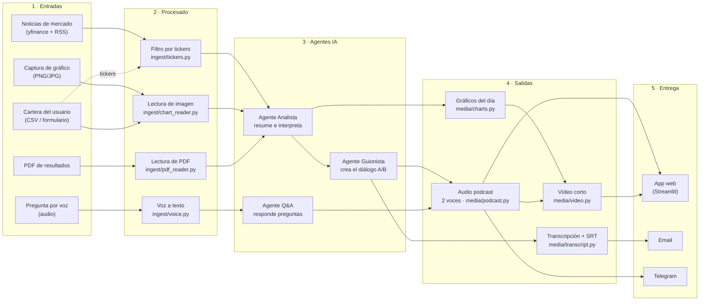
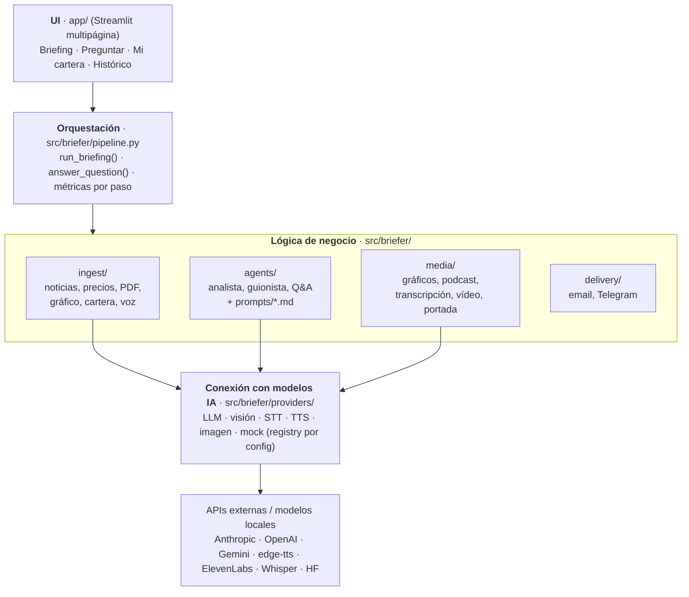

# Market Briefer

[](https://github.com/Romequinco/multimodal-market-briefer/actions/workflows/tests.yml)

**Tu podcast diario de mercados, hecho a medida de tu cartera.**

Market Briefer es el MVP de una startup FinTech de IA multimodal (práctica MIAX, taller B5-T4). Cada día
recoge las noticias de mercado relevantes para los tickers que sigue el usuario, las interpreta y genera un
**podcast explicativo a dos voces** con su transcripción, los gráficos del día y, opcionalmente, un **vídeo
corto**. El usuario puede además subir una captura de gráfico o un PDF de resultados para que entren en el
análisis, y **preguntar por voz** sobre el briefing a un agente que le responde también por voz.

> **Estado (05-oct-2026 · Fase 1, camino real, cerrada):** el producto funciona **de punta a punta con datos y
> modelos reales**: noticias de Google News, Yahoo Finance, Expansión y Europa Press + precios de yfinance (con
> caché diaria) → lectura de PDF y gráfico con Claude visión → Agente Analista (Claude Sonnet 5.5, con puerta de
> *grounding* de cifras) → Agente Guionista (Claude Haiku 4.5) → podcast a dos voces con edge-tts → transcripción
> SRT → gráficos → `briefing.json`, más el Agente Q&A (texto → respuesta hablada). **Medido:** ≈ 0,065 € y
> ≈ 62 s por briefing con PDF + gráfico; Q&A ≈ 0,005 € y 6-7 s (11-13 s en frío). La app abre con un **briefing
> real pregenerado** y funciona también **sin claves**. Pendiente: pregunta por voz (Whisper), Q&A < 10 s en
> frío, vídeo, portada, envíos por email/Telegram y captura de cartera. Plan en
> [docs/05_roadmap_TODO.md](docs/05_roadmap_TODO.md) (**mar 6-mié 7** latencia, voz, vídeo y caminos de revisión;
> *feature freeze* mié 22:00 · **jue 8** capturas, demo grabada y pitch, entrega 16:30). Estado vivo en
> [docs/06_estado_actual.md](docs/06_estado_actual.md).

> **Aviso legal.** Market Briefer genera **información financiera genérica con fines educativos**. No es
> asesoramiento en materia de inversión en el sentido de MiFID II, no tiene en cuenta la situación personal
> del usuario y **no emite recomendaciones de compra o venta**. Las voces del podcast son **sintéticas**,
> generadas por IA. Ver [viabilidad y compliance](docs/04_viabilidad_costes_latencia_compliance.md).

---

## Índice

1. [Problema y propuesta de valor](#problema-y-propuesta-de-valor)
2. [Flujo de datos multimodal](#flujo-de-datos-multimodal)
3. [Modalidades y modelos](#modalidades-y-modelos)
4. [Arquitectura por capas](#arquitectura-por-capas)
5. [Estructura del repositorio](#estructura-del-repositorio)
6. [Arranque rápido](#arranque-rápido)
7. [Configuración](#configuración)
8. [Capturas](#capturas)
9. [Demo](#demo)
10. [Documentación](#documentación)
11. [Equipo](#equipo)

---

## Problema y propuesta de valor

| | |
| --- | --- |
| **Problema** | El inversor minorista recibe la información de mercado dispersa y en formatos heterogéneos: titulares, notas de prensa, PDFs de resultados de 40 páginas, gráficos de velas. Leerlo todo cada día no es realista, y los resúmenes genéricos no hablan de *su* cartera. |
| **Público** | **B2C:** inversor minorista hispanohablante con cartera propia (acciones y ETFs). **B2B2C (canal):** brokers, neobancos y newsletters financieras que quieren ofrecer el briefing con su marca. |
| **Propuesta** | Un briefing diario **personalizado por cartera** que se **escucha** (camino al trabajo, en el gimnasio), se **lee** (transcripción), se **ve** (gráficos y vídeo corto) y se **interroga por voz**. |
| **Por qué multimodal** | Las fuentes ya son multimodales (texto, PDF, imagen de gráfico, voz del usuario) y el consumo también (audio, vídeo, texto, gráficos). Un solo modelo de chat no cubre ese ciclo; una cadena de modelos especializados sí. |

Detalle en [docs/01_producto_y_propuesta_valor.md](docs/01_producto_y_propuesta_valor.md).

---

## Flujo de datos multimodal


El mismo flujo en Mermaid, con el módulo del repo que implementa cada caja:



> En el diagrama original la cartera entra por «lectura de imagen» (captura de la cartera del broker). En el
> MVP la cartera también se puede introducir como CSV o formulario; en ambos casos sus tickers alimentan el
> filtro de noticias. El agente Q&A usa como contexto el briefing ya generado.

Arquitectura completa, diagramas de secuencia y mapeo caja → módulo en
[docs/02_arquitectura_y_flujo_datos.md](docs/02_arquitectura_y_flujo_datos.md).

---

## Modalidades y modelos

La columna **«Activo en la demo»** dice con honestidad qué se ve funcionar hoy (05-oct, Fase 1) y en qué modo:
**real** = con claves y red · **sin claves** = demo con voces reales · **offline** = todo mock.

| # | Modalidad | Dirección | Uso en la app | Modelo / herramienta por defecto | Alternativas (por config) | Activo en la demo |
| --- | --- | --- | --- | --- | --- | --- |
| 1 | Texto → texto | Entrada → razonamiento | Noticias filtradas → análisis (Agente Analista) con puerta de *grounding* de cifras | Claude Sonnet 5.5 (`BRIEFER_LLM_MODEL`) | Gemini, `mock` | **Sí** (real); simulado en sin claves/offline |
| 2 | Texto → texto | Razonamiento → guion | Análisis → diálogo a dos voces (Agente Guionista) | Claude Haiku 4.5 (`BRIEFER_LLM_MODEL_CHEAP`) | Gemini, `mock` | **Sí** (real); simulado en sin claves/offline |
| 3 | Texto → texto | Conversación | Preguntas sobre el briefing (Agente Q&A) | Claude Haiku 4.5 | Gemini, `mock` | **Sí** (real, por texto); simulado en sin claves/offline |
| 4 | Imagen → texto | Entrada | Captura de gráfico de cotización → descripción y cifras | Claude Sonnet 5.5 visión + Haiku (estructura) | Qwen2.5-VL-3B local *(stub)*, `mock` | **Sí** (real) |
| 5 | Documento → texto | Entrada | PDF de resultados → cifras clave y resumen | `pypdf` + Claude visión en páginas con poco texto + Claude Haiku | Qwen2.5-VL local *(stub)* | **Sí** (real) |
| 6 | Imagen → etiqueta | Enrutado | ¿La imagen subida es velas, tabla u otra cosa? (zero-shot) | CLIP *(opcional, desactivado)* | `none`, `mock` | **No** (pendiente, D2) |
| 7 | Audio → texto | Entrada | Pregunta por voz del usuario y notas de voz subidas | Whisper API | `faster-whisper` local, `mock` | **No** en real (Whisper pendiente, D2); solo simulado |
| 8 | Texto → audio | Salida | Podcast a dos voces y respuesta hablada del Q&A | `edge-tts` (gratis, voces es-ES) + normalización para locución | ElevenLabs *(stub)*, `mock` | **Sí** (real y sin claves); silencio en offline |
| 9 | Datos → imagen | Salida | Gráficos del día (variación con índices, cotización por ticker, cartera) | matplotlib | — | **Sí** (todos los modos) |
| 10 | Audio → texto (subtítulos) | Salida | Transcripción y fichero SRT sincronizado | Derivado del guion + tiempos reales del TTS | Whisper sobre el audio final | **Sí** (todos los modos) |
| 11 | Texto → imagen | Salida | Portada del episodio *(opcional)* | API texto→imagen (Gemini image) prevista | `none`, `mock` | **No** (pendiente, D2) |
| 12 | Imagen + audio → vídeo | Salida | Vídeo corto con gráficos, audio y subtítulos *(opcional)* | ffmpeg | — | **No** (pendiente, D2) |

Proveedores por defecto según `.env.example`; en el código, sin `.env`, todo es `mock`. Si un proveedor real
falla durante un briefing, el paso se completa con un sustituto (mock o datos de ejemplo) **marcado** en la UI y
en la traza.

La gracia no está en cada modelo por separado sino en **encadenarlos**: imagen/PDF/voz → texto estructurado →
análisis → guion → audio → vídeo, con contratos tipados entre cada paso.

---

## Arquitectura por capas



| Capa | Ubicación | Responsabilidad | No hace |
| --- | --- | --- | --- |
| UI | `app/` | Formularios, reproductores, histórico, subida de ficheros | Llamar a modelos o APIs directamente |
| Orquestación | `src/briefer/pipeline.py` | Resolver proveedores según el modo, encadenar pasos (ingesta y subidas en paralelo), medir latencia y coste, tolerar fallos (opcional → se omite; núcleo → sustituto marcado) | Lógica de prompts o de formato |
| Negocio | `ingest/`, `agents/`, `media/`, `delivery/` | Transformar datos entre contratos (`schemas.py`); reciben el proveedor por parámetro | Conocer qué proveedor concreto hay detrás |
| Proveedores | `providers/` | Hablar con cada API/modelo detrás de una interfaz común | Lógica de negocio |

Contratos (schemas Pydantic e interfaces) en [docs/03_contratos_modulos.md](docs/03_contratos_modulos.md).

---

## Estructura del repositorio

```text
.
├── app/                         # UI Streamlit (solo presentación; llama a briefer.pipeline / storage)
│   ├── main.py                  # portada y navegación
│   ├── pages/                   # 1_Briefing.py · 2_Preguntar.py · 3_Mi_cartera.py · 4_Historico.py
│   └── components/              # __init__.py (añade src/ al path) · players.py (modos, insignias, reproductores) · trace.py («Cómo se hizo»)
├── src/briefer/
│   ├── config.py                # Settings desde .env (pydantic-settings)
│   ├── schemas.py               # contratos de datos (Pydantic v2, v0.3) + DISCLAIMER_ES
│   ├── pipeline.py              # run_briefing() y answer_question() (modos real / mock / demo_voices)
│   ├── costs.py                 # coste estimado por paso (tarifas Anthropic verificadas 05-oct)
│   ├── logging_utils.py         # logger, track_step() → StepMetric, step_fell_back()
│   ├── storage.py               # guardar/cargar/exportar briefings; briefing destacado de la portada
│   ├── providers/               # base.py · registry.py · mock.py · llm/ · vision/ · stt/ · tts/ · image/
│   ├── ingest/                  # news, cache, tickers, prices, pdf_reader, chart_reader, portfolio, voice
│   ├── agents/                  # analyst, scriptwriter, qa, guardrails + prompts/{analyst,scriptwriter,qa}.md
│   ├── media/                   # charts, podcast, speech (normalización para TTS), transcript, video, cover
│   └── delivery/                # email_sender, telegram_sender
├── tests/                       # 419 tests sin red (mock y fixtures) + 7 «live» (-m live)
├── scripts/                     # run.ps1 · run.sh · demo.py · smoke_real.py
├── .github/workflows/tests.yml  # CI: pytest en modo mock en cada push a main y PR
├── data/samples/                # ejemplos versionados (CSV, JSON, PDF, PNG) + demo_briefing/ (briefing real pregenerado)
├── data/cache/ data/outputs/    # generados en ejecución (ignorados por git)
├── notebooks/                   # pruebas exploratorias de modelos (README con ideas)
├── pitch/                       # pitch deck técnico (README con el contenido previsto)
├── docs/                        # documentación del proyecto (ver índice)
├── Dockerfile  docker-compose.yml
├── requirements.txt             # dependencias del MVP
├── requirements-local.txt       # opcional: modelos locales (torch, transformers, faster-whisper…)
├── pyproject.toml  .env.example  .gitignore
├── CLAUDE.md                    # contexto para agentes IA
└── README.md
```

---

## Arranque rápido

Requisitos: **Python 3.11+** y **ffmpeg** en el PATH (solo para el vídeo). Con Docker no hace falta nada más.

### Windows (PowerShell)

```powershell
powershell -ExecutionPolicy Bypass -File scripts\run.ps1          # MVP
powershell -ExecutionPolicy Bypass -File scripts\run.ps1 -Local   # + modelos locales (requirements-local.txt)
```

### Linux / macOS

```bash
bash scripts/run.sh            # MVP
bash scripts/run.sh --local    # + modelos locales (requirements-local.txt)
```

Ambos scripts crean `.venv`, instalan `requirements.txt` (y `requirements-local.txt` con `-Local` /
`--local`), copian `.env.example` a `.env` si no existe, fijan `PYTHONPATH=src` y lanzan
`streamlit run app/main.py` en <http://localhost:8501>.

Manualmente: `pip install -r requirements.txt` (o `pip install -e .`, y `pip install -e .[local]` para los
modelos locales) y `streamlit run app/main.py` (`app/components` añade `src/` al path).

### Docker

```bash
docker compose up --build      # http://localhost:8501
```

Requiere **Docker Compose ≥ 2.24** (usa `env_file` con `required: false`: si no hay `.env`, arranca en modo
mock). La imagen incluye ffmpeg pero no los modelos locales; `data/outputs/` y `data/cache/` se montan como
volúmenes.

### Lo primero que se ve: el briefing pregenerado

Al abrir la app, la portada muestra el **último briefing guardado** o, si no hay ninguno, un **briefing real
pregenerado** que viene en el repo (`data/samples/demo_briefing/`: generado el 05-oct-2026 con Claude y
edge-tts para SAN.MC, ITX.MC, IBE.MC, AAPL y NVDA más un PDF y un gráfico de ejemplo; podcast de ~4 min, SRT,
gráficos y traza «Cómo se hizo»). Se ve y se escucha **sin claves ni red**.

### Modos de ejecución

| Modo | Qué hace | Necesita | UI | CLI |
| --- | --- | --- | --- | --- |
| **Real** | Noticias y precios reales (caché diaria en `data/cache/`), Claude para análisis, guion, visión y Q&A, edge-tts | `ANTHROPIC_API_KEY` en `.env` + red | Interruptor «Modo real (APIs de .env)» en la barra lateral (bloqueado si faltan claves, con el motivo) | `python scripts/demo.py` |
| **Demo sin claves (voces reales)** | Noticias de ejemplo, precios sintéticos y modelos simulados, pero el podcast y la respuesta del Q&A **suenan** con edge-tts | Red (edge-tts es gratis y sin clave) | «Tipo de demo» → demo sin claves | `python scripts/demo.py --demo-voices` |
| **Mock offline** | Todo simulado y determinista; el audio es un WAV mudo | Nada | «Tipo de demo» → demo offline | `python scripts/demo.py --mock` |

En modo real, si un proveedor falla en un paso núcleo, el briefing termina igualmente con un sustituto (datos de
ejemplo o mock) **y la UI lo avisa** (insignias, avisos y nodo naranja en «Cómo se hizo»). El botón «Refrescar
datos» (o `--refresh`) ignora la caché del día.

```bash
python scripts/demo.py --demo-voices                              # sin claves, con voces reales (~6 s, 0 €)
python scripts/demo.py --mock                                     # todo mock, sin red
python scripts/demo.py --tickers SAN.MC AAPL --upload data/samples/resultados_ejemplo.pdf data/samples/grafico_ejemplo.png
python scripts/demo.py --refresh                                  # real, ignorando la caché diaria
python scripts/demo.py --question "¿Por qué ha subido hoy el Santander?"
python scripts/smoke_real.py                                      # prueba de humo de cada proveedor con clave (< 0,01 €)
python -m pytest -q                                               # 419 tests sin red (los «live» con -m live)
```

Flags de `scripts/demo.py`: `--tickers T [T ...]` (por defecto `BRIEFER_DEFAULT_TICKERS`; admite nombres como
«santander»), `--portfolio CSV`, `--upload [FICHERO ...]` (PDF, imagen o audio), `--video`, `--cover`,
`--deliver [email|telegram ...]`, `--mock` o `--demo-voices` (excluyentes; sin ninguno, modo real),
`--refresh` (ignora la caché de noticias y precios) y `--question TEXTO` (en vez del briefing, pregunta al
Agente Q&A). Imprime la tabla de pasos con proveedor, latencia, coste estimado y caídas a sustituto. Si un paso
núcleo aún es un *stub*, termina con «Pendiente de implementar: …» (código de salida 2).

`scripts/smoke_real.py` hace una llamada mínima real por proveedor configurado (`anthropic.text`,
`anthropic.structured`, `anthropic.vision`, `gemini.structured`, TTS y STT) e imprime `OK` / `FAIL` / `SKIP` /
`PEND` con latencia y coste; nunca imprime claves. Opciones: `--only anthropic gemini audio`, `--gemini-model`.
Hoy el STT sale `PEND` (Whisper API pendiente).

Medido el 05-oct-2026 (detalle en [docs/04](docs/04_viabilidad_costes_latencia_compliance.md)): briefing real
con PDF + gráfico **≈ 0,065 € y ≈ 61-64 s**; pregunta al Q&A con respuesta hablada **≈ 0,005 € y 6-7 s** (11-13 s
la primera de cada proceso).

---

## Configuración

Toda la configuración vive en `.env` (nunca se versiona) y se lee en `src/briefer/config.py`
(pydantic-settings, sin distinguir mayúsculas). Plantilla completa y comentada en `.env.example`.

**Ojo con los valores por defecto:** en el **código** todos los proveedores son `mock` (y `none` para imagen y
clasificador) para que tests y desarrollo funcionen sin red ni claves; **`.env.example` propone el stack real**
del MVP (`anthropic` + `claude` + `whisper_api` + `edge`). La columna «`.env.example`» indica el valor que
queda al copiar la plantilla.

### Proveedores

| Variable | Valores | Código | `.env.example` | Para qué |
| --- | --- | --- | --- | --- |
| `BRIEFER_LLM_PROVIDER` | `anthropic` · `gemini` · `openai` · `mock` | `mock` | `anthropic` | Agentes analista, guionista y Q&A |
| `BRIEFER_VISION_PROVIDER` | `claude` · `qwen_local` · `mock` | `mock` | `claude` | Lectura de gráficos y páginas de PDF |
| `BRIEFER_STT_PROVIDER` | `whisper_api` · `whisper_local` · `mock` | `mock` | `whisper_api` | Pregunta por voz |
| `BRIEFER_TTS_PROVIDER` | `edge` · `elevenlabs` · `mock` | `mock` | `edge` | Podcast y respuesta hablada |
| `BRIEFER_IMAGE_GEN_PROVIDER` | `sdxl_turbo` · `none` · `mock` | `none` | `none` | Portada (opcional) |
| `BRIEFER_IMAGE_CLASSIFIER_PROVIDER` | `clip` · `none` · `mock` | `none` | `none` | Clasificar capturas (opcional) |
| `BRIEFER_FALLBACK_TO_MOCK` | `true` · `false` | `true` | `true` | Si falta clave o librería: mock con aviso (`true`) o `ProviderConfigError` (`false`) |

### Modelos

| Variable | Por defecto (código y `.env.example`) | Para qué |
| --- | --- | --- |
| `BRIEFER_LLM_MODEL` | `claude-sonnet-5-5` | Agente Analista (Anthropic) |
| `BRIEFER_LLM_MODEL_CHEAP` | `claude-haiku-4-5-20251001` | Guionista, Q&A y estructurado de PDF/gráfico (`get_llm(cheap=True)`) |
| `BRIEFER_GEMINI_MODEL` | `gemini-2.5-flash` | LLM si `BRIEFER_LLM_PROVIDER=gemini` |
| `BRIEFER_OPENAI_MODEL` | `gpt-4o-mini` | LLM si `BRIEFER_LLM_PROVIDER=openai` |
| `BRIEFER_VISION_MODEL` | `claude-sonnet-5-5` | Visión con Claude |
| `BRIEFER_QWEN_VL_MODEL` | `Qwen/Qwen2.5-VL-3B-Instruct` | Visión local |
| `BRIEFER_WHISPER_API_MODEL` | `whisper-1` | STT por API |
| `BRIEFER_WHISPER_LOCAL_MODEL` | `base` (`tiny` · `base` · `small` · `medium`) | STT local (`faster-whisper`) |
| `BRIEFER_SDXL_MODEL` | `stabilityai/sdxl-turbo` | Portada local |
| `BRIEFER_CLIP_MODEL` | `openai/clip-vit-base-patch32` | Clasificador local |
| `BRIEFER_LOCAL_DEVICE` | `auto` (`auto` · `cpu` · `cuda` · `mps`) | Dispositivo de los modelos locales |

Los modelos locales requieren `requirements-local.txt`.

### Idioma, voces y contenido

| Variable | Por defecto (código y `.env.example`) | Para qué |
| --- | --- | --- |
| `BRIEFER_LANGUAGE` | `es` | Idioma de STT y contenido |
| `BRIEFER_VOICE_A` · `BRIEFER_VOICE_B` | `es-ES-AlvaroNeural` · `es-ES-ElviraNeural` | Voces edge-tts (B también responde en el Q&A) |
| `BRIEFER_SPEAKER_A_NAME` · `BRIEFER_SPEAKER_B_NAME` | `Álvaro` · `Elvira` | Nombres de los presentadores en guion y transcripción |
| `ELEVENLABS_VOICE_A` · `ELEVENLABS_VOICE_B` | vacío | Ids de voz si `BRIEFER_TTS_PROVIDER=elevenlabs` |
| `ELEVENLABS_MODEL` | `eleven_multilingual_v2` | Modelo de ElevenLabs |
| `BRIEFER_TTS_RATE` · `BRIEFER_TTS_PITCH` | vacío (`+0%` · `+0Hz`) | Velocidad y tono de edge-tts (p. ej. `+8%`, `-2Hz`) |
| `BRIEFER_DEFAULT_TICKERS` | `SAN.MC,ITX.MC,IBE.MC,AAPL,NVDA` | Tickers por defecto (formato Yahoo, separados por comas) |
| `BRIEFER_CONTEXT_TICKERS` | `^IBEX,^GSPC` | Índices de referencia: precios y noticias de mercado en todo briefing, sin contar como tickers del usuario |
| `BRIEFER_NEWS_RSS_FEEDS` | vacío | Feeds RSS generalistas; vacío = Expansión «Mercados» + Europa Press (además, por ticker: Google News es-ES, RSS de Yahoo y yfinance) |
| `BRIEFER_NEWS_MAX_ITEMS` | `20` | Máximo de noticias por briefing |
| `BRIEFER_PODCAST_TARGET_MINUTES` | `4` | Duración objetivo del podcast |

### Claves y entrega

| Variable | Por defecto | Para qué |
| --- | --- | --- |
| `ANTHROPIC_API_KEY` | vacío | LLM y visión con Claude |
| `OPENAI_API_KEY` | vacío | Whisper API y LLM OpenAI (opcional) |
| `GEMINI_API_KEY` | vacío | LLM Gemini (opcional) |
| `ELEVENLABS_API_KEY` | vacío | Voces ElevenLabs (opcional) |
| `TELEGRAM_BOT_TOKEN` · `TELEGRAM_CHAT_ID` | vacío | Entrega por Telegram (opcional) |
| `SMTP_HOST` · `SMTP_USER` · `SMTP_PASSWORD` · `SMTP_FROM` | vacío | Entrega por email (opcional) |
| `SMTP_PORT` | `587` | Puerto SMTP |
| `SMTP_TO` | vacío | Destinatarios, separados por comas |
| `SMTP_USE_TLS` | `true` | Usar TLS en la conexión SMTP |

### Rutas y logging

| Variable | Por defecto | Para qué |
| --- | --- | --- |
| `BRIEFER_DATA_DIR` · `BRIEFER_CACHE_DIR` · `BRIEFER_OUTPUT_DIR` · `BRIEFER_SAMPLES_DIR` | `data` · `data/cache` · `data/outputs` · `data/samples` | Rutas (relativas a la raíz del repo si no son absolutas) |
| `BRIEFER_LOG_LEVEL` | `INFO` | `DEBUG` · `INFO` · `WARNING` · `ERROR` |

Sin `ANTHROPIC_API_KEY` (u otra clave necesaria) la app sigue arrancando: con `BRIEFER_FALLBACK_TO_MOCK=true`
el `registry` cae a `mock` y lo deja en el log; la barra lateral de la UI muestra una insignia por familia
(«real» o «MOCK (falta X)») y bloquea el modo real con el motivo. `BRIEFER_LLM_PROVIDER=openai` está
reservado (*stub* documentado; el paso cae a mock marcado).

---

## Capturas

> TODO: añadir capturas reales en `docs/assets/capturas/` cuando la UI esté terminada (D3, 08-oct).

| Pantalla | Captura |
| --- | --- |
| Portada / selección de tickers | TODO `docs/assets/capturas/01_portada.png` |
| Briefing del día (podcast + transcripción + gráficos) | TODO `docs/assets/capturas/02_briefing.png` |
| Vídeo corto generado | TODO `docs/assets/capturas/03_video.png` |
| Preguntar por voz (Q&A) | TODO `docs/assets/capturas/04_preguntar.png` |
| Subida de PDF / captura de gráfico | TODO `docs/assets/capturas/05_subidas.png` |
| Mi cartera | TODO `docs/assets/capturas/06_cartera.png` |
| Histórico y métricas (latencia/coste por paso) | TODO `docs/assets/capturas/07_historico.png` |

---

## Demo

> TODO: enlace a la demo grabada (vídeo de 3-5 min) y, si se despliega, URL pública. Mientras tanto, la
> portada de la app enseña el briefing real pregenerado de `data/samples/demo_briefing/` sin necesidad de
> claves.

Guion previsto de la demo:

1. Elegir tickers / cargar cartera de ejemplo.
2. Subir un PDF de resultados y una captura de gráfico.
3. Generar el briefing: mostrar análisis, podcast a dos voces, transcripción, gráficos y vídeo.
4. Preguntar por voz sobre el briefing y escuchar la respuesta.
5. Enviar por email / Telegram.
6. Enseñar la tabla de métricas (latencia y coste estimado por paso) y el modo mock.

---

## Documentación

| Documento | Contenido |
| --- | --- |
| [docs/README.md](docs/README.md) | Índice operativo y ruta de lectura |
| [00 · Enunciado](docs/00_enunciado.md) | Enunciado estructurado y checklist de rúbrica |
| [01 · Producto](docs/01_producto_y_propuesta_valor.md) | Problema, público, propuesta de valor, monetización |
| [02 · Arquitectura](docs/02_arquitectura_y_flujo_datos.md) | Capas, componentes, secuencias, cadena de modelos |
| [03 · Contratos](docs/03_contratos_modulos.md) | Schemas, interfaces y reparto por carriles |
| [04 · Viabilidad](docs/04_viabilidad_costes_latencia_compliance.md) | Costes, latencias, compliance, monetización |
| [05 · Roadmap](docs/05_roadmap_TODO.md) | TODO hasta la entrega |
| [06 · Estado actual](docs/06_estado_actual.md) | Qué funciona y qué no |
| [07 · Revisión crítica](docs/07_revision_critica.md) | Revisión del plan: hallazgos, prioridades MoSCoW, plan por fases |
| [Decisiones (ADR)](docs/decisiones/README.md) | Decisiones de arquitectura |
| [Material de clase](docs/clase/00_indice.md) | Resumen del material del taller |
| [Pitch deck](pitch/README.md) | Pitch técnico |

---

## Aviso legal

Market Briefer es un proyecto académico. El contenido generado:

- es **información genérica**, no asesoramiento de inversión personalizado (MiFID II);
- **no** contiene recomendaciones de compra, venta o mantenimiento de ningún instrumento;
- puede contener errores: los modelos de IA pueden equivocarse o interpretar mal una noticia;
- resume y **cita la fuente** de cada noticia; los derechos de las noticias pertenecen a sus editores;
- usa **voces sintéticas** generadas por IA (transparencia, AI Act).

Los datos de cartera se procesan localmente y solo se envían a un proveedor de IA los tickers y pesos
necesarios para el análisis. Ver [docs/04](docs/04_viabilidad_costes_latencia_compliance.md).

---

## Equipo

| Integrante | Rol principal |
| --- | --- |
| TODO nombre 1 | TODO |
| TODO nombre 2 | TODO |
| TODO nombre 3 | TODO |

Máster MIAX · Taller B5-T4 · Entrega 8-oct-2026.
