# Briefly

[](https://github.com/Romequinco/multimodal-market-briefer/actions/workflows/tests.yml)

**Lo que ha movido tu cartera hoy, contado a dos voces en unos cuatro minutos: noticias, PDFs y gráficos
convertidos en un podcast, un vídeo y un agente al que se le pregunta hablando.**

- **Enlace a la demo:** (pendiente de grabar; guion en [pitch/demo_guion.md](pitch/demo_guion.md))
- **Pitch técnico:** [pitch/pitch_briefly.pdf](pitch/pitch_briefly.pdf) (12 diapositivas)
- **Arranque:** [en 2 comandos](#arranca-en-2-comandos), sin claves (modo demo) o con claves (modo real)

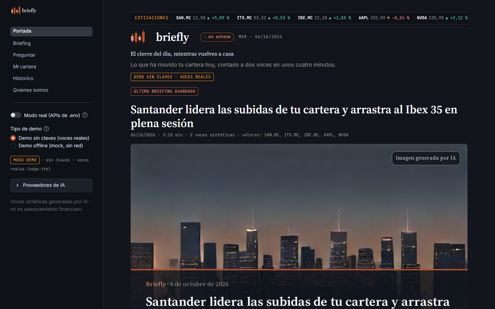

Briefly es el MVP de una startup FinTech de IA multimodal (práctica MIAX, taller B5-T4). Cada tarde, al cierre
de la sesión, recoge las noticias de mercado relevantes para los valores que sigue el usuario, las interpreta y
genera un **podcast explicativo a dos voces** (Toro y Osa, voces sintéticas) con su transcripción, los gráficos
del día, un **vídeo corto** vertical y una **portada** generada con IA, y lo envía por **Telegram**. El usuario
puede además subir una captura de gráfico o un PDF de resultados para que entren en el análisis, cargar su
cartera desde una **captura de su broker** y **preguntar por voz** sobre el briefing a un agente que le responde
también por voz. Detrás hay una cadena de modelos especializados (Claude Sonnet y Haiku, visión, voz a texto,
texto a voz, CLIP, FinBERT, SDXS) con contratos tipados entre cada paso.

> **Estado (listo para entregar; entrega el jue 8-oct-2026).** Fases 0-3 cerradas: núcleo real de punta a punta (noticias →
> Analista → Guionista → podcast → SRT → gráficos), todas las modalidades de la tabla verificadas en real (vídeo,
CLIP, cartera desde captura, portada local y Telegram incluidos), **Docker verificado**,
> clon limpio en Windows con `run.ps1`, **1225 tests sin red** (+ 13 «live») con ruff + mypy, y evaluación de
> **6 briefings reales** (p50 52,7 s y 0,034 €; 0 recomendaciones; 232/232 cifras trazables). Quedan la demo
> grabada y el pregenerado final. Detalle y registro de jornadas en
> [docs/06_estado_actual.md](docs/06_estado_actual.md).

> **Aviso legal.** Briefly genera **información financiera genérica con fines educativos**. No es asesoramiento
> en materia de inversión en el sentido de MiFID II, no tiene en cuenta la situación personal del usuario y **no
> emite recomendaciones de compra o venta**. Las voces del podcast son **sintéticas**, generadas por IA. Ver
> [Compliance y privacidad](#compliance-y-privacidad).

> **Nombres internos.** La marca visible es **Briefly**; el código conserva su nombre técnico: paquete
> `briefer`, repositorio `multimodal-market-briefer`, variables `BRIEFER_*` y servicio de Docker.

---

## Índice

1. [Arranca en 2 comandos](#arranca-en-2-comandos)
2. [Capturas](#capturas)
3. [Problema y propuesta de valor](#problema-y-propuesta-de-valor)
4. [Flujo de datos multimodal](#flujo-de-datos-multimodal)
5. [Orquestación de modelos](#orquestación-de-modelos)
6. [Modalidades y modelos](#modalidades-y-modelos)
7. [Arquitectura por capas](#arquitectura-por-capas)
8. [Estructura del repositorio](#estructura-del-repositorio)
9. [Mediciones](#mediciones)
10. [Viabilidad y monetización](#viabilidad-y-monetización)
11. [Compliance y privacidad](#compliance-y-privacidad)
12. [Identidad](#identidad)
13. [Demo y pitch](#demo-y-pitch)
14. [Documentación](#documentación)
15. [Equipo](#equipo)
16. [Anexo A · Arranque en detalle, modos y CLI](#anexo-a--arranque-en-detalle-modos-y-cli)
17. [Anexo B · Configuración](#anexo-b--configuración)
18. [Anexo C · Telegram](#anexo-c--telegram)

---

## Arranca en 2 comandos

Requisitos: **Python 3.11+** (o solo Docker). ffmpeg no hace falta instalarlo: lo trae `imageio-ffmpeg`.

```bash
git clone https://github.com/Romequinco/multimodal-market-briefer.git && cd multimodal-market-briefer
```

y después, según el sistema:

| Sistema | Comando | Abre |
| --- | --- | --- |
| **Windows** (PowerShell) | `powershell -ExecutionPolicy Bypass -File scripts\run.ps1` | http://localhost:8501 |
| **Linux / macOS** | `bash scripts/run.sh` | http://localhost:8501 |
| **Docker** (Compose ≥ 2.24) | `docker compose up --build` | http://localhost:8501 |

Los scripts crean `.venv`, instalan dependencias (solo si han cambiado), copian `.env.example` a `.env` y lanzan
Streamlit. Añade `-Local` / `--local` para los modelos locales (CLIP, FinBERT, portada SDXS); la imagen de Docker
ya los trae.

- **Sin claves = modo demo.** La app abre con un **briefing real pregenerado** (podcast, vídeo, transcripción,
  gráficos y traza) que se ve y se escucha sin red, y deja generar briefings de demostración: con red, el podcast
  suena con voces reales (edge-tts, gratis); sin red, todo simulado.
- **Con claves = modo real.** Pon `ANTHROPIC_API_KEY` en `.env` (y `OPENAI_API_KEY` para preguntar por voz) y
  activa «Modo real (APIs de .env)» en la barra lateral. Un briefing real cuesta unos 3-7 céntimos.

Opciones, modos de ejecución, CLI y detalles de Docker en el [Anexo A](#anexo-a--arranque-en-detalle-modos-y-cli);
variables de entorno en el [Anexo B](#anexo-b--configuración).

---

## Capturas

Capturas reales de la app (1440 × 900, tema oscuro «Noticiero nocturno»).

| | |
| --- | --- |
| **Portada** · propuesta de valor, briefing destacado con reproductor y franja «Cómo se hizo» | **Briefing del día** · puntos clave con fuente enlazada e «impacto de la noticia» (FinBERT); pestañas de vídeo, transcripción, gráficos y traza |
|  | 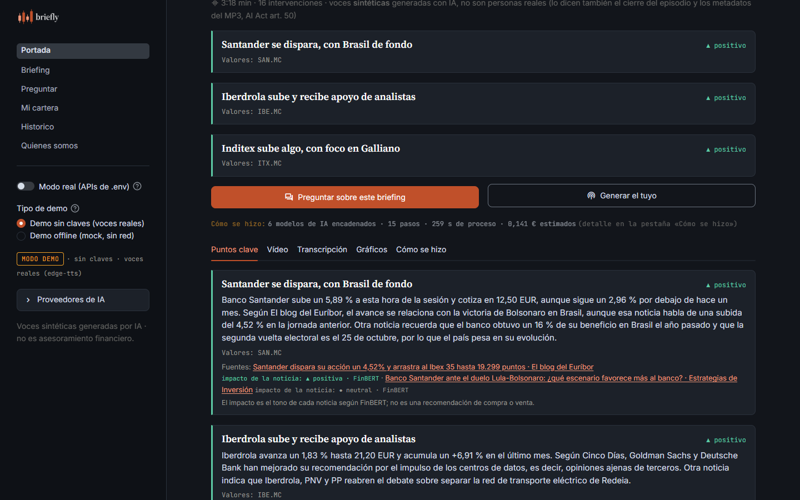 |
| **Vídeo corto 9:16** · diapositivas alineadas con el audio, subtítulos por locutor y rótulo de voz sintética | **Preguntar** · pregunta por voz o por texto, respuesta con fuentes y leída con voz sintética |
| 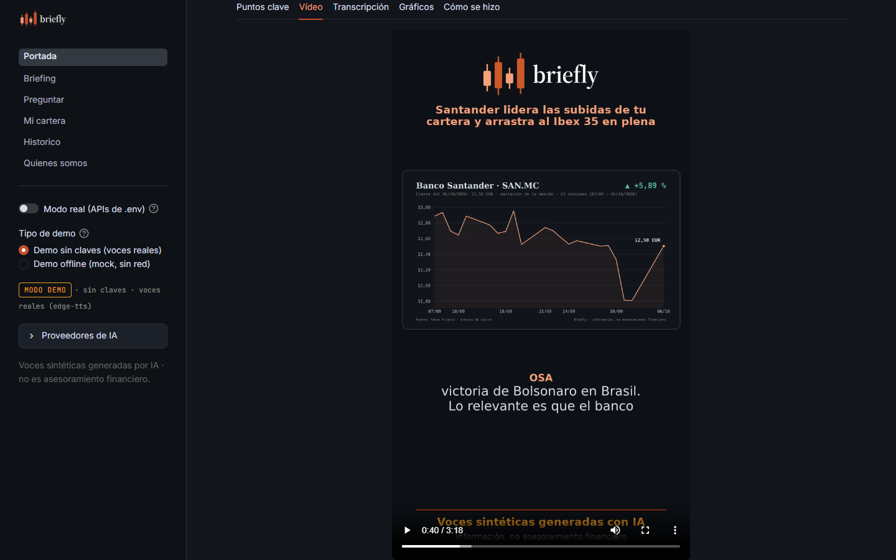 | 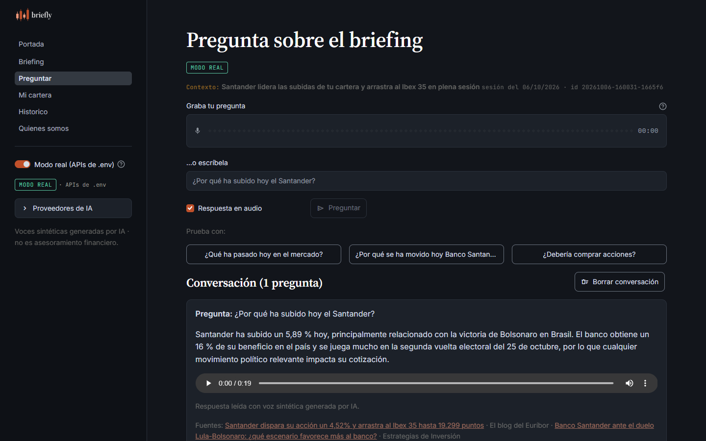 |
| **Subidas** · PDF de resultados y captura de gráfico, con las opciones de vídeo, portada y Telegram | **Mi cartera** · cartera leída desde una captura del broker (no se guarda en disco) |
| 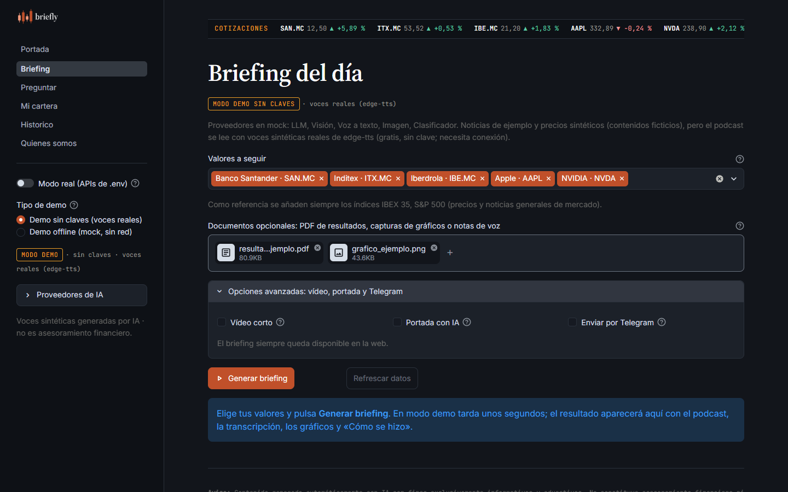 | 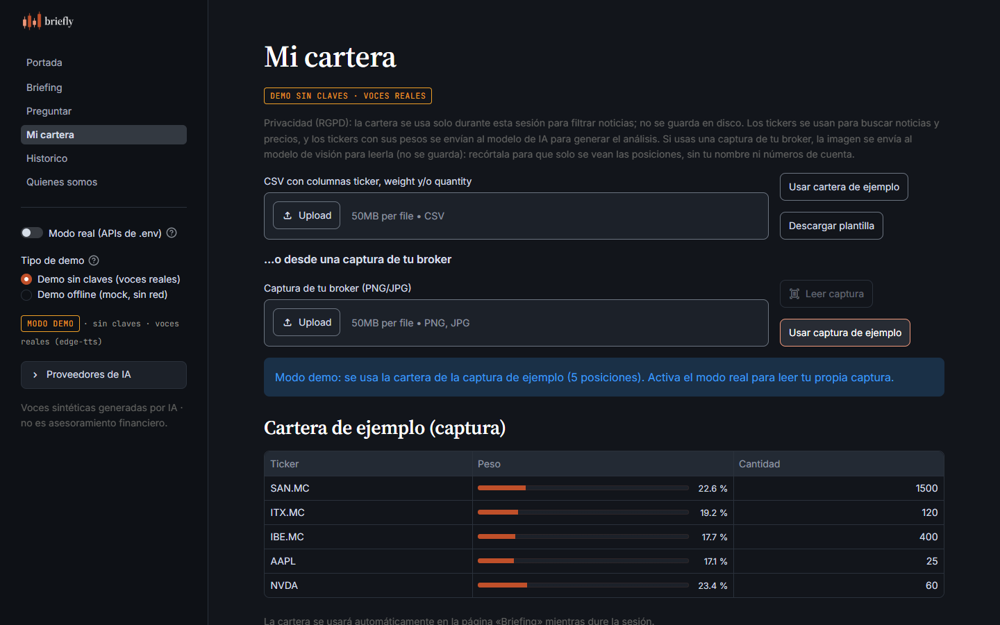 |
| **Histórico** · briefings guardados para reabrir, escuchar de nuevo o borrar | **Quiénes somos** · la historia (ficticia) de la startup y sus locutores |
| 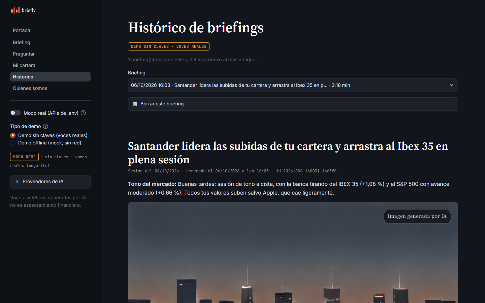 | 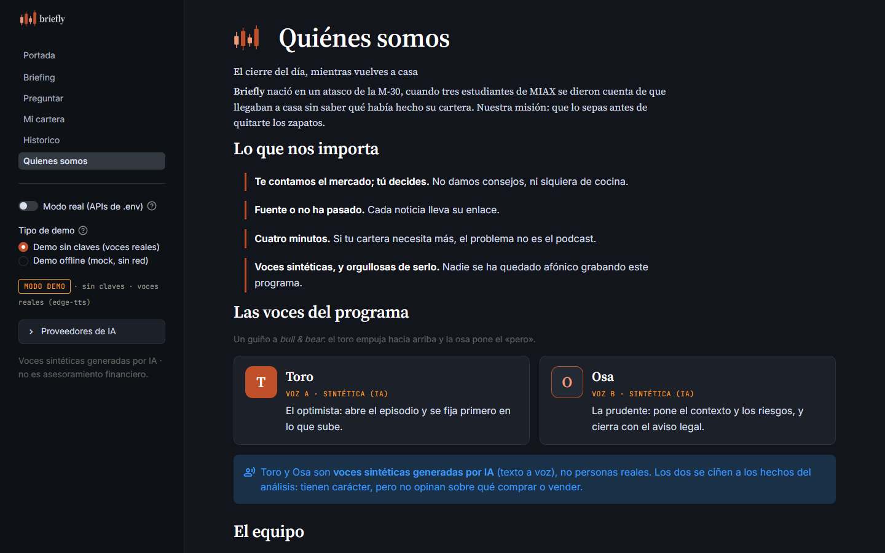 |

---

## Problema y propuesta de valor

| | |
| --- | --- |
| **Problema** | El inversor minorista recibe la información de mercado dispersa y en formatos heterogéneos: titulares, notas de prensa, PDFs de resultados de 40 páginas, gráficos de velas. Leerlo todo cada día no es realista, y los resúmenes genéricos no hablan de *su* cartera. |
| **Público** | **B2C (cara visible):** inversor minorista hispanohablante con cartera propia (acciones y ETFs) que escucha el resumen en el trayecto de vuelta. **B2B2C (negocio):** neobancos, brokers y newsletters financieras que quieren ofrecer el briefing con su marca (marca blanca). |
| **Propuesta** | Un briefing diario **personalizado por cartera**, en **edición de noche** (al cierre), que se **escucha** (de vuelta a casa), se **lee** (transcripción), se **ve** (gráficos y vídeo corto), llega por **Telegram** y se **interroga por voz**. La edición de mañana, antes de la apertura, queda en el roadmap. |
| **Por qué multimodal** | Las fuentes ya son multimodales (texto, PDF, imagen de gráfico, captura del broker, voz del usuario) y el consumo también (audio, vídeo, texto, gráficos). Un solo modelo de chat no cubre ese ciclo; una cadena de modelos especializados sí. |

Detalle en [docs/01_producto_y_propuesta_valor.md](docs/01_producto_y_propuesta_valor.md).

---

## Flujo de datos multimodal

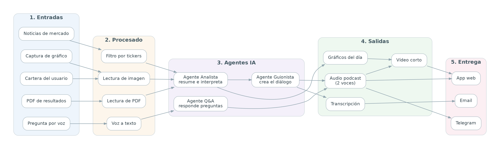

El mismo flujo en Mermaid, con el módulo del repo que implementa cada caja:

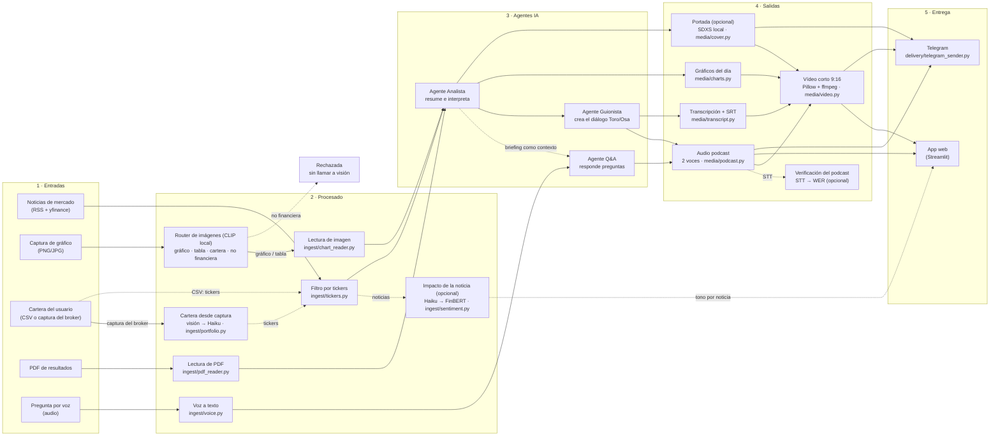

> La cartera puede entrar por **imagen** (captura de la pantalla de posiciones del broker, página «Mi cartera»:
> visión transcribe, Haiku estructura y un mapeo determinista da los tickers) o como CSV; en ambos casos sus
> tickers alimentan el filtro de noticias. Si la captura de cartera se sube junto a las de gráficos en «Generar
> briefing», el router CLIP la desvía (sin gastar en visión) con el aviso de subirla en «Mi cartera»; sin CLIP, el
> propio prompt de visión la reconoce y se desvía igual, sin estructurarla ni guardar nada. El agente Q&A usa
> como contexto el briefing ya generado. La entrega es por **web y Telegram** (el email se retiró).

Arquitectura completa, diagramas de secuencia y mapeo caja → módulo en
[docs/02_arquitectura_y_flujo_datos.md](docs/02_arquitectura_y_flujo_datos.md).

---

## Orquestación de modelos

Lo que hace `pipeline.run_briefing()` en cada ejecución, con sus ramas y decisiones. Cada paso deja un
`StepMetric` (proveedor, modelo, latencia, coste estimado, detalle de las puertas) que la app enseña en la
pestaña «Cómo se hizo». Pasos **núcleo** (si el proveedor real falla, se repite con un sustituto marcado) y
**opcionales** (si fallan, se omiten y el briefing sigue).

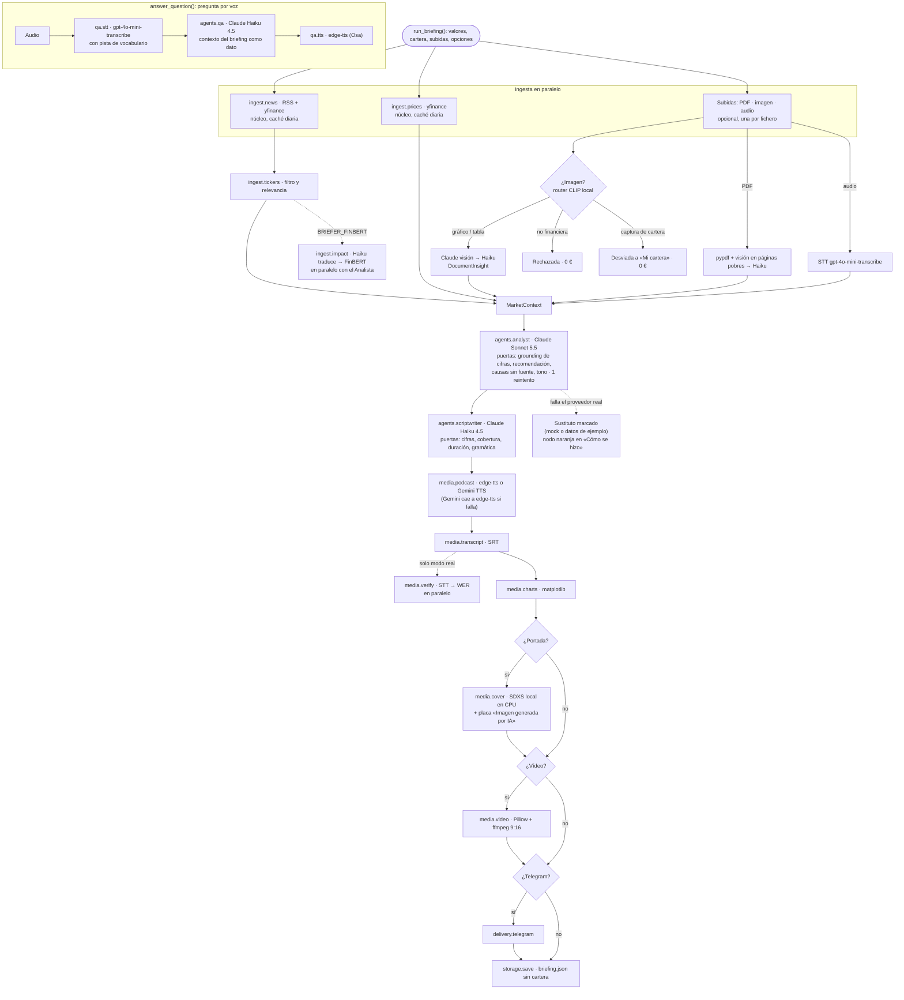

La gracia no está en cada modelo por separado sino en **encadenarlos**: imagen/PDF/voz → texto estructurado →
análisis → guion → audio → vídeo, con contratos Pydantic entre cada paso
([docs/03](docs/03_contratos_modulos.md)). El router CLIP muestra la idea también en la entrada: un modelo local
y gratis decide antes si merece la pena llamar al de visión, que es de pago. La elección de modelo por agente se
decidió con evidencia ([ADR-006](docs/decisiones/ADR-006-guionista-haiku-puertas-deterministas.md),
[ADR-007](docs/decisiones/ADR-007-modelos-por-agente.md)). El cuaderno
[00 · recorrido del pipeline](notebooks/00_recorrido_pipeline.ipynb) ejecuta los 15 pasos uno a uno, sin red ni
claves.

---

## Modalidades y modelos

La columna **«Activo en la demo»** dice qué se ve funcionar y en qué modo: **real** = con claves y red ·
**sin claves** = demo con voces reales · **offline** = todo mock. Todas las filas están verificadas en real.

| # | Modalidad | Dirección | Uso en la app | Modelo / herramienta por defecto | Alternativas (por config) | Activo en la demo |
| --- | --- | --- | --- | --- | --- | --- |
| 1 | Texto → texto | Entrada → razonamiento | Noticias filtradas → análisis (Agente Analista) con puerta de *grounding* de cifras | Claude Sonnet 5.5 (`BRIEFER_LLM_MODEL`) | Gemini, `mock` | **Sí** (real); simulado en sin claves/offline |
| 2 | Texto → texto | Razonamiento → guion | Análisis → diálogo a dos voces (Agente Guionista) con puertas de cifras, cobertura, duración y gramática | Claude Haiku 4.5 (`BRIEFER_LLM_MODEL_CHEAP`; `BRIEFER_SCRIPTWRITER_MODEL` para cambiarlo) | Sonnet 5.5, Gemini, `mock` | **Sí** (real); simulado en sin claves/offline |
| 3 | Texto → texto | Conversación | Preguntas sobre el briefing (Agente Q&A) | Claude Haiku 4.5 | Gemini, `mock` | **Sí** (real, por texto y por voz); simulado en sin claves/offline |
| 4 | Imagen → texto | Entrada | Captura de gráfico de cotización → descripción y cifras | Claude Sonnet 5.5 visión + Haiku (estructura) | `mock` | **Sí** (real) |
| 4b | Imagen → datos | Entrada | **Cartera desde una captura del broker** (página «Mi cartera»): visión transcribe la tabla → Haiku la estructura → mapeo determinista a tickers y pesos; nada a disco | Claude Sonnet 5.5 visión + Claude Haiku 4.5 | `mock` | **Sí** (real: 5/5 posiciones de `data/samples/cartera_ejemplo.png`, 8,5 s, ≈ 0,005 €; botón «Usar captura de ejemplo») |
| 5 | Documento → texto | Entrada | PDF de resultados → cifras clave y resumen | `pypdf` + Claude visión en páginas con poco texto + Claude Haiku | `mock` | **Sí** (real) |
| 6 | Imagen → etiqueta | Enrutado | Router de las imágenes subidas (zero-shot): gráfico / tabla → visión con la etiqueta como pista; no financiera → rechazada **sin llamar a visión**; captura de cartera → «súbela en Mi cartera» | CLIP `openai/clip-vit-base-patch32` local en CPU, 0 € | `none`, `mock` | **Sí** (con `clip`: 5/5 imágenes de prueba; 70-85 ms por imagen) |
| 7 | Audio → texto | Entrada | Pregunta por voz y notas de voz subidas | OpenAI `gpt-4o-mini-transcribe` | `whisper-1`, `mock` | **Sí** (real, con `OPENAI_API_KEY`); simulada y marcada `[MOCK]` en sin claves/offline |
| 8 | Texto → audio | Salida | Podcast a dos voces (Toro y Osa) y respuesta hablada del Q&A | `edge-tts` (gratis: Álvaro / Ximena a +10 %, pausas variables) + normalización para locución | **Gemini TTS multi-locutor** (`gemini-3.8-flash-tts`, de pago; cae a edge-tts si falla; el Q&A habla siempre con edge-tts), `mock` | **Sí** (real y sin claves); silencio en offline |
| 8b | Texto → etiqueta | Enriquecimiento | «Impacto de la noticia»: tono de cada noticia (▲ positiva · ▼ negativa · ● neutral) junto a su fuente; nunca agregado por valor ni como recomendación | Claude Haiku 4.5 (traduce) → **FinBERT** (`ProsusAI/finbert`, local en CPU) | `BRIEFER_FINBERT=true` (desactivado por defecto) | **Sí** (real, en el pregenerado). Aportación de Daniel García (PR #1) |
| 9 | Datos → imagen | Salida | Gráficos del día (variación con «Índices de referencia», cotización por valor, reparto de la cartera solo en la sesión) | matplotlib | — | **Sí** (todos los modos; «precios sintéticos (demo)» en la demo) |
| 10 | Audio → texto (subtítulos) | Salida | Transcripción y SRT sincronizado | Guion + tiempos reales del TTS | — | **Sí** (todos los modos) |
| 10b | Audio → texto (control de calidad) | Bucle | El STT escucha el podcast generado y mide el WER contra el guion | OpenAI `gpt-4o-mini-transcribe` / `whisper-1` | `BRIEFER_VERIFY_PODCAST=false` | **Sí** (real: WER 1,1 % con edge-tts y 1,4 % con Gemini) |
| 11 | Texto → imagen | Salida | Portada del episodio según el tono del día (sin cifras ni empresas), con titular y placa «Imagen generada por IA» | SDXS local `IDKiro/sdxs-512-dreamshaper` en CPU (1 paso, OpenRAIL++ con uso comercial; 4-7 s, 0 €) | Gemini imagen (de pago, requiere facturación; sin prueba real), `none`, `mock` | **Sí** (con `local`) |
| 12 | Imagen + audio → vídeo | Salida | Vídeo vertical 9:16 del episodio completo: una diapositiva por imagen (cada gráfico entra cuando el audio nombra su empresa), subtítulos quemados por locutor y rótulo «Voces sintéticas generadas con IA» | Pillow + ffmpeg (`imageio-ffmpeg`), 720×1280, 12 fps, 0 € | — | **Sí** (todos los modos; 6-9 s por episodio) |
| 13 | Briefing → mensajería | Entrega | **Telegram**: resumen HTML con fuentes y aviso legal + audio + portada (o gráfico general) + vídeo | Bot API (`requests`) | — | **Sí** (real: mensaje, audio, imagen y vídeo en 8,5 s; ver [Anexo C](#anexo-c--telegram)) |

Proveedores por defecto según `.env.example`; en el código, sin `.env`, todo es `mock`. Si un proveedor real
falla durante un briefing, el paso se completa con un sustituto **marcado** en la UI y en la traza.

---

## Arquitectura por capas

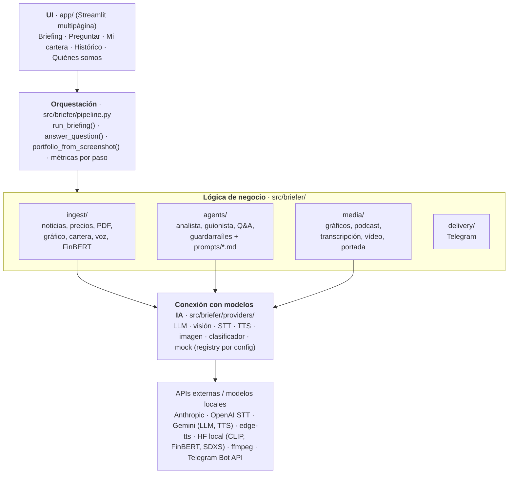

| Capa | Ubicación | Responsabilidad | No hace |
| --- | --- | --- | --- |
| UI | `app/` | Formularios, reproductores, histórico, subida de ficheros | Llamar a modelos o APIs directamente |
| Orquestación | `src/briefer/pipeline.py` | Resolver proveedores según el modo, encadenar pasos (ingesta y subidas en paralelo), medir latencia y coste, tolerar fallos (opcional → se omite; núcleo → sustituto marcado) | Lógica de prompts o de formato |
| Negocio | `ingest/`, `agents/`, `media/`, `delivery/` | Transformar datos entre contratos (`schemas.py`); reciben el proveedor por parámetro | Conocer qué proveedor concreto hay detrás |
| Proveedores | `providers/` | Hablar con cada API/modelo detrás de una interfaz común; todos tienen mock | Lógica de negocio |

Contratos (schemas Pydantic e interfaces) en [docs/03_contratos_modulos.md](docs/03_contratos_modulos.md);
decisiones de arquitectura en [docs/decisiones/](docs/decisiones/README.md) (ADR-001 a ADR-007).

---

## Estructura del repositorio

```text
.
├── app/                         # UI Streamlit (solo presentación; llama a briefer.pipeline / storage)
│   ├── main.py                  # portada (propuesta de valor + briefing destacado) y navegación
│   ├── pages/                   # 1_Briefing.py · 2_Preguntar.py · 3_Mi_cartera.py · 4_Historico.py · 5_Quienes_somos.py
│   └── components/              # theme.py (tema «Noticiero nocturno») · players.py (modos, insignias, reproductores) · trace.py («Cómo se hizo»)
├── src/briefer/                 # paquete con el nombre técnico interno (la marca visible es Briefly)
│   ├── brand.py                 # identidad: nombre, eslogan, edición, locutores Toro y Osa (fuente única)
│   ├── config.py                # Settings desde .env (pydantic-settings)
│   ├── schemas.py               # contratos de datos (Pydantic v2) + DISCLAIMER_ES
│   ├── pipeline.py              # run_briefing() y answer_question() (modos real / mock / demo_voices)
│   ├── costs.py                 # coste estimado por paso (tarifas verificadas)
│   ├── logging_utils.py         # track_step() → StepMetric, step_fell_back(), redact_secrets()
│   ├── storage.py               # guardar (sin cartera)/cargar/exportar (ZIP) briefings; briefing destacado
│   ├── providers/               # base.py · registry.py · mock.py · llm/ · vision/ · stt/ · tts/ · image/
│   ├── ingest/                  # news, article_meta, cache, tickers, prices, pdf_reader, chart_reader, portfolio, voice, sentiment
│   ├── agents/                  # analyst, scriptwriter, qa, guardrails, timeframe + prompts/{analyst,scriptwriter,qa}.md
│   ├── media/                   # charts, podcast, speech (normalización para TTS), transcript, video, cover
│   └── delivery/                # telegram_sender
├── tests/                       # 1225 tests sin red (mock y fixtures; red bloqueada) + 13 «live» (-m live)
├── scripts/                     # run.ps1 · run.sh · demo.py · smoke_real.py · telegram_setup.py · build_pitch.py · métricas y evaluación
├── notebooks/                   # 00 recorrido del pipeline · 01 evaluación de briefings · 02 comparativa de modelos (resultados en eval/)
├── pitch/                       # pitch_briefly.pdf (+ fuente HTML) y demo_guion.md
├── docs/                        # documentación (ver índice); marca en docs/assets/marca/, capturas en docs/assets/capturas/
├── data/samples/                # ejemplos versionados (CSV, JSON, PDF, PNG; cartera_ejemplo.png ficticia) + demo_briefing/
├── data/cache/ data/outputs/    # generados en ejecución (ignorados por git)
├── .github/workflows/tests.yml  # CI: ruff + mypy y pytest en mock (Python 3.11 y 3.13)
├── .streamlit/config.toml       # tema, subida máxima 50 MB, sin telemetría
├── Dockerfile  docker-compose.yml  .dockerignore
├── requirements.txt             # dependencias del MVP
├── requirements-local.txt       # opcional: modelos locales (torch, transformers, diffusers, accelerate)
├── requirements-dev.txt         # pytest-cov, ruff, mypy
├── pyproject.toml  .env.example  .gitignore
├── CLAUDE.md                    # contexto para agentes IA
└── README.md
```

---

## Mediciones

Todas las cifras salen de los `StepMetric` de ejecuciones reales (tokens reales × tarifa pública en `costs.py`;
revisado a ojo contra la consola del proveedor). Método y detalle en
[docs/04 · Método de medición](docs/04_viabilidad_costes_latencia_compliance.md#método-de-medición).

**Evaluación de N = 6 briefings reales** (06-oct-2026; 3 carteras y 3 listas de valores, una con PDF + gráfico;
[`notebooks/eval/resumen.md`](notebooks/eval/resumen.md)):

| Métrica | Resultado |
| --- | --- |
| Latencia de pared | p50 **52,7 s** · p95 **68,2 s** |
| Coste por briefing | p50 **0,034 €** · p95 **0,062 €** (0,069 € con PDF + gráfico) |
| Fiabilidad | 0 fallos · 0 pasos caídos a sustituto |
| *Grounding* y compliance | **232/232** cifras trazables · **0** frases con recomendación · 35/35 puntos clave con fuente |
| Podcast | 3,2-3,7 min (6/6 en la banda de 3-5 min) |
| Juez Sonnet (1-5) | fidelidad 3,3 · claridad 4,0 · sin consejo 4,2 · utilidad 3,3 |

**Otras mediciones**:

| Qué | Medido |
| --- | --- |
| Pregunta por voz de punta a punta (audio → STT → Haiku → voz) | p50 **6,4 s** en frío (con precalentamiento) · **6,0 s** en caliente · ≈ 0,0014 € con caché de prompt (≈ 0,006 € sin ella) |
| Transcripción de la pregunta | 1,3 s · WER 0 |
| Verificación del podcast por STT | WER 1,1 % (edge-tts) · 1,4 % (Gemini TTS) |
| Briefing con vídeo y tres subidas (gráfico, captura de cartera, paisaje) | 0,057 € · 82 s; la cartera y el paisaje se descartan sin llamar a visión (0 €) |
| Briefing dentro de Docker (gráfico, vídeo, portada local y Telegram) | 0,061 € · 114 s · 0 errores |
| Cartera desde captura del broker | 8,5 s · ≈ 0,005 € · 5/5 posiciones |
| Vídeo 9:16 · portada SDXS · router CLIP | 6-9 s · 4-7 s · 70-85 ms por imagen; los tres a 0 € |
| Telegram (mensaje, audio, imagen y vídeo) | 8,5 s |
| Demo sin claves con voces reales | ≈ 6 s · 0 € |

La comparativa Sonnet / Haiku / Gemini por agente con juez ciego
([ADR-007](docs/decisiones/ADR-007-modelos-por-agente.md),
[cuaderno 02](notebooks/02_comparativa_modelos.ipynb)) confirma Sonnet en el Analista y Haiku en Guionista y Q&A;
Gemini queda como plan B de proveedor. Para medir de nuevo: `scripts/metrics_report.py`,
`scripts/evaluar_briefings.py` y `scripts/measure_qa_voice.py` ([Anexo A](#cli)).

---

## Viabilidad y monetización

Resumen de [docs/04](docs/04_viabilidad_costes_latencia_compliance.md#6-monetización). Los costes de IA son
**medidos**; los fijos y los precios son **estimaciones** o tarifas públicas, y así se marcan allí.

| | |
| --- | --- |
| **Coste variable** | IA ≈ 0,034 € por briefing (medido) + TTS de producción con contrato (Azure, ≈ 0,049 € por episodio, estimación). Usuario Pro con episodio propio ≈ 2,1 €/mes; con generación por segmentos compartidos por valor, ≈ 0,75 €/mes |
| **Costes fijos** | ≈ 1.070 €/mes en un lanzamiento B2C · ≈ 3.700 €/mes listo para B2B2C (datos y noticias con licencia, nube en la UE, cumplimiento). Sin salarios |
| **Planes** | Free (3 valores de un catálogo compartido) · **Pro 6,99 €/mes** (cartera completa, voz, subidas, vídeo) · **Marca blanca B2B2C**: alta de 15.000 € + 1.500 €/mes + 0,30 €/MAU |
| **Punto de equilibrio** | B2C: ≈ 9.200 registrados con un 4 % de conversión · B2B2C: **un** cliente de ≈ 10.000 MAU cubre el fijo |
| **Latencia** | Briefing en ≈ 1 min en segundo plano (se prepara al cierre, el usuario no espera); Q&A por voz ≈ 6 s |
| **Conclusión** | El B2B2C es el motor (un contrato cubre el fijo y la distribución la pone el banco o *broker*); el B2C es escaparate y laboratorio |

---

## Compliance y privacidad

Cada control está en el código y tiene tests; la tabla riesgo → control → fichero está en
[docs/04 §5](docs/04_viabilidad_costes_latencia_compliance.md#5-marco-regulatorio).

- **MiFID II · informa, no asesora.** `agents/guardrails.py` detecta recomendaciones y fuerza un reintento en
  Analista y Guionista (y recorta si persisten); el Q&A reconduce las peticiones de consejo. Disclaimer visible en
  la app, en el guion (lo dice Osa al cerrar), en el vídeo y en Telegram. Red-team en
  `tests/test_agents_redteam.py`.
- **Veracidad.** Puertas de *grounding*: toda cifra del análisis y del guion debe estar en las fuentes; las
  causas sin fuente se atribuyen o se matizan. Documentos y noticias entran al LLM delimitados como dato
  (defensa ante *prompt injection*).
- **Derechos de autor.** De cada noticia solo titular, extracto ≤ 200 caracteres, fuente y enlace, respetando el
  `robots.txt` del medio; nunca el cuerpo.
- **AI Act art. 50 · transparencia.** Voces sintéticas avisadas en el audio (cierre hablado y metadatos ID3), en
  el vídeo (rótulo fijo y metadatos MP4), en la app y en Telegram; la portada lleva la placa «Imagen generada por
  IA».
- **MAR.** El «impacto de la noticia» (FinBERT) es el tono de cada noticia, nunca un agregado por valor ni una
  señal.
- **RGPD · cartera.** La cartera **no se guarda en disco** (`briefing.json` con `portfolio: null` y sin gráfico de
  cartera; [ADR-005](docs/decisiones/ADR-005-privacidad-cartera-no-persistida.md)); al LLM solo van tickers y
  pesos. La captura del broker va entera al modelo de visión, en memoria y sin guardarse (la app recomienda
  recortar nombre y nº de cuenta). Las subidas se procesan en una carpeta temporal que se borra y el audio de la
  pregunta se borra tras transcribirlo. «Borrar mis datos» en el Histórico.
- **Secretos.** Las claves se redactan en errores, métricas, logs y UI; la app escucha solo en `localhost`
  salvo que se pida lo contrario.

Briefly es un proyecto académico y una startup ficticia; el nombre no está registrado como marca. El contenido
generado puede contener errores: los modelos de IA pueden equivocarse o interpretar mal una noticia, y los
derechos de las noticias pertenecen a sus editores.

---

## Identidad

| | |
| --- | --- |
| **Nombre** | **Briefly** (la marca y el programa se llaman igual) |
| **Eslogan** | «El cierre del día, mientras vuelves a casa» |
| **Tono** | Radio nocturna: serio y preciso con los datos, cercano en la conversación. Lema: «Te contamos el mercado; tú decides.» |
| **Locutores** | **Toro** (voz A, el optimista que abre y se fija en lo que sube) y **Osa** (voz B, la prudente que pone el contexto y los riesgos y cierra con el aviso legal). Guiño a *bull & bear*; las dos voces son **sintéticas** |
| **Paleta** | «Noticiero nocturno»: fondo `#12151B`, superficie `#1C2129`, texto `#D6DEE8`, acento `#C0502A` / `#F0997B`, sube `#5DCAA5`, baja `#F09595` (contrastes WCAG AA validados en los tests) |
| **Tipografía** | Source Serif 4 (marca y titulares) · Inter (texto) · JetBrains Mono (datos y rótulos) |
| **Logo** | Cuatro velas japonesas que hacen de barras de ecualizador + «briefly» en minúscula. Variantes en [`docs/assets/marca/`](docs/assets/marca/) |

Los textos de marca viven en un único sitio, `src/briefer/brand.py`, y de ahí los leen la app, el guion, la
transcripción, los gráficos y los metadatos del audio. Guía completa en
[docs/08_identidad_marca.md](docs/08_identidad_marca.md).

---

## Demo y pitch

- **Demo grabada:** el enlace está [arriba del todo](#briefly). Recorre portada → generar un briefing real con
  gráfico, vídeo, portada y Telegram → «Puntos clave», transcripción y vídeo → «Cómo se hizo» → cartera desde
  captura → pregunta por voz → llegada a Telegram. Guion con tiempos, locución y checklist en
  [pitch/demo_guion.md](pitch/demo_guion.md).
- **Sin vídeo también se ve:** la portada de la app enseña el briefing real pregenerado de
  `data/samples/demo_briefing/` (podcast, vídeo, portada, «impacto de la noticia» y traza) sin claves ni red.
- **Pitch técnico:** [pitch/pitch_briefly.pdf](pitch/pitch_briefly.pdf), 12 diapositivas (problema, propuesta,
  demo, cadena de modelos, resultados medidos, costes, compliance, monetización, roadmap, equipo). Fuente en
  [pitch/pitch_briefly.html](pitch/pitch_briefly.html); se regenera con `python scripts/build_pitch.py` (ver
  [pitch/README.md](pitch/README.md)).

---

## Documentación

| Documento | Contenido |
| --- | --- |
| [docs/README.md](docs/README.md) | Índice operativo y ruta de lectura |
| [00 · Enunciado](docs/00_enunciado.md) | Enunciado estructurado y checklist de rúbrica |
| [01 · Producto](docs/01_producto_y_propuesta_valor.md) | Problema, público, propuesta de valor, monetización |
| [02 · Arquitectura](docs/02_arquitectura_y_flujo_datos.md) | Capas, componentes, secuencias, cadena de modelos |
| [03 · Contratos](docs/03_contratos_modulos.md) | Schemas, interfaces y reparto por carriles |
| [04 · Viabilidad](docs/04_viabilidad_costes_latencia_compliance.md) | Costes, latencias, compliance, monetización |
| [05 · Roadmap](docs/05_roadmap_TODO.md) | Plan por fases y tareas hasta la entrega |
| [06 · Estado actual](docs/06_estado_actual.md) | Qué funciona, mediciones, riesgos y registro de jornadas |
| [07 · Revisión crítica](docs/07_revision_critica.md) | Revisión del plan: hallazgos, prioridades MoSCoW, plan por fases |
| [08 · Identidad de marca](docs/08_identidad_marca.md) | Guía de marca de Briefly: logo, colores, tipografía, tono, locutores |
| [Decisiones (ADR)](docs/decisiones/README.md) | Decisiones de arquitectura |
| [Material de clase](docs/clase/00_indice.md) | Resumen del material del taller |
| [Cuadernos](notebooks/README.md) | Recorrido del pipeline, evaluación de briefings, comparativa de modelos |
| [Pitch](pitch/README.md) | Deck técnico y guion de la demo |

---

## Equipo

| Integrante | Notas |
| --- | --- |
| Óscar Romero Quincoces | |
| Daniel García | Integración de FinBERT: «impacto de la noticia» (PR #1) |
| **TODO: tercer integrante** | |

El trabajo se organizó en tres carriles paralelos, cada uno contra los mocks de `providers/mock.py` y los
contratos de `schemas.py`:

| Carril | Ámbito |
| --- | --- |
| **A** · Entradas y procesado | Noticias, precios, PDF, gráficos, cartera, voz, router CLIP, FinBERT |
| **B** · Agentes y orquestación | Analista, Guionista, Q&A, guardarraíles, pipeline, costes y métricas |
| **C** · Salidas y UI | Podcast, transcripción, gráficos, vídeo, portada, Telegram y la app Streamlit |

Máster MIAX · Taller B5-T4 · Entrega 8-oct-2026.

---

## Anexo A · Arranque en detalle, modos y CLI

### Scripts de arranque

```powershell
powershell -ExecutionPolicy Bypass -File scripts\run.ps1          # MVP en http://localhost:8501
powershell -ExecutionPolicy Bypass -File scripts\run.ps1 -Local   # + modelos locales (requirements-local.txt)
powershell -ExecutionPolicy Bypass -File scripts\run.ps1 -Expose  # visible desde otros equipos de la red
```

```bash
bash scripts/run.sh            # MVP en http://localhost:8501
bash scripts/run.sh --local    # + modelos locales (requirements-local.txt)
bash scripts/run.sh --expose   # visible desde otros equipos de la red
```

Ambos scripts buscan un **Python ≥ 3.11** (en Windows también el lanzador `py`), crean `.venv`, instalan
`requirements.txt` (y `requirements-local.txt` con `-Local` / `--local`) **solo si los requirements han cambiado**
desde la última instalación (así se puede relanzar sin red el día de la demo), **se detienen con un mensaje claro
si `pip` falla**, copian `.env.example` a `.env` si no existe, fijan `PYTHONPATH=src` y lanzan
`streamlit run app/main.py`. Por defecto la app escucha **solo en `localhost`**, para no exponer tus claves de API
en la red; `-Expose` / `--expose` la abre a la red local (con aviso). Otras opciones: `-Port N` / `--port N`
(8501 por defecto) y `-Reinstall` / `--reinstall` (fuerza `pip install`).

`run.ps1` está verificado desde un **clon limpio** en Windows sin `.env` (la app responde a los 220 s con el
briefing pregenerado, en modo demo). `run.sh` sigue la misma lógica; su prueba en un clon limpio de Linux
(`python:3.11-slim`) llegó a crear `.venv` e instalar, pero se cortó por la red lenta antes de terminar.

Manualmente: `pip install -r requirements.txt` (o `pip install -e .`, y `pip install -e .[local]` para los
modelos locales) y `streamlit run app/main.py`.

### Docker

```bash
docker compose up --build      # http://localhost:8501
```

Requiere **Docker Compose ≥ 2.24** (usa `env_file` con `required: false`: si no hay `.env`, arranca en modo
demo). La imagen (Python 3.11, usuario **no root** con UID 1000, `TZ=Europe/Madrid`, *healthcheck* en
`/_stcore/health`) incluye ffmpeg y, por defecto (`ARG LOCAL_MODELS=true`), torch CPU + transformers + diffusers +
accelerate, de modo que CLIP, FinBERT y la portada local funcionan en el contenedor (`--build-arg
LOCAL_MODELS=false` para una imagen mínima). Los modelos de Hugging Face se guardan en el volumen `hf-cache`;
`data/outputs/` y `data/cache/` se montan como volúmenes (en Linux, si tu UID no es 1000, da permisos de escritura
a esas carpetas). Compose publica el puerto **solo en este equipo** (`127.0.0.1:8501`).

**Verificado el 06-oct-2026** (Docker Desktop, Windows): imagen de 3,37 GB (769 MB comprimida), contenedor
*healthy* a los 10 s y briefing real dentro del contenedor:

```bash
docker compose exec briefer python scripts/demo.py --tickers SAN.MC AAPL --video --cover \
  --upload data/samples/grafico_ejemplo.png --deliver telegram
```

114 s, 0,061 €, 0 pasos con error (portada SDXS, vídeo y Telegram incluidos). Consejos: usa **rutas de modelos
relativas** en `.env` (p. ej. `BRIEFER_SDXL_MODEL=data/cache/models/sdxs-512-dreamshaper`) para que el mismo
`.env` valga en Windows y en el contenedor, y **construye la imagen con antelación** (con la red lenta, la
*build* tardó entre 6 y 60 min).

### Lo primero que se ve: el briefing pregenerado

Al abrir la app, la portada muestra el **último briefing real guardado** o, si no hay ninguno, el **briefing
real pregenerado** del repo (`data/samples/demo_briefing/`: cinco valores del IBEX y de EE. UU. con un PDF y un
gráfico de ejemplo, voz premium de Gemini TTS, «impacto de la noticia» con FinBERT, portada local, vídeo y traza
«Cómo se hizo»). Un briefing de ensayo en modo demo (mock, datos de ejemplo o sustitutos) **nunca** lo tapa. Desde
la portada, «Preguntar sobre este briefing» lleva al Agente Q&A y «Generar el tuyo» abre el formulario. Se
regenera con `storage.export_briefing`, no se edita a mano.

### Modos de ejecución

| Modo | Qué hace | Necesita | UI | CLI |
| --- | --- | --- | --- | --- |
| **Real** | Noticias y precios reales (caché diaria en `data/cache/`), Claude para análisis, guion, visión y Q&A, STT de OpenAI para la voz, edge-tts (o Gemini TTS con `BRIEFER_TTS_PROVIDER=gemini`); FinBERT si `BRIEFER_FINBERT=true` | `ANTHROPIC_API_KEY` + red (`OPENAI_API_KEY` para preguntar por voz) | Interruptor «Modo real (APIs de .env)» en la barra lateral (bloqueado si faltan claves, con el motivo) | `python scripts/demo.py` |
| **Demo sin claves (voces reales)** | Noticias de ejemplo, precios sintéticos y modelos simulados, pero el podcast y la respuesta del Q&A **suenan** con edge-tts | Red (edge-tts es gratis y sin clave) | «Tipo de demo» → demo sin claves | `python scripts/demo.py --demo-voices` |
| **Mock offline** | Todo simulado y determinista; el audio es un WAV mudo | Nada | «Tipo de demo» → demo offline | `python scripts/demo.py --mock` |

En modo real, si un proveedor falla en un paso núcleo, el briefing termina igualmente con un sustituto (datos de
ejemplo o mock) **y la UI lo avisa** (insignias, avisos y nodo naranja en «Cómo se hizo»). El botón «Refrescar
datos» (o `--refresh`) ignora la caché del día.

### CLI

```bash
python scripts/demo.py --demo-voices                              # sin claves, con voces reales (~6 s, 0 €)
python scripts/demo.py --mock                                     # todo mock, sin red
python scripts/demo.py --mock --video --cover                     # + vídeo 9:16 y portada (mock), sin red
python scripts/demo.py --tickers SAN.MC AAPL --upload data/samples/resultados_ejemplo.pdf data/samples/grafico_ejemplo.png
python scripts/demo.py --refresh                                  # real, ignorando la caché diaria
python scripts/demo.py --question "¿Qué dice el PDF?" --briefing pregenerado --warmup
python scripts/demo.py --mock --strict                            # sale con 3 si algún paso usó un sustituto
python scripts/smoke_real.py                                      # prueba de humo de cada proveedor con clave (< 0,01 €)
python scripts/telegram_setup.py --write --test                   # configura el chat de Telegram (Anexo C)
python -m pytest -q                                               # 1225 tests sin red (los «live» con -m live)
ruff check src app scripts tests && mypy                          # estilo y tipos, como la CI (pip install -r requirements-dev.txt)
python scripts/metrics_report.py --include-demo                   # p50/p95 de latencia y coste de los briefings guardados
python scripts/evaluar_briefings.py                               # evaluación de briefings (tabla en notebooks/eval/); --real genera y juzga lo que falte (gasta)
python scripts/measure_qa_voice.py                                # cadena de voz del Q&A (audio → STT → Q&A → voz), en frío y caliente
python scripts/build_pitch.py                                     # regenera pitch/pitch_briefly.pdf
```

Flags de `scripts/demo.py`: `--tickers T [T ...]` (por defecto `BRIEFER_DEFAULT_TICKERS`; admite nombres como
«santander»), `--portfolio CSV`, `--upload [FICHERO ...]` (PDF, imagen o audio), `--video`, `--cover` (necesita
`BRIEFER_IMAGE_GEN_PROVIDER` distinto de `none` en modo real), `--deliver telegram`, `--mock` o `--demo-voices`
(excluyentes; sin ninguno, modo real), `--refresh`, `--question TEXTO` (pregunta al Agente Q&A en vez de generar),
`--briefing auto|pregenerado|ninguno|<id o ruta>` (contexto de la pregunta), `--warmup` y `--strict`. Imprime la
tabla de pasos con proveedor, latencia, coste estimado y caídas a sustituto. **Códigos de salida:** 0 bien · 1
falló un paso núcleo (dice cuál y lo ya gastado) · 2 entrada inválida · 3 con `--strict`, algún paso usó un
sustituto · 130 interrumpido.

`scripts/smoke_real.py` hace una llamada mínima real por proveedor configurado (Anthropic texto, estructurado y
visión, Gemini, TTS y STT; el STT transcribe el audio que acaba de generar el TTS y se valida con el WER) e
imprime `OK` / `FAIL` / `SKIP` con latencia y coste; nunca imprime claves. Opciones: `--only anthropic gemini
audio`, `--gemini-model`.

Cuadernos (en [`notebooks/`](notebooks/)):
[00 · recorrido del pipeline paso a paso](notebooks/00_recorrido_pipeline.ipynb) (mock, sin red ni claves, 13 s) ·
[01 · evaluación de briefings reales](notebooks/01_evaluacion_briefings.ipynb) ·
[02 · comparativa de modelos por agente](notebooks/02_comparativa_modelos.ipynb).

---

## Anexo B · Configuración

Toda la configuración vive en `.env` (nunca se versiona) y se lee en `src/briefer/config.py`
(pydantic-settings, sin distinguir mayúsculas). Plantilla completa y comentada en `.env.example`.

**Ojo con los valores por defecto:** en el **código** todos los proveedores son `mock` (y `none` para imagen y
clasificador) para que tests y desarrollo funcionen sin red ni claves; **`.env.example` propone el stack real**
del MVP (`anthropic` + `claude` + `whisper_api` + `edge`). La columna «`.env.example`» indica el valor que
queda al copiar la plantilla. La pregunta por voz real necesita `OPENAI_API_KEY`; sin ella, el STT cae a `mock`
(transcripción marcada `[MOCK]`).

Sin `ANTHROPIC_API_KEY` (u otra clave necesaria) la app sigue arrancando: con `BRIEFER_FALLBACK_TO_MOCK=true`
el `registry` cae a `mock` y lo deja en el log; la barra lateral muestra una insignia por familia («real» o
«MOCK (falta X)») y bloquea el modo real con el motivo. Solo se aceptan proveedores implementados: un `.env`
antiguo que nombre uno retirado (`openai` como LLM, `qwen_local`, `whisper_local`, `elevenlabs`) pasa esa familia
a `mock` con un aviso; cualquier otro nombre no válido hace fallar la configuración al arrancar.

### Proveedores

| Variable | Valores | Código | `.env.example` | Para qué |
| --- | --- | --- | --- | --- |
| `BRIEFER_LLM_PROVIDER` | `anthropic` · `gemini` · `mock` | `mock` | `anthropic` | Agentes analista, guionista y Q&A |
| `BRIEFER_VISION_PROVIDER` | `claude` · `mock` | `mock` | `claude` | Lectura de gráficos, páginas de PDF y capturas de cartera |
| `BRIEFER_STT_PROVIDER` | `whisper_api` · `mock` | `mock` | `whisper_api` | Pregunta por voz y verificación del podcast |
| `BRIEFER_TTS_PROVIDER` | `edge` · `gemini` · `mock` | `mock` | `edge` | Podcast y respuesta hablada. `gemini` (de pago, `GEMINI_API_KEY`) solo cambia el podcast: si falla, cae a edge-tts, y el Q&A habla siempre con edge-tts |
| `BRIEFER_IMAGE_GEN_PROVIDER` | `local` (alias `sdxl_turbo`) · `gemini` · `none` · `mock` | `none` | `none` | Portada (opcional). `local` es gratis (SDXS en CPU, `requirements-local.txt`, ~1,8 GB la primera vez). `gemini` es de pago (≈ 0,029 € por portada, requiere **facturación activa**). Con `none`, la casilla «Portada con IA» se desactiva en modo real |
| `BRIEFER_IMAGE_CLASSIFIER_PROVIDER` | `clip` · `none` · `mock` | `none` | `none` | Router de las imágenes subidas (opcional, local y gratis). `clip` necesita `requirements-local.txt`; la primera vez descarga ~600 MB |
| `BRIEFER_FALLBACK_TO_MOCK` | `true` · `false` | `true` | `true` | Si falta clave o librería: mock con aviso (`true`) o `ProviderConfigError` (`false`) |

### Modelos

| Variable | Por defecto (código y `.env.example`) | Para qué |
| --- | --- | --- |
| `BRIEFER_LLM_MODEL` | `claude-sonnet-5-5` | Agente Analista (Anthropic) |
| `BRIEFER_LLM_MODEL_CHEAP` | `claude-haiku-4-5-20251001` | Guionista, Q&A y estructurado de PDF/gráfico/cartera (`get_llm(cheap=True)`) |
| `BRIEFER_SCRIPTWRITER_MODEL` | vacío (= el barato) | Modelo del Guionista si se quiere otro, p. ej. `claude-sonnet-5-5` (≈ 2,6-2,9× más caro; ver [ADR-006](docs/decisiones/ADR-006-guionista-haiku-puertas-deterministas.md)) |
| `BRIEFER_GEMINI_MODEL` | `gemini-2.5-flash` | LLM si `BRIEFER_LLM_PROVIDER=gemini` |
| `BRIEFER_VISION_MODEL` | `claude-sonnet-5-5` | Visión con Claude |
| `BRIEFER_WHISPER_API_MODEL` | `gpt-4o-mini-transcribe` (alternativa: `whisper-1`) | STT por API (OpenAI): WER 0, 1,3 s y la mitad de coste que `whisper-1`; máximo 25 MB por audio |
| `BRIEFER_GEMINI_IMAGE_MODEL` | `gemini-3.1-flash-lite-image` | Portada con Gemini (0,0336 $ por imagen 1K, tarifa oficial consultada el 06-oct-2026) |
| `BRIEFER_SDXL_MODEL` | `IDKiro/sdxs-512-dreamshaper` | Portada local (SDXS, OpenRAIL++, uso comercial); admite una ruta local relativa |
| `BRIEFER_SDXL_STEPS` | `0` | Pasos de la portada local (`0` = los del modelo: 1 en SDXS) |
| `BRIEFER_CLIP_MODEL` | `openai/clip-vit-base-patch32` | Router de imágenes local (CPU) |
| `BRIEFER_LOCAL_DEVICE` | `auto` (`auto` · `cpu` · `cuda` · `mps`) | Dispositivo de los modelos locales |

### Idioma, voces y contenido

| Variable | Por defecto (código y `.env.example`) | Para qué |
| --- | --- | --- |
| `BRIEFER_LANGUAGE` | `es` | Idioma de STT y contenido |
| `BRIEFER_VOICE_A` · `BRIEFER_VOICE_B` | `es-ES-AlvaroNeural` · `es-ES-XimenaNeural` | Voces edge-tts de Toro (A) y Osa (B; también responde en el Q&A). Elegidas en una cata a ciegas |
| `BRIEFER_GEMINI_TTS_MODEL` | `gemini-3.8-flash-tts` | Modelo de Gemini TTS si `BRIEFER_TTS_PROVIDER=gemini` |
| `BRIEFER_GEMINI_VOICE_A` · `BRIEFER_GEMINI_VOICE_B` | `Puck` · `Kore` | Voces de Gemini para Toro (A) y Osa (B) |
| `BRIEFER_SPEAKER_A_NAME` · `BRIEFER_SPEAKER_B_NAME` | `Toro` · `Osa` | Nombres de los locutores (por defecto, los de `src/briefer/brand.py`) |
| `BRIEFER_TTS_RATE` · `BRIEFER_TTS_PITCH` | `+10%` · vacío (`+0Hz`) | Velocidad y tono de edge-tts |
| `BRIEFER_VERIFY_PODCAST` | `true` | En modo real, el STT escucha el podcast y mide el WER contra el guion |
| `BRIEFER_DEFAULT_TICKERS` | `SAN.MC,ITX.MC,IBE.MC,AAPL,NVDA` | Valores por defecto (formato Yahoo, separados por comas) |
| `BRIEFER_CONTEXT_TICKERS` | `^IBEX,^GSPC` | Índices de referencia: precios y noticias de mercado en todo briefing |
| `BRIEFER_NEWS_RSS_FEEDS` | vacío | Feeds RSS generalistas; vacío = Expansión «Mercados» + Europa Press (además, por valor: Google News, Bing News, Yahoo y yfinance) |
| `BRIEFER_NEWS_MAX_ITEMS` | `20` | Máximo de noticias por briefing |
| `BRIEFER_FINBERT` | `false` | «Impacto de la noticia» (Haiku traduce + FinBERT clasifica). Necesita `requirements-local.txt` |
| `BRIEFER_PODCAST_TARGET_MINUTES` | `4` | Duración objetivo del podcast |

### Claves

| Variable | Por defecto | Para qué |
| --- | --- | --- |
| `ANTHROPIC_API_KEY` | vacío | LLM y visión con Claude |
| `OPENAI_API_KEY` | vacío | STT: voz a texto y verificación del podcast (opcional) |
| `GEMINI_API_KEY` | vacío | LLM Gemini, TTS Gemini multi-locutor y portada con Gemini imagen (opcional) |
| `TELEGRAM_BOT_TOKEN` · `TELEGRAM_CHAT_ID` | vacío | Entrega por Telegram (opcional; ver [Anexo C](#anexo-c--telegram)) |

### Rutas y logging

| Variable | Por defecto | Para qué |
| --- | --- | --- |
| `BRIEFER_DATA_DIR` · `BRIEFER_CACHE_DIR` · `BRIEFER_OUTPUT_DIR` · `BRIEFER_SAMPLES_DIR` | `data` · `data/cache` · `data/outputs` · `data/samples` | Rutas (relativas a la raíz del repo si no son absolutas) |
| `BRIEFER_LOG_LEVEL` | `INFO` | `DEBUG` · `INFO` · `WARNING` · `ERROR`. Solo con `DEBUG` la UI enseña el *traceback* de un error (siempre con las claves redactadas) |

---

## Anexo C · Telegram

El envío por Telegram (`delivery/telegram_sender.py`) está **verificado en real** (06-oct-2026: mensaje, audio,
imagen y vídeo en 8,5 s). Para configurar tu propio bot, una sola vez:

1. En Telegram, abre **@BotFather** → `/newbot` → elige nombre y usuario → copia el token.
2. Pon el token en `.env`: `TELEGRAM_BOT_TOKEN=<token>` (nunca en un chat ni en un issue).
3. Abre la conversación con tu bot y escríbele algo (p. ej. `/start`).
4. `python scripts/telegram_setup.py --write` comprueba el bot (`getMe`), lista los chats que le han escrito
   (`getUpdates`, últimas 24 h) y escribe `TELEGRAM_CHAT_ID` en `.env` (solo esa línea). Si hay varios chats,
   añade `--chat-id <id>`.
5. `python scripts/telegram_setup.py --test` envía un mensaje de prueba.

Con las dos variables rellenas, la casilla de envío por Telegram aparece en «Opciones avanzadas» de la página del
briefing (o `python scripts/demo.py --deliver telegram`). Se envía: el resumen (HTML, con fuentes y aviso legal),
el podcast, la portada (con el pie «Imagen generada por IA») o, si no hay, el gráfico general, y el vídeo si se
generó (límites de la Bot API: 50 MB audio y vídeo, 10 MB foto; lo que se pasa se omite y se avisa). Si falla el
mensaje, el envío falla; si falla una pieza posterior, el resto cuenta como enviado y el detalle dice qué faltó.
El token nunca aparece en errores, logs ni traza.
