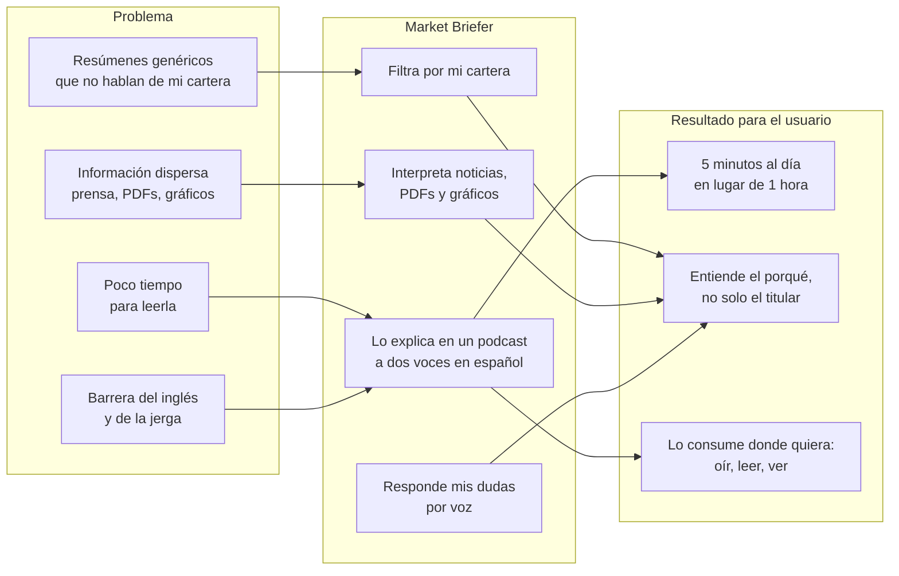

# 01 · Producto y propuesta de valor

## Esquema del producto

## Problema

El inversor minorista que gestiona su propia cartera tiene un problema de **tiempo y de formato**, no de
acceso a la información:

- Las noticias relevantes para *sus* valores están mezcladas con cientos de titulares irrelevantes.
- Las fuentes primarias (resultados trimestrales en PDF, gráficos técnicos) exigen tiempo y formación.
- Buena parte de la información de calidad está en inglés y con jerga.
- Los formatos que sí consume a diario (podcasts, vídeo corto) son genéricos y no conocen su cartera.

## Público objetivo

| Segmento | Tipo | Descripción | Papel en el MVP |
| --- | --- | --- | --- |
| Inversor minorista hispanohablante | **B2C (principal)** | 25-55 años, cartera propia en broker online (acciones y ETFs, 5-20 posiciones), sin tiempo para seguir el mercado a diario | Usuario de la app web |
| Brokers y neobancos | B2B2C (canal) | Quieren aumentar el engagement diario de sus clientes con contenido propio | Cliente *white-label*: el briefing con su marca dentro de su app |
| Newsletters y medios financieros | B2B2C (canal) | Quieren convertir su contenido escrito en audio/vídeo sin estudio de grabación | Cliente de la API de generación |

El MVP se diseña para el **B2C**; el B2B2C es el canal de escalado que justifica la arquitectura por
proveedores y la generación compartida por ticker (ver [04](04_viabilidad_costes_latencia_compliance.md)).

## Propuesta de valor diferencial

La multimodalidad no es decorativa: cada modalidad resuelve una fricción concreta.

| Fricción | Modalidad | Qué aporta |
| --- | --- | --- |
| «No tengo tiempo de leer» | Texto → audio (podcast a 2 voces) | Se consume mientras se hace otra cosa; dos voces hacen el contenido más didáctico que una locución plana |
| «No entiendo este PDF de resultados» | Documento → texto (visión) | Extrae cifras clave y las lleva al análisis del día |
| «¿Qué significa este gráfico?» | Imagen → texto (visión) | El usuario sube la captura de su broker y entra en el briefing |
| «Tengo una duda concreta» | Audio → texto → texto → audio | Pregunta hablando, responde hablando: experiencia de asistente de voz |
| «Quiero verlo de un vistazo» | Datos → imagen, imagen + audio → vídeo | Gráficos del día y vídeo corto compartible |
| «Quiero leerlo después» | Transcripción + SRT | Accesibilidad y consulta rápida |

**Diferencial frente a un chat financiero:** el usuario no tiene que saber qué preguntar. El producto es
*push* (llega solo cada mañana), personalizado por cartera, y el chat por voz es un complemento, no el núcleo.

## Casos de uso

| ID | Caso | Modalidades | Flujo |
| --- | --- | --- | --- |
| CU1 | Briefing diario de mi cartera | texto → texto → audio, datos → imagen | Cartera → noticias filtradas → análisis → guion → podcast + gráficos |
| CU2 | Briefing enriquecido con un PDF de resultados | documento → texto | Sube el PDF de la empresa → cifras clave entran en el análisis |
| CU3 | «Explícame este gráfico» | imagen → texto | Sube captura de velas → descripción entra en el análisis |
| CU4 | Pregunta por voz sobre el briefing | audio → texto → texto → audio | «¿Por qué ha caído Inditex hoy?» → respuesta hablada con fuentes |
| CU5 | Recibirlo sin abrir la app | entrega | Email con transcripción + enlace; Telegram con el audio |
| CU6 | Compartir un resumen visual | imagen + audio → vídeo | Vídeo corto con gráficos, subtítulos y audio |
| CU7 | Consultar días anteriores | — | Histórico de briefings guardados |

## Competencia y alternativas

| Alternativa | Qué hace bien | Qué le falta frente a Market Briefer |
| --- | --- | --- |
| Podcasts de mercado generalistas | Calidad editorial, voz humana | No conocen tu cartera; horario fijo; no puedes preguntar |
| Newsletters financieras | Curación, análisis | Texto; genéricas; en inglés muchas de las buenas |
| Apps de broker (noticias por valor) | Integradas con la cartera | Titulares sueltos sin interpretación ni audio |
| Chat generalista con IA | Responde lo que preguntes | Hay que saber preguntar; no es *push*; no genera podcast ni lee tu PDF en un flujo |
| Herramientas de «texto a podcast» | Convierten documentos en audio | No son financieras, no filtran por cartera, no tienen compliance |

**Hueco:** contenido financiero *push*, personalizado por cartera, en español, multiformato y con capa de
compliance desde el diseño.

## Monetización

| Modelo | Precio orientativo | Incluye |
| --- | --- | --- |
| Freemium | 0 € | Briefing diario de hasta 3 tickers, voces gratuitas, sin Q&A por voz o con cupo bajo |
| Suscripción Pro | 4,99-7,99 €/mes *(a validar)* | Cartera completa, Q&A por voz, PDFs y gráficos propios, vídeo, email/Telegram, voces premium |
| White-label B2B2C | Licencia + por usuario activo *(a negociar)* | Briefing con la marca del broker/neobanco, integración vía API |

Números y supuestos detallados en [04](04_viabilidad_costes_latencia_compliance.md#monetización).

## Métricas de producto

Métricas que se medirían en un piloto. **Ninguna está medida en el MVP.**

| Métrica | Qué indica | Objetivo orientativo |
| --- | --- | --- |
| % de usuarios que escuchan el briefing ≥ 3 días/semana | Hábito | > 40 % |
| % de escucha completa del episodio | Calidad y duración del guion | > 60 % |
| Preguntas por voz por usuario activo y semana | Valor del Q&A | ≥ 2 |
| Conversión free → Pro | Monetización | 3-5 % |
| Coste de generación por usuario activo y mes | Viabilidad | < 15 % del ingreso por usuario |
| Latencia de respuesta del Q&A | UX | < 10 s |
| Errores factuales detectados por cada 100 briefings | Confianza | Tendencia a 0 |
