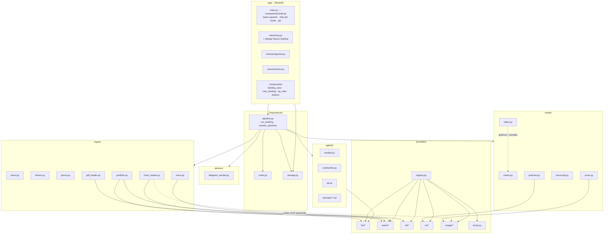
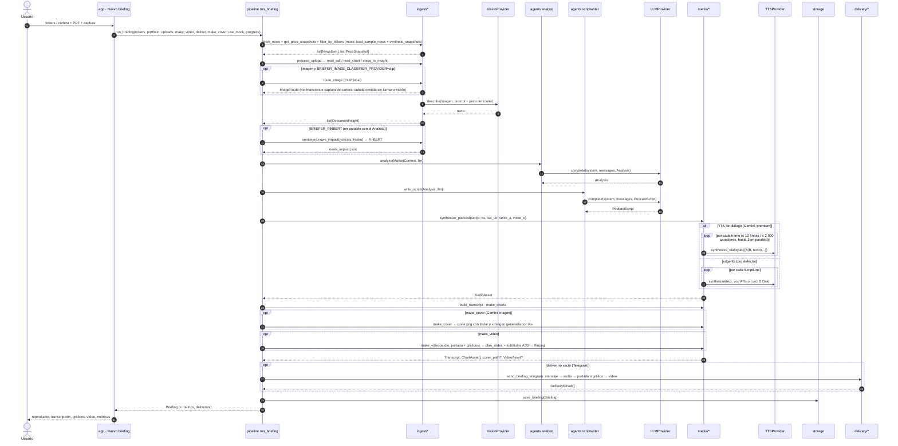
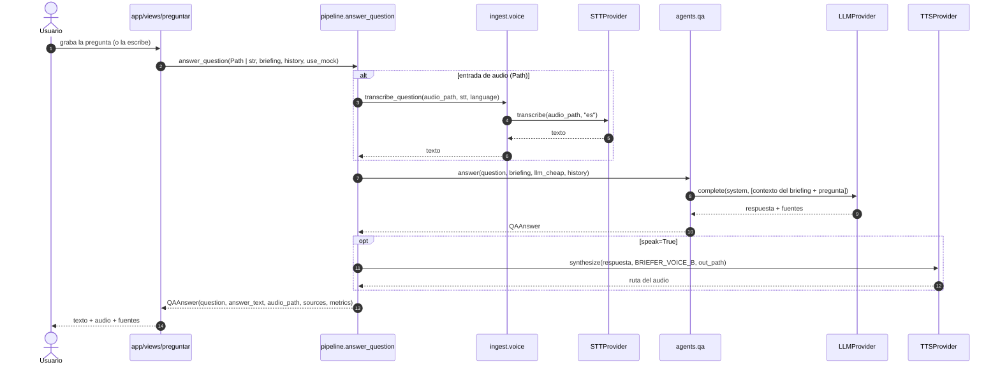

# 02 · Arquitectura y flujo de datos

## Capas

| Capa | Paquete | Depende de | Regla |
| --- | --- | --- | --- |
| UI | `app/` | `briefer.pipeline`, `briefer.storage`, `briefer.schemas`, `briefer.config`, `briefer.costs`; además `ingest.tickers.TICKER_UNIVERSE`, `ingest.portfolio.load_portfolio_csv` y `providers.registry.describe_providers` (solo lee la configuración) | Nunca instancia proveedores ni importa SDKs de IA |
| Orquestación | `briefer/pipeline.py` | ingest, agents, media, delivery, storage, costs, `providers.registry` | Resuelve los proveedores (`get_providers`), los inyecta, encadena y mide; sin prompts ni formato |
| Negocio | `briefer/ingest`, `agents`, `media`, `delivery` | `providers.base`, `schemas` | Recibe el proveedor por parámetro y lo usa solo vía las interfaces de `providers/base.py` |
| Proveedores | `briefer/providers/` | SDKs externos | Única capa que importa `anthropic`, `openai`, `edge_tts`, etc. |
| Transversal | `config.py`, `schemas.py`, `costs.py`, `logging_utils.py`, `storage.py`, `brand.py` | — | Sin dependencias de capas superiores. `brand.py` es la fuente única de la identidad visible (**Briefly**: nombre, eslogan, edición, locutores Toro y Osa); el paquete sigue llamándose `briefer` |

## Diagrama de componentes



## Mapeo caja del diagrama → módulo

Fuente: `docs/assets/arquitectura_mvp_podcast_financiero.png`.

| Columna | Caja | Módulo | Función pública | Proveedor |
| --- | --- | --- | --- | --- |
| 1 · Entradas | Noticias de mercado | `ingest/news.py` | `fetch_news(tickers, max_items, since, rss_feeds)`; en mock `load_sample_news()` | yfinance + RSS (sin IA) |
| | Precios (gráficos y contexto) | `ingest/prices.py` | `get_price_snapshots(tickers, period)`; en mock `synthetic_snapshots(tickers)` | yfinance (sin IA) |
| | Captura de gráfico | subida en «Documentos» del diálogo «Nuevo briefing» (`app/components/new_briefing.py`) → `pipeline.process_upload` | — | — |
| | Cartera del usuario | `ingest/portfolio.py`, sección «Tu cartera» de `app/components/new_briefing.py` | `load_portfolio_csv(source, name)` (CSV) · `pipeline.portfolio_from_screenshot(image, mode=…)` → `portfolio_from_image(image, vision, llm)` (captura del broker) | CSV: — · captura: `VisionProvider` (transcribe) + `LLMProvider` barato (estructura) + mapeo determinista a tickers |
| | PDF de resultados | subida en «Documentos» de `app/components/new_briefing.py` → `pipeline.process_upload` | — | — |
| | Pregunta por voz | `app/views/preguntar.py` (`st.chat_input(accept_audio=True)`: voz y texto en la misma barra) → `pipeline.answer_question(Path)` | — | — |
| 2 · Procesado | Filtro por tickers | `ingest/tickers.py` | `filter_by_tickers(news, tickers)` | — |
| | Router de imágenes *(opcional, `BRIEFER_IMAGE_CLASSIFIER_PROVIDER=clip`)* | `ingest/chart_reader.py` | `route_image(image, classifier, stats_out)` → `ImageRoute` (gráfico · tabla · cartera · no financiera) | `ImageClassifier` (CLIP local, CPU) |
| | Lectura de imagen | `ingest/chart_reader.py` | `read_chart(image, source_name, vision, llm, *, route=…)` | `VisionProvider` + LLM barato (estructura) |
| | Lectura de PDF | `ingest/pdf_reader.py` | `read_pdf(path, llm, vision, max_pages)` | `pypdf` + `LLMProvider` barato + `VisionProvider` |
| | Voz a texto | `ingest/voice.py` | `transcribe_question(audio_path, stt, language)` (Q&A) · `voice_to_insight(...)` (audio subido al briefing) | `STTProvider` |
| | Impacto de la noticia *(opcional, `BRIEFER_FINBERT`)* | `ingest/sentiment.py` | `news_impact(news, llm_barato)` → `news_impact.json` (fuera del contrato `Briefing`) | Haiku (traducción) + FinBERT local (`torch` + `transformers`) |
| 3 · Agentes IA | Agente Analista | `agents/analyst.py` | `analyze(context, llm)` | `LLMProvider` |
| | Agente Guionista | `agents/scriptwriter.py` | `write_script(analysis, llm, target_minutes, speaker_names)` | `LLMProvider` |
| | Agente Q&A | `agents/qa.py` | `answer(question, briefing, llm, history)` | `LLMProvider` (modelo barato) |
| 4 · Salidas | Gráficos del día | `media/charts.py` | `make_charts(prices, out_dir, portfolio)` | matplotlib |
| | Audio podcast (2 voces) | `media/podcast.py` | `synthesize_podcast(script, tts, out_dir, voice_a, voice_b)` (pausas variables; con Gemini, por tramos de diálogo) | `TTSProvider` (edge-tts por defecto; Gemini TTS premium) |
| | Transcripción | `media/transcript.py` | `build_transcript(script, segments, out_dir, speaker_names)` | — (tiempos del TTS) |
| | Vídeo corto *(opcional)* | `media/video.py` | `make_video(audio, images, out_path, transcript, size=(720, 1280), title=…)` | Pillow (diapositivas) + ffmpeg de `imageio-ffmpeg` (libx264, subtítulos ASS); sin moviepy |
| | Portada *(opcional)* | `media/cover.py` | `make_cover(analysis, image_gen, out_dir)` | `ImageGenProvider` (`GeminiImage`) + Pillow (titular y placa «Imagen generada por IA») |
| 5 · Entrega | App web | `app/` | — | Streamlit |
| | Telegram | `delivery/telegram_sender.py` | `send_briefing_telegram(briefing, chat_id, settings)`; chat con `scripts/telegram_setup.py` | Telegram Bot API (`requests`) |

Firmas exactas en [03_contratos_modulos.md](03_contratos_modulos.md) (v0.3.5). Al cierre de la fase 1 (06-oct)
todas las funciones de esta tabla están implementadas y probadas sin red, y en real salvo dos: `make_cover` con
`GeminiImage` (la clave del equipo no tiene facturación y los modelos de imagen no tienen nivel gratuito) y
`send_briefing_telegram` (falta crear el bot). El canal email se retiró el 06-oct (decisión de producto: la
entrega es por web y Telegram). Ver [06](06_estado_actual.md).

## Secuencia · generación del briefing



Cada paso se envuelve en `logging_utils.track_step(...)`, que añade un `StepMetric` (latencia real + coste
estimado vía `costs.estimate_cost_eur`) incluso si el paso falla. La entrega se hace **antes** de guardar, para
que `briefing.json` incluya `deliveries` (siempre con la entrada `web`).

**Cartera desde captura.** No pasa por `run_briefing`: la sección «Tu cartera» del diálogo «Nuevo briefing» llama a
`pipeline.portfolio_from_screenshot(image)` (paso `ingest.portfolio_image`: visión transcribe la tabla de
posiciones → Haiku la estructura → mapeo determinista a tickers y pesos), y la `Portfolio` resultante queda en la
sesión de Streamlit como la del CSV. Así sus tickers ya están fijados cuando se genera el briefing; por eso una
captura de cartera subida junto a los gráficos se desvía con un aviso en vez de leerse.

**Tolerancia a fallos** ([ADR-003](decisiones/ADR-003-tolerancia-fallos-y-contratos-v02.md)): cada paso es
**núcleo** u **opcional** (lista en [03](03_contratos_modulos.md#pasos-núcleo-y-pasos-opcionales)). Un paso
opcional que falla (una subida, portada, vídeo, un canal de entrega, el guardado) deja su `StepMetric` con
`error`, se registra en el log y el briefing sigue; un canal caído queda en `deliveries` con `ok=False`. Un paso
núcleo que falla lanza `PipelineStepError` con el nombre del paso (`StepNotImplementedError` si es un *stub*: la
UI lo muestra como «Pendiente»). Dentro de los pasos hay reintentos locales (TTS por línea, reescritura del
Guionista). Además del fallback del `registry` al **crear** el proveedor (`BRIEFER_FALLBACK_TO_MOCK`), un paso
núcleo con proveedor real que falla se repite con un sustituto (mock o datos de ejemplo) y queda marcado en la UI
(desde v0.3).
El guardado va al final y su métrica también queda en `Briefing.metrics`.

## Secuencia · pregunta por voz (Q&A)



El Q&A solo responde con el contexto del briefing (noticias, insights y análisis del día). Si la pregunta pide
una recomendación personal («¿vendo?»), el prompt obliga a reconducirla a información genérica con el
disclaimer.

## Cadena de modelos

| Paso | Entrada | Modelo por defecto | Salida | Encadena con |
| --- | --- | --- | --- | --- |
| 0 | Imagen subida | CLIP `clip-vit-base-patch32` zero-shot, local (opcional): gráfico/tabla → 1 con pista; no financiera → descartada sin visión; cartera → desviada a «Tu cartera» | `ImageRoute` | 1 |
| 1 | Imagen de gráfico | Claude visión + Haiku (estructura) | `DocumentInsight` | 3 |
| 1b | Captura de cartera (sección «Tu cartera» de «Nuevo briefing») | Claude visión (transcribe) → Claude Haiku (estructura) → mapeo determinista | `Portfolio` | filtro de tickers, 3 |
| 2 | PDF | `pypdf` + Claude visión en páginas con poco texto + LLM barato (Haiku) para resumir | `DocumentInsight` | 3 |
| 3 | `MarketContext` | Claude Sonnet (`BRIEFER_LLM_MODEL`, Analista) | `Analysis` | 4 |
| 4 | `Analysis` | Claude Haiku (`BRIEFER_LLM_MODEL_CHEAP`, Guionista; ADR-006) | `PodcastScript` | 5 |
| 5 | `PodcastScript` | edge-tts, 2 voces es-ES (`BRIEFER_VOICE_A` / `BRIEFER_VOICE_B`: Álvaro / Ximena, +10 %) · premium: Gemini TTS multi-locutor (Puck / Kore), con caída a edge-tts | `AudioAsset` | 6, 8 |
| 6 | `AudioAsset` | — (tiempos del TTS; aproximados dentro de cada tramo con Gemini) / Whisper opcional | `Transcript` + SRT | 8 |
| 3b | `NewsItem[]` (opcional) | Claude Haiku (traduce al inglés) → FinBERT (`ProsusAI/finbert`, local) | `news_impact.json` (tono por noticia) | UI («Puntos clave») |
| 7 | Precios (+ cartera) | matplotlib | `ChartAsset[]` | 8 |
| 7b | `Analysis` (tono del día; opcional) | Gemini imagen `gemini-3.1-flash-lite-image` + Pillow (textos) | `cover.png` | 8, entrega |
| 8 | Audio (+ segmentos) + gráficos (+ portada) | Pillow (diapositivas) + ffmpeg (`imageio-ffmpeg`, libx264, subtítulos ASS) | `VideoAsset` (MP4 720×1280) | entrega |
| 9 | `Briefing` | Telegram Bot API (sin modelo) | `DeliveryResult` | — |
| Q&A | Audio de pregunta | Whisper → Claude Haiku (`BRIEFER_LLM_MODEL_CHEAP`) → edge-tts (también si el podcast usa Gemini) | `QAAnswer` | UI |

Son hasta **7 modelos distintos** encadenados en el briefing (CLIP, visión, LLM analista, LLM guionista, TTS,
texto-a-imagen y, opcional, FinBERT), más STT en la verificación del podcast y en el Q&A.

## Proveedores intercambiables y modo mock

Cada familia de modelo tiene una interfaz abstracta en `providers/base.py` y varias implementaciones. El
`registry.py` elige la implementación según `.env`:

```text
BRIEFER_LLM_PROVIDER=anthropic | gemini | mock
BRIEFER_VISION_PROVIDER=claude | mock
BRIEFER_STT_PROVIDER=whisper_api | mock
BRIEFER_TTS_PROVIDER=edge | gemini | mock
BRIEFER_IMAGE_GEN_PROVIDER=local | gemini | none | mock   # none = sin portada; local gratis (alias sdxl_turbo); gemini de pago
BRIEFER_IMAGE_CLASSIFIER_PROVIDER=clip | none | mock          # none = sin router; clip local y gratis
BRIEFER_FALLBACK_TO_MOCK=true | false
```

En el código (`config.py`) el valor por defecto de todos es `mock` (`none` para imagen y clasificador);
`.env.example` propone el stack real (`anthropic`, `claude`, `whisper_api`, `edge`). `mock` está siempre
disponible, no necesita red ni claves y devuelve objetos válidos según los schemas (textos fijos, un WAV de
silencio como audio, un PNG de color liso). Usos: tests, desarrollo en paralelo de los tres carriles y demo de
respaldo si falla una API. Si falta la clave o la librería de un proveedor real y
`BRIEFER_FALLBACK_TO_MOCK=true` (por defecto), el registry devuelve `mock` y lo registra en el log; con `false`
lanza `ProviderConfigError`. Además, el chip del modo de la barra superior de la UI (`components/shell.py`: «Real», «Demo · voces
reales» por defecto o «Demo offline») y `scripts/demo.py` (`--mock`, `--demo-voices`) fuerzan mocks y datos de
ejemplo (`use_mock=True`) salvo en el modo real. Justificación en [ADR-002](decisiones/ADR-002-proveedores-intercambiables.md).

## Almacenamiento

Sin base de datos: ficheros en disco, suficiente para el MVP.

```text
data/
├── samples/                      # versionado: CSV, JSON, grafico_ejemplo.png, cartera_ejemplo.png, resultados_ejemplo.pdf,
│                                 #   generar_muestras.py, demo_briefing/ (briefing real pregenerado)
├── cache/                        # ignorado: noticias/precios del día, URL finales, extractos y robots.txt
│                                 #   (<fuente>_<clave>_<YYYYMMDD>.json; purga automática a 7 días)
└── outputs/                      # ignorado (BRIEFER_OUTPUT_DIR)
    ├── <briefing_id>/            # YYYYMMDD-HHMMSS-xxxxxx (new_briefing_id): orden alfabético = cronológico
    │   ├── briefing.json         # Briefing serializado; rutas internas relativas a esta carpeta
    │   ├── podcast.<ext>         # .mp3 con edge-tts y Gemini TTS, .wav con MockTTS
    │   ├── news_impact.json      # opcional (FinBERT): tono de cada noticia, fuera del contrato Briefing
    │   ├── parts/                # audio por línea (000_A, 001_B…); se borra al terminar salvo keep_parts
    │   ├── podcast.srt
    │   ├── charts/               # <TICKER>_price.png, overview_change.png (el de cartera NO se guarda aquí)
    │   ├── cover.png             # opcional (portada con el titular y «Imagen generada por IA»)
    │   ├── briefing.mp4          # opcional (vídeo 9:16; las diapositivas se componen en una carpeta temporal)
    │   └── qa/respuesta_<id>.<ext>
    └── sin_briefing/qa/          # respuestas del Q&A sin briefing de referencia
```

Rutas tomadas de `pipeline.py`, `media/*` y `storage.py`. `storage` (`briefing_dir`, `save_briefing`,
`load_briefing`, `list_briefings`) es la puerta para guardar y leer `briefing.json`; al guardar escribe las rutas
de dentro de la carpeta como relativas (portables entre máquinas y Docker) y al cargar las resuelve de nuevo; el
pipeline crea la carpeta `<briefing_id>/` y los módulos de `media/` escriben en ella. La vista «Archivo» de la UI lee
de aquí. **La cartera no se persiste** ([ADR-005](decisiones/ADR-005-privacidad-cartera-no-persistida.md)):
`briefing.json` lleva `portfolio: null` y el gráfico de cartera se dibuja en `<tmp>/briefer_cartera/`, que se
borra a las 12 h. Las subidas de la UI van a una carpeta temporal única por ejecución que se borra al terminar.
La captura de cartera de «Tu cartera» no toca el disco: se lee como `bytes` en memoria.
