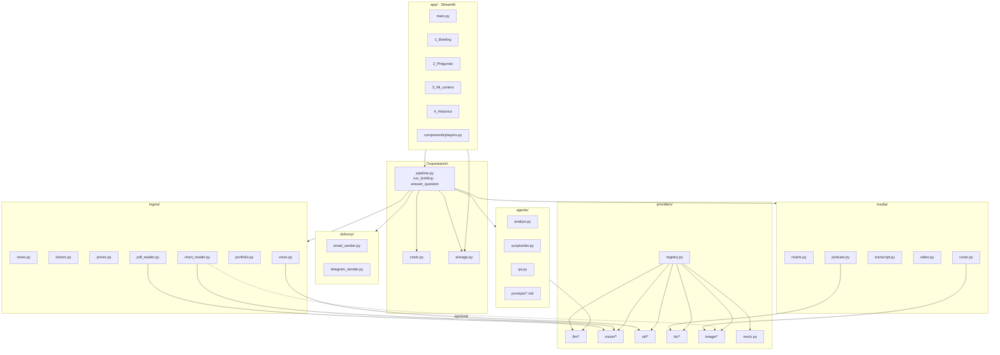
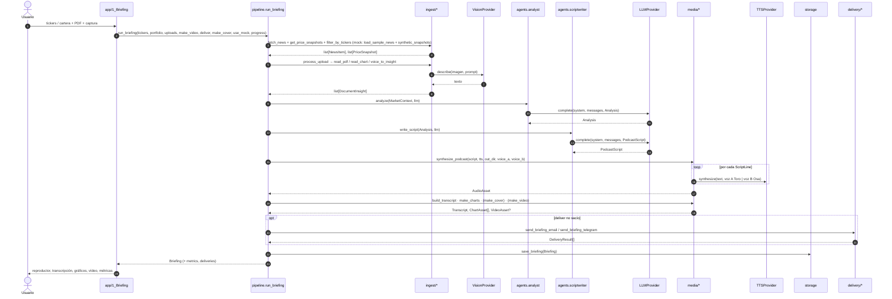

# 02 · Arquitectura y flujo de datos

## Capas

| Capa | Paquete | Depende de | Regla |
| --- | --- | --- | --- |
| UI | `app/` | `briefer.pipeline`, `briefer.storage`, `briefer.schemas`, `briefer.config`, `briefer.costs`; además `ingest.tickers.TICKER_UNIVERSE`, `ingest.portfolio.load_portfolio_csv` y `providers.registry.describe_providers` (solo lee la configuración) | Nunca instancia proveedores ni importa SDKs de IA |
| Orquestación | `briefer/pipeline.py` | ingest, agents, media, delivery, storage, costs, `providers.registry` | Resuelve los proveedores (`get_providers`), los inyecta, encadena y mide; sin prompts ni formato |
| Negocio | `briefer/ingest`, `agents`, `media`, `delivery` | `providers.base`, `schemas` | Recibe el proveedor por parámetro y lo usa solo vía las interfaces de `providers/base.py` |
| Proveedores | `briefer/providers/` | SDKs externos | Única capa que importa `anthropic`, `openai`, `edge_tts`, etc. |
| Transversal | `config.py`, `schemas.py`, `costs.py`, `logging_utils.py`, `storage.py`, `brand.py` | — | Sin dependencias de capas superiores. `brand.py` es la fuente única de la identidad visible (**Briefly**: nombre, eslogan, edición, locutores Toro y Osa); el paquete sigue llamándose `briefer` |

## Diagrama de componentes



## Mapeo caja del diagrama → módulo

Fuente: `docs/assets/arquitectura_mvp_podcast_financiero.png`.

| Columna | Caja | Módulo | Función pública | Proveedor |
| --- | --- | --- | --- | --- |
| 1 · Entradas | Noticias de mercado | `ingest/news.py` | `fetch_news(tickers, max_items, since, rss_feeds)`; en mock `load_sample_news()` | yfinance + RSS (sin IA) |
| | Precios (gráficos y contexto) | `ingest/prices.py` | `get_price_snapshots(tickers, period)`; en mock `synthetic_snapshots(tickers)` | yfinance (sin IA) |
| | Captura de gráfico | subida en `app/pages/1_Briefing.py` → `pipeline.process_upload` | — | — |
| | Cartera del usuario | `ingest/portfolio.py`, `app/pages/3_Mi_cartera.py` | `load_portfolio_csv(source, name)` | — (CSV; la captura de cartera no está prevista en el código) |
| | PDF de resultados | subida en `app/pages/1_Briefing.py` → `pipeline.process_upload` | — | — |
| | Pregunta por voz | `app/pages/2_Preguntar.py` (`st.audio_input`) → `pipeline.answer_question(Path)` | — | — |
| 2 · Procesado | Filtro por tickers | `ingest/tickers.py` | `filter_by_tickers(news, tickers)` | — |
| | Lectura de imagen | `ingest/chart_reader.py` | `read_chart(image, source_name, vision, llm, classifier)` | `VisionProvider` (+ `ImageClassifier` opcional) |
| | Lectura de PDF | `ingest/pdf_reader.py` | `read_pdf(path, llm, vision, max_pages)` | `pypdf` + `LLMProvider` barato + `VisionProvider` |
| | Voz a texto | `ingest/voice.py` | `transcribe_question(audio_path, stt, language)` (Q&A) · `voice_to_insight(...)` (audio subido al briefing) | `STTProvider` |
| 3 · Agentes IA | Agente Analista | `agents/analyst.py` | `analyze(context, llm)` | `LLMProvider` |
| | Agente Guionista | `agents/scriptwriter.py` | `write_script(analysis, llm, target_minutes, speaker_names)` | `LLMProvider` |
| | Agente Q&A | `agents/qa.py` | `answer(question, briefing, llm, history)` | `LLMProvider` (modelo barato) |
| 4 · Salidas | Gráficos del día | `media/charts.py` | `make_charts(prices, out_dir, portfolio)` | matplotlib |
| | Audio podcast (2 voces) | `media/podcast.py` | `synthesize_podcast(script, tts, out_dir, voice_a, voice_b)` | `TTSProvider` |
| | Transcripción | `media/transcript.py` | `build_transcript(script, segments, out_dir, speaker_names)` | — (tiempos del TTS) |
| | Vídeo corto | `media/video.py` | `make_video(audio, images, out_path, transcript)` | ffmpeg (`imageio-ffmpeg`) |
| | Portada *(opcional)* | `media/cover.py` | `make_cover(analysis, image_gen, out_dir)` | `ImageGenProvider` |
| 5 · Entrega | App web | `app/` | — | Streamlit |
| | Email | `delivery/email_sender.py` | `send_briefing_email(briefing, to, settings)` | SMTP |
| | Telegram | `delivery/telegram_sender.py` | `send_briefing_telegram(briefing, chat_id, settings)` | Telegram Bot API |

Firmas exactas en [03_contratos_modulos.md](03_contratos_modulos.md) (v0.3.1). Al cierre de la revisión de las
Fases 0 y 1 todas las funciones de esta tabla están implementadas y probadas (con mocks y en real), salvo
`make_video`, `make_cover` y los envíos (`send_briefing_email`, `send_briefing_telegram`), que son *stubs* con el
control desactivado en la UI. Ver [06](06_estado_actual.md).

## Secuencia · generación del briefing



Cada paso se envuelve en `logging_utils.track_step(...)`, que añade un `StepMetric` (latencia real + coste
estimado vía `costs.estimate_cost_eur`) incluso si el paso falla. La entrega se hace **antes** de guardar, para
que `briefing.json` incluya `deliveries` (siempre con la entrada `web`).

**Tolerancia a fallos** ([ADR-003](decisiones/ADR-003-tolerancia-fallos-y-contratos-v02.md)): cada paso es
**núcleo** u **opcional** (lista en [03](03_contratos_modulos.md#pasos-núcleo-y-pasos-opcionales)). Un paso
opcional que falla (una subida, portada, vídeo, un canal de entrega, el guardado) deja su `StepMetric` con
`error`, se registra en el log y el briefing sigue; un canal caído queda en `deliveries` con `ok=False`. Un paso
núcleo que falla lanza `PipelineStepError` con el nombre del paso (`StepNotImplementedError` si es un *stub*: la
UI lo muestra como «Pendiente»). Dentro de los pasos hay reintentos locales (TTS por línea, reescritura del
Guionista). Además del fallback del `registry` al **crear** el proveedor (`BRIEFER_FALLBACK_TO_MOCK`), está
previsto para D1 que un paso núcleo con proveedor real que falla se repita con `mock` y quede marcado en la UI.
El guardado va al final y su métrica también queda en `Briefing.metrics`.

## Secuencia · pregunta por voz (Q&A)


El Q&A solo responde con el contexto del briefing (noticias, insights y análisis del día). Si la pregunta pide
una recomendación personal («¿vendo?»), el prompt obliga a reconducirla a información genérica con el
disclaimer.

## Cadena de modelos

| Paso | Entrada | Modelo por defecto | Salida | Encadena con |
| --- | --- | --- | --- | --- |
| 1 | Imagen de gráfico | Claude visión (opcional antes: CLIP zero-shot para clasificar) | `DocumentInsight` | 3 |
| 2 | PDF | `pypdf` + Claude visión en páginas con poco texto + LLM barato (Haiku) para resumir | `DocumentInsight` | 3 |
| 3 | `MarketContext` | Claude Sonnet (`BRIEFER_LLM_MODEL`, Analista) | `Analysis` | 4 |
| 4 | `Analysis` | Claude Sonnet (`BRIEFER_LLM_MODEL`, Guionista) | `PodcastScript` | 5 |
| 5 | `PodcastScript` | edge-tts, 2 voces es-ES (`BRIEFER_VOICE_A` / `BRIEFER_VOICE_B`) | `AudioAsset` | 6, 8 |
| 6 | `AudioAsset` | — (tiempos del TTS) / Whisper opcional | `Transcript` + SRT | 8 |
| 7 | Precios (+ cartera) | matplotlib | `ChartAsset[]` | 8 |
| 8 | Audio + gráficos + SRT (+ portada generada) | ffmpeg (`imageio-ffmpeg`) | `VideoAsset` | entrega |
| Q&A | Audio de pregunta | Whisper → Claude Haiku (`BRIEFER_LLM_MODEL_CHEAP`) → edge-tts | `QAAnswer` | UI |

Son hasta **6 modelos distintos** encadenados (CLIP, visión, LLM analista, LLM guionista, TTS, texto-a-imagen)
más STT en el Q&A.

## Proveedores intercambiables y modo mock

Cada familia de modelo tiene una interfaz abstracta en `providers/base.py` y varias implementaciones. El
`registry.py` elige la implementación según `.env`:

```text
BRIEFER_LLM_PROVIDER=anthropic | gemini | openai | mock
BRIEFER_VISION_PROVIDER=claude | qwen_local | mock
BRIEFER_STT_PROVIDER=whisper_api | whisper_local | mock
BRIEFER_TTS_PROVIDER=edge | elevenlabs | mock
BRIEFER_IMAGE_GEN_PROVIDER=sdxl_turbo | none | mock          # none = sin portada
BRIEFER_IMAGE_CLASSIFIER_PROVIDER=clip | none | mock         # none = sin clasificador
BRIEFER_FALLBACK_TO_MOCK=true | false
```

En el código (`config.py`) el valor por defecto de todos es `mock` (`none` para imagen y clasificador);
`.env.example` propone el stack real (`anthropic`, `claude`, `whisper_api`, `edge`). `mock` está siempre
disponible, no necesita red ni claves y devuelve objetos válidos según los schemas (textos fijos, un WAV de
silencio como audio, un PNG de color liso). Usos: tests, desarrollo en paralelo de los tres carriles y demo de
respaldo si falla una API. Si falta la clave o la librería de un proveedor real y
`BRIEFER_FALLBACK_TO_MOCK=true` (por defecto), el registry devuelve `mock` y lo registra en el log; con `false`
lanza `ProviderConfigError`. Además, la barra lateral de la UI tiene el interruptor «Modo demo» (activado por
defecto) y `scripts/demo.py` el flag `--mock`, que fuerzan mocks y datos de ejemplo (`use_mock=True`). Justificación en [ADR-002](decisiones/ADR-002-proveedores-intercambiables.md).

## Almacenamiento

Sin base de datos: ficheros en disco, suficiente para el MVP.

```text
data/
├── samples/                      # versionado: CSV, JSON, grafico_ejemplo.png, resultados_ejemplo.pdf,
│                                 #   generar_muestras.py, demo_briefing/ (briefing real pregenerado)
├── cache/                        # ignorado: noticias/precios del día, URL finales, extractos y robots.txt
│                                 #   (<fuente>_<clave>_<YYYYMMDD>.json; purga automática a 7 días)
└── outputs/                      # ignorado (BRIEFER_OUTPUT_DIR)
    ├── <briefing_id>/            # YYYYMMDD-HHMMSS-xxxxxx (new_briefing_id): orden alfabético = cronológico
    │   ├── briefing.json         # Briefing serializado; rutas internas relativas a esta carpeta
    │   ├── podcast.<ext>         # .mp3 con edge-tts, .wav con MockTTS
    │   ├── parts/                # audio por línea (000_A, 001_B…); se borra al terminar salvo keep_parts
    │   ├── podcast.srt
    │   ├── charts/               # <TICKER>_price.png, overview_change.png (el de cartera NO se guarda aquí)
    │   ├── cover.png             # opcional
    │   ├── briefing.mp4          # opcional
    │   └── qa/respuesta_<id>.<ext>
    └── sin_briefing/qa/          # respuestas del Q&A sin briefing de referencia
```

Rutas tomadas de `pipeline.py`, `media/*` y `storage.py`. `storage` (`briefing_dir`, `save_briefing`,
`load_briefing`, `list_briefings`) es la puerta para guardar y leer `briefing.json`; al guardar escribe las rutas
de dentro de la carpeta como relativas (portables entre máquinas y Docker) y al cargar las resuelve de nuevo; el
pipeline crea la carpeta `<briefing_id>/` y los módulos de `media/` escriben en ella. El histórico de la UI lee
de aquí. **La cartera no se persiste** ([ADR-005](decisiones/ADR-005-privacidad-cartera-no-persistida.md)):
`briefing.json` lleva `portfolio: null` y el gráfico de cartera se dibuja en `<tmp>/briefer_cartera/`, que se
borra a las 12 h. Las subidas de la UI van a una carpeta temporal única por ejecución que se borra al terminar.
