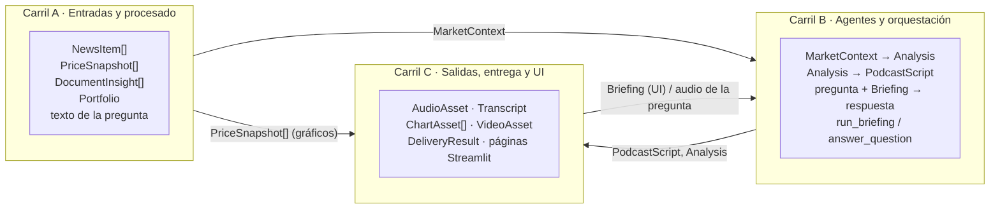

# 03 · Contratos entre módulos

Este documento permite que los tres carriles trabajen **en paralelo** desde el día 0: cada carril programa
contra estos contratos y usa `providers/mock.py` y los datos de `data/samples/` mientras lo de los demás no
existe.

**Versión de contratos: v0.2 (05-oct-2026, cierre de la Fase 0).** Fuente de verdad en código:
`src/briefer/schemas.py` y `src/briefer/providers/base.py`. Si el código y este documento discrepan, se corrige
el que esté mal en el mismo cambio. Cambios respecto a v0.1: ver el [registro de cambios](#registro-de-cambios-de-contrato)
al final (todos **aditivos**: ningún campo ni firma de v0.1 cambia de tipo ni desaparece).

> A partir del martes 6-oct a las 13:00 (Sync 1) **solo se admiten cambios aditivos** en `schemas.py` y
> `providers/base.py`, con un único responsable de hacer el merge (ver [05](05_roadmap_TODO.md#reglas-de-trabajo)).
> Este documento queda congelado salvo el registro de cambios y las firmas que cambien.

## Reglas de cambio

1. `schemas.py` y `providers/base.py` son **transversales**: ningún carril los cambia en solitario.
2. Cambio **compatible** (campo nuevo con valor por defecto, función nueva): se avisa a los otros dos y se
   sube la versión menor (v0.1 → v0.2). No hace falta esperar respuesta.
3. Cambio **incompatible** (renombrar o quitar un campo, cambiar un tipo, cambiar una firma pública): se acuerda
   entre los tres **antes** de tocarlo, se sube la versión mayor y se actualizan mock y tests en el mismo cambio.
4. Toda modificación se refleja aquí y en el registro de cambios del final.
5. `tests/test_schemas.py` y `tests/test_pipeline_mock.py` deben pasar tras cualquier cambio de contrato.

---

## Schemas de datos

`src/briefer/schemas.py`, Pydantic v2. Todos heredan de una base común `_Model` con
`ConfigDict(validate_assignment=True, extra="forbid")`: se valida también al asignar un campo y **se
rechazan campos desconocidos**. Todos son serializables a JSON (`model_dump_json`). Las listas y dicts tienen
`default_factory` (por defecto vacíos).

Tipos auxiliares (alias `Literal`):

| Alias | Valores |
| --- | --- |
| `Sentiment` | `"positivo"`, `"negativo"`, `"neutral"` |
| `Speaker` | `"A"`, `"B"` |
| `SourceType` | `"pdf"`, `"chart"`, `"voice"`, `"text"` |
| `Channel` | `"web"`, `"email"`, `"telegram"` |

Otros símbolos públicos del módulo:

- `DISCLAIMER_ES: str`: aviso MiFID II («Contenido generado automáticamente con IA… No constituye
  asesoramiento financiero…»). Es el valor por defecto de `Analysis.disclaimer`, lo muestra la UI, lo imprime
  `scripts/demo.py` y debe aparecer en email, Telegram y al final del podcast.
- `new_briefing_id(now: datetime | None = None) -> str`: id legible y ordenable `YYYYMMDD-HHMMSS-xxxxxx`
  (6 caracteres hex de un `uuid4`). Es el `default_factory` de `Briefing.id` y el nombre de la carpeta del
  briefing en `data/outputs/`.

### Entradas y contexto

| Modelo | Campos | Notas |
| --- | --- | --- |
| `NewsItem` | `id: str`, `title: str`, `summary: str`, `source: str`, `url: str`, `published_at: datetime`, `tickers: list[str] = []`, `language: str = "es"` | `source` y `url` obligatorios: se citan siempre |
| `PriceSnapshot` | `ticker: str`, `last: float`, `change_pct: float`, `currency: str`, `history: list[tuple[date, float]] = []` | `change_pct` en %, no en tanto por uno |
| `Position` | `ticker: str`, `weight: float \| None = None`, `quantity: float \| None = None` | Basta con `weight` (0-1) o `quantity` (no se valida que haya al menos uno). Un validador pasa `ticker` a mayúsculas y quita espacios |
| `Portfolio` | `name: str`, `positions: list[Position] = []` | Dato personal (RGPD): no se persiste sin consentimiento |
| `DocumentInsight` | `source_type: SourceType`, `source_name: str`, `extracted_text: str`, `key_figures: dict[str, str] = {}`, `summary: str` | Salida común de PDF, gráfico, voz y texto libre |
| `MarketContext` | `date: date`, `tickers: list[str]`, `news: list[NewsItem] = []`, `prices: list[PriceSnapshot] = []`, `insights: list[DocumentInsight] = []`, `portfolio: Portfolio \| None = None` | Entrada única del Analista |

### Agentes

| Modelo | Campos | Notas |
| --- | --- | --- |
| `KeyPoint` | `title: str`, `explanation: str`, `tickers: list[str] = []`, `sentiment: Sentiment = "neutral"`, `sources: list[str] = []` | `sources` = ids/URLs de noticias o `source_name` de insights |
| `Analysis` | `date: date`, `headline: str`, `key_points: list[KeyPoint] = []`, `market_mood: str`, `disclaimer: str = DISCLAIMER_ES` | `disclaimer` nunca vacío |
| `ScriptLine` | `speaker: Speaker`, `text: str` | A = presentador/a que guía, B = analista; nombres en `BRIEFER_SPEAKER_A_NAME` / `BRIEFER_SPEAKER_B_NAME` |
| `PodcastScript` | `title: str`, `lines: list[ScriptLine] = []`, `est_duration_s: float = 0.0` | Objetivo 3-5 min (`BRIEFER_PODCAST_TARGET_MINUTES`); la última línea incluye el disclaimer hablado |

### Salidas

| Modelo | Campos | Notas |
| --- | --- | --- |
| `AudioSegment` | `speaker: Speaker`, `text: str`, `start_s: float`, `end_s: float` | Tramo por línea del guion; base para SRT y subtítulos del vídeo |
| `AudioAsset` | `path: Path`, `duration_s: float`, `segments: list[AudioSegment] = []` | Podcast final concatenado |
| `Transcript` | `text: str`, `srt_path: Path \| None = None` | `srt_path` es `None` si no hay tiempos de audio |
| `ChartAsset` | `path: Path`, `ticker: str \| None = None`, `kind: str` | `kind`: p. ej. `"price_line"`, `"overview_bar"`, `"portfolio_pie"` |
| `VideoAsset` | `path: Path`, `duration_s: float` | |
| `StepMetric` | `step: str`, `provider: str`, `model: str`, `latency_s: float`, `est_cost_eur: float = 0.0`, `error: str \| None = None` | Coste **estimado** vía `costs.py`; lo crea `logging_utils.track_step`. **v0.2:** `error` = `"Tipo: mensaje"` (recortado) si el paso falló, `None` si fue bien; `model` queda siempre limpio (sustituye a la marca `"<modelo> [ERROR …]"` que usaba la Fase 0) |
| `DeliveryResult` | `channel: Channel`, `ok: bool`, `detail: str = ""` | Resultado de entregar por un canal |
| `Briefing` | `id: str = new_briefing_id()`, `created_at: datetime = datetime.now()`, `context: MarketContext`, `analysis: Analysis`, `script: PodcastScript`, `audio: AudioAsset \| None = None`, `transcript: Transcript \| None = None`, `charts: list[ChartAsset] = []`, `cover_path: Path \| None = None`, `video: VideoAsset \| None = None`, `metrics: list[StepMetric] = []`, `deliveries: list[DeliveryResult] = []` | Resultado de `pipeline.run_briefing`; se guarda como `briefing.json`. `run_briefing` siempre añade a `deliveries` la entrada `web` |
| `QAAnswer` | `question: str`, `answer_text: str`, `audio_path: Path \| None = None`, `sources: list[str] = []`, `metrics: list[StepMetric] = []` | Respuesta del Agente Q&A. **v0.2:** `metrics` lleva los pasos `qa.stt` / `agents.qa` / `qa.tts` de esa pregunta, para demostrar el objetivo de latencia (< 10 s) en la UI |

**Persistencia (`briefing.json`).** `storage.save_briefing` escribe las rutas de ficheros que están **dentro** de
la carpeta del briefing como **relativas** a ella y con `/` (`podcast.wav`, `charts/AAPL_price.png`), de modo
que la carpeta se puede mover a otra máquina o a Docker; `load_briefing` las resuelve de nuevo contra la carpeta
donde está el JSON. Las rutas de fuera de la carpeta se guardan tal cual. En memoria, los `Path` de `Briefing`
son siempre absolutos o relativos al directorio de trabajo; el formato relativo solo existe en disco.

---

## Interfaces de proveedores

`src/briefer/providers/base.py`, clases abstractas (ABC). Todas heredan de `_Provider`, que define dos
atributos que cada implementación fija para `StepMetric` y `costs.py`:

- `provider_name: str`: nombre del proveedor (`"anthropic"`, `"edge"`, `"mock"`…). No siempre coincide con el
  valor de `.env`: `ClaudeVision.provider_name == "anthropic"` y `WhisperAPI.provider_name == "openai"`.
- `model: str`: modelo concreto (`"claude-sonnet-5-5"`, `"edge-tts"`, `"mock-llm"`…).

`LLMProvider` y `VisionProvider` tienen además `last_usage: dict[str, int]`
(`{"input_tokens": int, "output_tokens": int}`, inicializado en `__init__`), que cada llamada debe rellenar; el
pipeline lo pasa a `costs.estimate_cost_eur(...)`.

```python
class LLMProvider(_Provider):
    last_usage: dict[str, int]
    def complete(self, system: str, messages: list[dict],
                 response_model: type[BaseModel] | None = None) -> str | BaseModel: ...

class VisionProvider(_Provider):
    last_usage: dict[str, int]
    def describe(self, image: bytes, prompt: str) -> str: ...

class STTProvider(_Provider):
    def transcribe(self, audio_path: Path, language: str = "es") -> str: ...

class TTSProvider(_Provider):
    audio_extension: str = ".mp3"   # MockTTS usa ".wav"
    def synthesize(self, text: str, voice: str, out_path: Path) -> Path: ...  # devuelve la ruta REAL escrita

class ImageGenProvider(_Provider):
    def generate(self, prompt: str, out_path: Path) -> Path: ...

class ImageClassifier(_Provider):
    def classify(self, image: bytes, labels: list[str]) -> dict[str, float]: ...  # {etiqueta: prob}, suma ~1
```

Las implementaciones reales reciben `Settings` en el constructor (las de LLM, además, `cheap: bool = False`).
Los mocks de `providers/mock.py` (`MockLLM`, `MockVision`, `MockSTT`, `MockTTS`, `MockImageGen`,
`MockImageClassifier`) aceptan `settings` opcional y `model`; todos tienen `provider_name = "mock"`.

### Registro (`providers/registry.py`)

```python
def get_llm(settings: Settings | None = None, *, cheap: bool = False, force_mock: bool = False) -> LLMProvider: ...
def get_vision(settings: Settings | None = None, *, force_mock: bool = False) -> VisionProvider: ...
def get_stt(settings: Settings | None = None, *, force_mock: bool = False) -> STTProvider: ...
def get_tts(settings: Settings | None = None, *, force_mock: bool = False) -> TTSProvider: ...
def get_image_gen(settings: Settings | None = None, *, force_mock: bool = False) -> ImageGenProvider | None: ...
def get_image_classifier(settings: Settings | None = None, *, force_mock: bool = False) -> ImageClassifier | None: ...
def describe_providers(settings: Settings | None = None) -> dict[str, str]: ...  # resumen para la barra lateral de la UI

class ProviderConfigError(RuntimeError): ...  # proveedor desconocido, sin clave o sin dependencias
```

| Función | Variable de `.env` | Valores | Clave requerida |
| --- | --- | --- | --- |
| `get_llm` | `BRIEFER_LLM_PROVIDER` | `anthropic` · `gemini` · `openai` · `mock` | `ANTHROPIC_API_KEY` / `GEMINI_API_KEY` / `OPENAI_API_KEY` |
| `get_vision` | `BRIEFER_VISION_PROVIDER` | `claude` · `qwen_local` · `mock` | `ANTHROPIC_API_KEY` (solo `claude`) |
| `get_stt` | `BRIEFER_STT_PROVIDER` | `whisper_api` · `whisper_local` · `mock` | `OPENAI_API_KEY` (solo `whisper_api`) |
| `get_tts` | `BRIEFER_TTS_PROVIDER` | `edge` · `elevenlabs` · `mock` | `ELEVENLABS_API_KEY` (solo `elevenlabs`) |
| `get_image_gen` | `BRIEFER_IMAGE_GEN_PROVIDER` | `sdxl_turbo` · `none` · `mock` | — (`none` → devuelve `None`) |
| `get_image_classifier` | `BRIEFER_IMAGE_CLASSIFIER_PROVIDER` | `clip` · `none` · `mock` | — (`none` → devuelve `None`) |

Comportamiento:

- `mock` siempre está disponible. `force_mock=True` lo fuerza sin mirar `.env` (lo usa el pipeline cuando
  `use_mock=True`).
- `cheap=True` pide el modelo barato: `anthropic` usa `BRIEFER_LLM_MODEL_CHEAP`; `gemini` y `openai` aún
  ignoran el flag (TODO en su código); el mock devuelve `model="mock-llm-cheap"`.
- Las implementaciones reales se importan de forma **perezosa** (`importlib`): no hace falta instalar `torch`,
  `anthropic`… si no se usan.
- Si falta la clave o la librería: con `BRIEFER_FALLBACK_TO_MOCK=true` (por defecto) devuelve el mock y deja un
  aviso en el log; con `false` lanza `ProviderConfigError`. Un nombre de proveedor desconocido lanza
  `ProviderConfigError` siempre.

Contrato de comportamiento:

- `complete(..., response_model=X)` devuelve una instancia válida de `X` o lanza excepción; nunca un dict suelto.
- `synthesize` puede cambiar la extensión de `out_path` según `audio_extension`: usar siempre la ruta devuelta.
- Los proveedores no escriben fuera de `out_path` ni de `data/cache/`.
- Errores de red se propagan como excepción; los reintentos los decide el pipeline, no el proveedor.

---

## Funciones públicas por módulo

> Firmas **reales del código** al cierre de la Fase 0 (05-oct-2026, noche). Estado por función:
> **[impl]** implementada y probada en modo mock · **[stub]** lanza `NotImplementedError` con un `TODO` que
> describe la implementación (todas requieren red o claves). Los carriles pueden añadir parámetros
> **opcionales** (con valor por defecto, preferiblemente *keyword-only*); cambiar tipos de entrada o salida sigue
> las reglas de cambio.

**Inyección de dependencias:** las funciones de `ingest/`, `agents/` y `media/` **reciben el proveedor por
parámetro**; solo `pipeline.get_providers` llama a `registry`.

### Orquestación (`pipeline.py`, `storage.py`, `costs.py`, `logging_utils.py`)

```python
# pipeline.py  [impl]
ProgressFn = Callable[[str], None]
DELIVERY_CHANNELS: tuple[str, ...] = ("email", "telegram")   # "web" va siempre incluido
PDF_EXTS = {".pdf"}
IMAGE_EXTS = {".png", ".jpg", ".jpeg", ".webp", ".gif"}
AUDIO_EXTS = {".wav", ".mp3", ".m4a", ".ogg", ".webm", ".flac"}

class PipelineStepError(RuntimeError):          # fallo de un paso NÚCLEO; .step = nombre del paso,
    step: str                                   # la causa original en __cause__
class StepNotImplementedError(PipelineStepError, NotImplementedError): ...
    # paso núcleo aún sin implementar: la UI lo pinta como «Pendiente» (es también NotImplementedError)

@dataclass
class Providers:  # llm, llm_cheap, vision, stt, tts, image_gen | None, classifier | None
    ...

def get_providers(settings: Settings, use_mock: bool = False) -> Providers: ...
def process_upload(path: Path, providers: Providers, metrics: list[StepMetric],
                   language: str = "es") -> DocumentInsight: ...
    # enruta por extensión: PDF / imagen / audio; extensión no soportada -> ValueError
    # (registrado como paso "ingest.upload"). Propaga errores: run_briefing decide omitir la subida.
def run_briefing(tickers: Sequence[str], portfolio: Portfolio | None = None,
                 uploads: Sequence[Path] | None = None, make_video: bool = False,
                 deliver: Sequence[str] | None = None, *, make_cover: bool = False,
                 use_mock: bool = False, settings: Settings | None = None,
                 progress: ProgressFn | None = None) -> Briefing: ...
    # Raises: ValueError (sin tickers ni cartera, o canal de `deliver` desconocido: se valida ANTES
    #         de gastar nada) · PipelineStepError / StepNotImplementedError (fallo de un paso núcleo)
def answer_question(question: str | Path, briefing: Briefing | None = None, *, speak: bool = True,
                    history: list[dict] | None = None, use_mock: bool = False,
                    settings: Settings | None = None) -> QAAnswer: ...
    # Path = audio -> STT. Raises: ValueError (pregunta vacía), PipelineStepError (qa.stt / agents.qa)

# storage.py  [impl]
BRIEFING_FILE = "briefing.json"
def briefing_dir(briefing_id: str, base_dir: Path | None = None) -> Path: ...  # valida el id (sin "../")
def save_briefing(briefing: Briefing, base_dir: Path | None = None) -> Path: ...     # ruta de briefing.json
def load_briefing(path_or_id: Path | str, base_dir: Path | None = None) -> Briefing: ...
def list_briefings(base_dir: Path | None = None, limit: int = 50) -> list[Path]: ...  # más reciente primero
    # rutas internas relativas y con "/" en disco (ver «Persistencia» arriba)

# costs.py  [impl; tarifas aproximadas, TODO verificar]
def estimate_tokens(text: str) -> int: ...
def estimate_image_tokens(width: int, height: int) -> int: ...
def estimate_llm_cost_eur(model: str, input_tokens: int = 0, output_tokens: int = 0) -> float: ...
def estimate_stt_cost_eur(model: str, duration_s: float) -> float: ...
def estimate_tts_cost_eur(provider: str, n_chars: int) -> float: ...
def estimate_image_cost_eur(provider: str, n_images: int = 1) -> float: ...
def estimate_cost_eur(provider: str, model: str, **usage: float) -> float: ...
    # usage: input_tokens/output_tokens · duration_s · n_chars · n_images; proveedores locales -> 0.0
def summarize_metrics(metrics: Iterable[StepMetric]) -> dict[str, float]: ...
    # {"steps", "total_latency_s", "total_cost_eur"}

# logging_utils.py  [impl]
def get_logger(name: str | None = None) -> logging.Logger: ...
@contextmanager
def track_step(step: str, provider: str = "-", model: str = "-",
               metrics: list[StepMetric] | None = None) -> Iterator[StepHandle]: ...
    # mide la latencia y añade un StepMetric a `metrics`, también si el paso falla; en ese caso
    # rellena StepMetric.error ("Tipo: mensaje") y relanza la excepción. StepHandle.est_cost_eur
    # permite fijar el coste dentro del bloque.
def step_failed(metric: StepMetric) -> bool: ...        # True si el paso falló
def step_error(metric: StepMetric) -> str | None: ...    # texto del error, o None
```

#### Pasos núcleo y pasos opcionales

`run_briefing` clasifica cada paso (campo `StepMetric.step`). Un paso **núcleo** que falla aborta el briefing
con `PipelineStepError` (la UI muestra el paso y la causa); un paso **opcional** que falla deja su
`StepMetric` con `error` relleno, se registra en el log y el briefing sigue sin esa pieza.

| Tipo | Pasos (`StepMetric.step`) | Si falla |
| --- | --- | --- |
| **Núcleo** | `ingest.news`, `ingest.tickers`, `ingest.prices`, `agents.analyst`, `agents.scriptwriter`, `media.podcast`, `media.transcript`, `media.charts` | `PipelineStepError` (o `StepNotImplementedError` si es un *stub*) |
| **Opcional** | `ingest.pdf` / `ingest.chart` / `ingest.voice` / `ingest.upload` (uno por subida), `media.cover` (si `make_cover` y hay proveedor de imagen), `media.video` (si `make_video`), `delivery.<canal>` (uno por canal), `storage.save` | Se omite: subida sin insight, `cover_path=None`, `video=None`, `DeliveryResult(ok=False, detail="Error al enviar: …")`, briefing solo en memoria |

Además: `make_charts` aísla cada gráfico (si uno falla, el resto sale); `synthesize_podcast` reintenta cada línea
(`retries`); el Guionista reescribe una vez si el guion no cumple y, si el LLM no devuelve nada válido, usa
`fallback_script`. **Aún no existe** la caída a `mock` de un paso núcleo con proveedor real (D1, ver
[05](05_roadmap_TODO.md)).

`answer_question`: `qa.stt` (si la pregunta es un `Path`) y `agents.qa` (con el LLM barato) son núcleo; `qa.tts`
(si `speak`) es opcional: si falla, se devuelve el texto con `audio_path=None`. Desde v0.2 los tres pasos van en
`QAAnswer.metrics`.

#### Progreso, métricas y tickers

- **Progreso:** el callback `progress` recibe un texto por paso con el formato `"(n/N) mensaje"`
  (p. ej. `"(3/6) Escribiendo el guion del podcast…"` sin subidas ni extras); `N` = 5 pasos fijos + 1 por subida + portada + vídeo +
  1 por canal + guardado. El último mensaje es `"(N/N) Briefing listo."`. Un fallo del callback nunca rompe el
  briefing.
- **Métricas:** `Briefing.metrics` incluye **todos** los pasos, también `storage.save` (se guarda, se añade la
  métrica del guardado y se reescribe el JSON; esa segunda escritura no se mide). Corrige el bug de v0.1, en el
  que la métrica de guardado solo iba al log.
- **Coste por paso con dos modelos:** `ingest.pdf` e `ingest.chart` suman en `est_cost_eur` el coste del LLM
  barato **y** de visión de todas las llamadas del paso (envoltorios `_MeteredLLM` / `_MeteredVision`);
  `agents.analyst` y `agents.scriptwriter` incluyen los reintentos.
- **Tickers:** la lista de entrada (más los de la cartera) se normaliza con `ingest.tickers.normalize_ticker`
  (`"santander"` → `"SAN.MC"`, `"aapl"` → `"AAPL"`), sin duplicados, antes de filtrar noticias y pedir precios.
- **Modo mock:** noticias de `ingest.news.load_sample_news()` y precios de `ingest.prices.synthetic_snapshots()`;
  si ningún ticker elegido aparece en las noticias de ejemplo, se usan todas (son ficticias y lo indican).

### Carril A · `ingest/`

```python
# news.py
SAMPLE_NEWS_FILE = "noticias_ejemplo.json"
def fetch_yfinance_news(ticker: str, max_items: int = 10) -> list[NewsItem]: ...           # [stub] red
def fetch_rss_news(feeds: list[str], max_items: int = 20) -> list[NewsItem]: ...           # [stub] red
def dedupe_news(items: list[NewsItem]) -> list[NewsItem]: ...                               # [impl] por URL y título
def fetch_news(tickers: list[str], max_items: int = 20, since: datetime | None = None,
               rss_feeds: list[str] | None = None) -> list[NewsItem]: ...                   # [stub] red
def load_sample_news(path: Path | None = None) -> list[NewsItem]: ...                       # [impl] data/samples/

# tickers.py  [impl]
TICKER_UNIVERSE: dict[str, dict[str, list[str] | str]]   # tickers conocidos + nombre + alias (lo usa la UI)
MARKET_INDEX_TICKERS: tuple[str, ...] = ("^IBEX", "^GSPC")  # noticias "de mercado" para rellenar
def normalize_ticker(raw: str) -> str: ...
    # ticker exacto, raíz ("san"), nombre o alias sin tildes/mayúsculas -> ticker Yahoo;
    # desconocido -> en mayúsculas y sin espacios; vacío -> ValueError
def extract_tickers(text: str, universe: list[str] | None = None) -> list[str]: ...
def filter_by_tickers(news: list[NewsItem], tickers: list[str], min_items: int = 3) -> list[NewsItem]: ...
    # devuelve copias con NewsItem.tickers rellenado; si quedan < min_items, completa con noticias
    # de MARKET_INDEX_TICKERS; tickers vacío -> todas

# prices.py
def get_price_snapshot(ticker: str, period: str = "1mo") -> PriceSnapshot: ...              # [stub] red
def get_price_snapshots(tickers: list[str], period: str = "1mo") -> list[PriceSnapshot]: ... # [stub] red
def currency_for(ticker: str) -> str: ...                                                   # [impl] ".MC"/"^IBEX" -> EUR; resto USD
def synthetic_snapshots(tickers: list[str], days: int = 30, seed: int = 0,
                        end: date | None = None) -> list[PriceSnapshot]: ...                # [impl] modo mock
    # determinista por ticker; `end` = última sesión (por defecto hoy; fin de semana -> viernes)

# pdf_reader.py  [impl; usa los proveedores inyectados]
MAX_VISION_PAGES = 5         # páginas pobres en texto que se mandan a visión, como mucho
MAX_LLM_CHARS = 30_000       # texto máximo que se pasa al LLM que estructura
MAX_IMAGES_PER_PAGE = 2
def extract_page_texts(path: Path, max_pages: int = 30) -> list[str]: ...
def pages_needing_vision(page_texts: list[str], min_chars: int = 200) -> list[int]: ...
def page_images(path: Path, page_index: int) -> list[bytes]: ...
def read_pdf(path: Path, llm: LLMProvider, vision: VisionProvider | None = None,
             max_pages: int = 30) -> DocumentInsight: ...
    # Raises FileNotFoundError / ValueError (PDF ilegible o vacío)

# chart_reader.py  [impl; usa los proveedores inyectados]
CHART_LABELS: list[str]      # etiquetas del clasificador zero-shot; la última = "no es un gráfico"
NOT_CHART_LABEL: str
NOT_CHART_THRESHOLD = 0.6
SUPPORTED_FORMATS = {"PNG", "JPEG", "WEBP", "GIF"}
CHART_PROMPT: str
def validate_image(image: bytes) -> str: ...   # formato ("PNG"…); vacía/corrupta/no soportada -> ValueError
def classify_image(image: bytes, classifier: ImageClassifier) -> tuple[str, float]: ...
def read_chart(image: bytes, source_name: str, vision: VisionProvider,
               llm: LLMProvider | None = None,
               classifier: ImageClassifier | None = None) -> DocumentInsight: ...

# portfolio.py  [impl]
WEIGHT_TOLERANCE = 0.02
def load_portfolio_csv(source: Path | BinaryIO | str, name: str = "Mi cartera") -> Portfolio: ...
def portfolio_tickers(portfolio: Portfolio) -> list[str]: ...

# voice.py  [impl; usa el STT inyectado]
def save_audio_upload(data: bytes, out_dir: Path, suffix: str = ".wav") -> Path: ...
def transcribe_question(audio_path: Path, stt: STTProvider, language: str = "es") -> str: ...
def voice_to_insight(audio_path: Path, stt: STTProvider, language: str = "es") -> DocumentInsight: ...
```

### Carril B · `agents/`

```python
# __init__.py  [impl]
PROMPTS_DIR: Path
def load_prompt(name: str) -> str: ...  # contenido de agents/prompts/<name>.md (sin comentarios HTML)

# analyst.py  [impl]
MAX_KEY_POINTS = 6
def build_user_message(context: MarketContext, max_chars: int = 40_000) -> str: ...
def allowed_sources(context: MarketContext) -> dict[str, str]: ...   # id/URL/nombre -> referencia canónica
def allowed_tickers(context: MarketContext) -> set[str]: ...
def postprocess_analysis(analysis: Analysis, context: MarketContext,
                         max_points: int = MAX_KEY_POINTS) -> Analysis: ...
    # no confía en el LLM: fija date y disclaimer, quita tickers y fuentes que no estén en el
    # contexto, elimina frases con recomendación (guardrails) y puntos vacíos; como mucho max_points
def analyze(context: MarketContext, llm: LLMProvider, max_chars: int = 40_000) -> Analysis: ...

# scriptwriter.py  [impl]
WORDS_PER_MINUTE = 150
LENGTH_TOLERANCE = 0.4        # desviación relativa de duración que dispara una reescritura
CLOSING_LINE_ES: str          # cierre hablado con disclaimer y aviso de voz sintética
def estimate_duration_s(lines: list[ScriptLine], wpm: int = WORDS_PER_MINUTE) -> float: ...
def build_user_message(analysis: Analysis) -> str: ...
def script_problems(script: PodcastScript, target_minutes: float,
                    length_tolerance: float | None = LENGTH_TOLERANCE) -> list[str]: ...
def fallback_script(analysis: Analysis,
                    speaker_names: tuple[str, str] = ("Álvaro", "Elvira")) -> PodcastScript: ...
def write_script(analysis: Analysis, llm: LLMProvider, target_minutes: float = 4.0,
                 speaker_names: tuple[str, str] = ("Álvaro", "Elvira"), *,
                 max_retries: int = 1,
                 length_tolerance: float | None = LENGTH_TOLERANCE) -> PodcastScript: ...
    # reescribe hasta max_retries veces si el guion tiene problemas (formato, alternancia,
    # cierre, duración); length_tolerance=None desactiva la comprobación de duración (MockLLM)

# qa.py  [impl]
MAX_HISTORY_TURNS = 8
def build_qa_context(briefing: Briefing | None, max_chars: int = 20_000) -> str: ...
def answer(question: str, briefing: Briefing | None, llm: LLMProvider,
           history: list[dict] | None = None) -> QAAnswer: ...
    # citas [id] -> sources (solo las que existen); guardarraíles MiFID; pregunta vacía -> ValueError

# guardrails.py  [impl, nuevo en v0.2] — compliance MiFID II compartido por los tres agentes
ADVICE_REMINDER_ES: str
def contains_advice(text: str) -> bool: ...              # frase con recomendación (ignora negaciones)
def strip_advice(text: str) -> tuple[str, bool]: ...     # (texto sin esas frases, hubo_cambios)
def asks_for_advice(question: str) -> bool: ...          # la pregunta del usuario pide consejo personal
```

Prompts de producción en `agents/prompts/{analyst,scriptwriter,qa}.md`, cargados en tiempo de ejecución con
`load_prompt` (editables sin tocar código). Los guardarraíles no sustituyen al prompt: son la segunda barrera
(determinista y verificable en tests).

### Carril C · `media/` y `delivery/`

```python
# charts.py  [impl]
def make_price_chart(snapshot: PriceSnapshot, out_dir: Path) -> ChartAsset: ...      # <TICKER>_price.png
def make_overview_chart(snapshots: list[PriceSnapshot], out_dir: Path) -> ChartAsset: ...  # overview_change.png
def portfolio_weights(portfolio: Portfolio,
                      prices: list[PriceSnapshot] | None = None) -> dict[str, float]: ...
def make_portfolio_chart(portfolio: Portfolio, out_dir: Path,
                         prices: list[PriceSnapshot] | None = None,
                         min_share: float = 0.03) -> ChartAsset: ...                   # portfolio_weights.png
    # posiciones < min_share (o más allá de 8 colores) -> «Otros»; sin pesos valorables -> ValueError
def make_charts(prices: list[PriceSnapshot], out_dir: Path,
                portfolio: Portfolio | None = None) -> list[ChartAsset]: ...
    # overview (si ≥ 2 valores) + uno por ticker + cartera; un gráfico fallido no tumba el resto

# podcast.py  [impl; ffmpeg vía imageio-ffmpeg, o stdlib para WAV]
DEFAULT_MAX_WORKERS = 4
def ffmpeg_exe() -> str: ...
def audio_duration_s(path: Path) -> float: ...
def concat_audio(paths: list[Path], out_path: Path, pause_s: float = 0.35) -> Path: ...
def synthesize_podcast(script: PodcastScript, tts: TTSProvider, out_dir: Path, voice_a: str,
                       voice_b: str, pause_s: float = 0.35, *,
                       max_workers: int = DEFAULT_MAX_WORKERS, retries: int = 2,
                       keep_parts: bool = False) -> AudioAsset: ...
    # TTS por línea en paralelo (orden conservado), reintentos por línea, out_dir/podcast<ext>;
    # out_dir/parts se borra salvo keep_parts=True; guion sin líneas -> ValueError

# transcript.py  [impl]
def default_speaker_names() -> dict[str, str]: ...
def format_srt_timestamp(seconds: float) -> str: ...
def segments_to_srt(segments: list[AudioSegment], speaker_names: dict[str, str] | None = None) -> str: ...
def build_transcript(script: PodcastScript, segments: list[AudioSegment], out_dir: Path,
                     speaker_names: dict[str, str] | None = None) -> Transcript: ...    # out_dir/podcast.srt

# cover.py  [stub, opcional]
def build_cover_prompt(analysis: Analysis) -> str: ...
def overlay_title(image_path: Path, title: str, date_text: str) -> Path: ...
def make_cover(analysis: Analysis, image_gen: ImageGenProvider | None, out_dir: Path) -> Path | None: ...

# video.py  [stub, opcional]
def make_video(audio: AudioAsset, images: list[Path], out_path: Path,
               transcript: Transcript | None = None, size: tuple[int, int] = (1080, 1920),
               fps: int = 24) -> VideoAsset: ...

# email_sender.py
SYNTHETIC_VOICE_NOTE: str
def build_email_html(briefing: Briefing, chart_cids: list[str] | None = None) -> str: ...   # [impl] pura
    # chart_cids: Content-ID de los PNG adjuntos (por defecto chart0, chart1… uno por briefing.charts)
def send_briefing_email(briefing: Briefing, to: list[str] | None = None,
                        settings: Settings | None = None) -> DeliveryResult: ...             # [stub] SMTP

# telegram_sender.py
API_URL = "https://api.telegram.org/bot{token}/{method}"
def build_caption(briefing: Briefing, max_len: int = 1024) -> str: ...                      # [impl] pura
def send_briefing_telegram(briefing: Briefing, chat_id: str | None = None,
                           settings: Settings | None = None) -> DeliveryResult: ...         # [stub] red
```

### Proveedores reales (todos *stubs* al cierre de la Fase 0)

`AnthropicLLM.complete`, `GeminiLLM.complete`, `OpenAILLM.complete`, `ClaudeVision.describe` (+
`detect_media_type`), `QwenVLLocal.describe`, `WhisperAPI.transcribe`, `WhisperLocal.transcribe`,
`EdgeTTS.synthesize`, `ElevenLabsTTS.synthesize`, `SDXLTurbo.generate`, `CLIPClassifier.classify`. Los mocks de
`providers/mock.py` están completos. Prioridad de implementación en [05](05_roadmap_TODO.md) (los de GPU o clave
de pago son *Won't* y se retiran del registry antes de entregar si no se implementan).

---

## Qué consume y qué produce cada carril



| Carril | Ficheros | Consume | Produce | Mientras no exista lo de otros, usa |
| --- | --- | --- | --- | --- |
| **A** · Entradas, visión y Telegram | `ingest/*`, `providers/vision/*`, `providers/stt/*`, `providers/image/clip_classifier.py`, `delivery/telegram_sender.py` (desde v0.2) | Tickers, ficheros subidos (PDF, imagen, audio), CSV de cartera | `NewsItem[]`, `PriceSnapshot[]`, `DocumentInsight[]`, `Portfolio`, texto de la pregunta | `data/samples/*`, `MockVision`, `MockSTT` |
| **B** · Agentes, orquestación y calidad | `agents/*` (incl. `guardrails.py`), `agents/prompts/*`, `pipeline.py`, `costs.py`, `providers/llm/*`, `scripts/demo.py`; dueño del merge de `schemas.py` | `MarketContext` (de A), `Briefing` para el Q&A | `Analysis`, `PodcastScript`, `QAAnswer`, `Briefing` completo con `metrics` y `deliveries` | `MarketContext` construido desde `data/samples/`, `MockLLM`, funciones de A y C en versión mock |
| **C** · Media, UI y demo | `media/*`, `delivery/email_sender.py`, `providers/tts/*`, `providers/image/*` (texto→imagen), `app/*`, `data/samples/demo_briefing/` | `PodcastScript`, `Analysis`, `PriceSnapshot[]`, `Briefing` | `AudioAsset`, `Transcript`, `ChartAsset[]`, `VideoAsset`, `cover.png`, `DeliveryResult`, UI | `PodcastScript` y `Briefing` de ejemplo generados por `MockLLM`, `MockTTS` |
| Transversal | `schemas.py`, `providers/base.py`, `providers/registry.py`, `providers/mock.py`, `config.py`, `logging_utils.py`, `storage.py`, `tests/`, docs, Docker | — | Contratos, configuración, métricas, persistencia y modo mock | — |

### Puntos de integración (por orden)

1. **Modo mock** *(hecho en la Fase 0, verificado en integración)*: `load_sample_news` +
   `synthetic_snapshots` + `filter_by_tickers` (A) → `analyze` + `write_script` con `MockLLM` (B) →
   `synthesize_podcast` + `build_transcript` + `make_charts` (C) → `save_briefing`. Criterio: sin `skip` en
   `tests/test_pipeline_mock.py` y en verde.
2. **A → B real:** `MarketContext` construido con `fetch_news` + `get_price_snapshots` + insights de
   `process_upload` → `analyze()`.
3. **B → C real:** `write_script()` → `synthesize_podcast()` con `EdgeTTS`.
4. **C → B:** la UI llama a `pipeline.run_briefing()` / `pipeline.answer_question()` y a `storage` para el
   histórico; no instancia proveedores.
5. **Fin a fin:** `python scripts/demo.py --mock` y `python scripts/demo.py` (con claves) producen un
   `briefing.json` válido en `data/outputs/<id>/`.

---

## Registro de cambios de contrato

| Versión | Fecha | Cambio | Acordado por |
| --- | --- | --- | --- |
| v0.1 | 05-oct-2026 | Versión inicial, alineada con el código del esqueleto. Incluye `Briefing.deliveries` (añadido respecto a la spec inicial), `DISCLAIMER_ES`, `new_briefing_id`, `provider_name`/`model`/`last_usage` en proveedores y `registry` con `cheap`/`force_mock` | Equipo |
| v0.2 | 05-oct-2026 (noche) | **Aditivo.** Schemas: `StepMetric.error: str \| None = None` (sustituye la marca `"[ERROR …]"` dentro de `model`); `QAAnswer.metrics: list[StepMetric] = []`. Pipeline: `PipelineStepError`, `StepNotImplementedError`, `DELIVERY_CHANNELS`, `ValueError` por canal desconocido o sin tickers; clasificación núcleo/opcional; progreso `"(n/N) …"`; `storage.save` incluido en `Briefing.metrics` (bug de v0.1 corregido); tickers normalizados con `normalize_ticker`; coste de PDF/gráfico suma LLM + visión. Storage: rutas relativas portables en `briefing.json`. Parámetros opcionales nuevos: `synthetic_snapshots(..., end=None)`, `filter_by_tickers(..., min_items=3)`, `analyze(..., max_chars=40_000)`, `write_script(..., *, max_retries=1, length_tolerance=LENGTH_TOLERANCE)`, `synthesize_podcast(..., *, max_workers=4, retries=2, keep_parts=False)`, `make_portfolio_chart(..., prices=None, min_share=0.03)`, `build_email_html(..., chart_cids=None)`. Funciones/constantes nuevas: `prices.currency_for`, `chart_reader.validate_image` (+ `NOT_CHART_LABEL`, `NOT_CHART_THRESHOLD`, `SUPPORTED_FORMATS`), `tickers.MARKET_INDEX_TICKERS`, `pdf_reader.MAX_VISION_PAGES` / `MAX_LLM_CHARS` / `MAX_IMAGES_PER_PAGE`, `analyst.postprocess_analysis` / `allowed_sources` / `allowed_tickers`, `scriptwriter.script_problems` / `fallback_script` / `CLOSING_LINE_ES` / `LENGTH_TOLERANCE`, `charts.portfolio_weights`, `podcast.ffmpeg_exe`, módulo `agents/guardrails.py`. Ver [ADR-003](decisiones/ADR-003-tolerancia-fallos-y-contratos-v02.md) | Equipo (integración Fase 0) |
