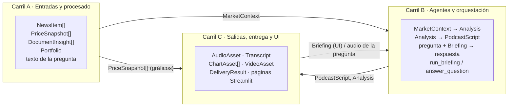

# 03 · Contratos entre módulos

Este documento permite que los tres carriles trabajen **en paralelo** desde el día 0: cada carril programa
contra estos contratos y usa `providers/mock.py` y los datos de `data/samples/` mientras lo de los demás no
existe.

**Versión de contratos: v0.3.1 (05-oct-2026, cierre de la revisión de las Fases 0 y 1).** Fuente de verdad en
código: `src/briefer/schemas.py` (`CONTRACTS_VERSION = "0.3"`) y `src/briefer/providers/base.py`. La v0.3.1 **no
toca** `schemas.py` ni `providers/base.py` (por eso `CONTRACTS_VERSION` sigue en `"0.3"`): añade funciones,
constantes y parámetros opcionales en los módulos y cambia la **semántica** de dos cosas (persistencia sin cartera
y `input_tokens` sin caché; ver el registro). Si el código y este documento discrepan, se corrige el que esté mal
en el mismo cambio. Cambios respecto a v0.1, v0.2 y v0.3: ver el
[registro de cambios](#registro-de-cambios-de-contrato) al final (todos **aditivos**: ningún campo ni firma
anterior cambia de tipo ni desaparece; solo se añaden campos con valor por defecto, parámetros opcionales
*keyword-only* y funciones nuevas). Marcado **(v0.3.1)** lo añadido en la revisión.

> A partir del martes 6-oct a las 13:00 (Sync 1) **solo se admiten cambios aditivos** en `schemas.py` y
> `providers/base.py`, con un único responsable de hacer el merge (ver [05](05_roadmap_TODO.md#reglas-de-trabajo)).
> Este documento queda congelado salvo el registro de cambios y las firmas que cambien.

## Reglas de cambio

1. `schemas.py` y `providers/base.py` son **transversales**: ningún carril los cambia en solitario.
2. Cambio **compatible** (campo nuevo con valor por defecto, función nueva): se avisa a los otros dos y se
   sube la versión menor (v0.1 → v0.2). No hace falta esperar respuesta.
3. Cambio **incompatible** (renombrar o quitar un campo, cambiar un tipo, cambiar una firma pública): se acuerda
   entre los tres **antes** de tocarlo, se sube la versión mayor y se actualizan mock y tests en el mismo cambio.
4. Toda modificación se refleja aquí y en el registro de cambios del final.
5. `tests/test_schemas.py` y `tests/test_pipeline_mock.py` deben pasar tras cualquier cambio de contrato.

---

## Schemas de datos

`src/briefer/schemas.py`, Pydantic v2. Todos heredan de una base común `_Model` con
`ConfigDict(validate_assignment=True, extra="forbid")`: se valida también al asignar un campo y **se
rechazan campos desconocidos**. Todos son serializables a JSON (`model_dump_json`). Las listas y dicts tienen
`default_factory` (por defecto vacíos).

Tipos auxiliares (alias `Literal`):

| Alias | Valores |
| --- | --- |
| `Sentiment` | `"positivo"`, `"negativo"`, `"neutral"` |
| `Speaker` | `"A"`, `"B"` |
| `SourceType` | `"pdf"`, `"chart"`, `"voice"`, `"text"` |
| `Channel` | `"web"`, `"email"`, `"telegram"` |

Otros símbolos públicos del módulo:

- `DISCLAIMER_ES: str`: aviso MiFID II («Contenido generado automáticamente con IA… No constituye
  asesoramiento financiero…»). Es el valor por defecto de `Analysis.disclaimer`, lo muestra la UI, lo imprime
  `scripts/demo.py` y debe aparecer en email, Telegram y al final del podcast.
- `new_briefing_id(now: datetime | None = None) -> str`: id legible y ordenable `YYYYMMDD-HHMMSS-xxxxxx`
  (6 caracteres hex de un `uuid4`). Es el `default_factory` de `Briefing.id` y el nombre de la carpeta del
  briefing en `data/outputs/`.

### Entradas y contexto

| Modelo | Campos | Notas |
| --- | --- | --- |
| `NewsItem` | `id: str`, `title: str`, `summary: str`, `source: str`, `url: str`, `published_at: datetime`, `tickers: list[str] = []`, `language: str = "es"` | `source` y `url` obligatorios: se citan siempre |
| `PriceSnapshot` | `ticker: str`, `last: float`, `change_pct: float`, `currency: str`, `history: list[tuple[date, float]] = []` | `change_pct` en %, no en tanto por uno |
| `Position` | `ticker: str`, `weight: float \| None = None`, `quantity: float \| None = None` | Basta con `weight` (0-1) o `quantity` (no se valida que haya al menos uno). Un validador pasa `ticker` a mayúsculas y quita espacios |
| `Portfolio` | `name: str`, `positions: list[Position] = []` | Dato personal (RGPD): **no se persiste** (v0.3.1: `save_briefing` / `export_briefing` escriben `context.portfolio = null`; ver [ADR-005](decisiones/ADR-005-privacidad-cartera-no-persistida.md)). En memoria, el Analista sí recibe tickers y pesos |
| `DocumentInsight` | `source_type: SourceType`, `source_name: str`, `extracted_text: str`, `key_figures: dict[str, str] = {}`, `summary: str` | Salida común de PDF, gráfico, voz y texto libre |
| `MarketContext` | `date: date`, `tickers: list[str]`, `news: list[NewsItem] = []`, `prices: list[PriceSnapshot] = []`, `insights: list[DocumentInsight] = []`, `portfolio: Portfolio \| None = None` | Entrada única del Analista |

### Agentes

| Modelo | Campos | Notas |
| --- | --- | --- |
| `KeyPoint` | `title: str`, `explanation: str`, `tickers: list[str] = []`, `sentiment: Sentiment = "neutral"`, `sources: list[str] = []` | `sources` = ids/URLs de noticias o `source_name` de insights |
| `Analysis` | `date: date`, `headline: str`, `key_points: list[KeyPoint] = []`, `market_mood: str`, `disclaimer: str = DISCLAIMER_ES` | `disclaimer` nunca vacío |
| `ScriptLine` | `speaker: Speaker`, `text: str` | A = presentador/a que guía, B = analista; nombres en `BRIEFER_SPEAKER_A_NAME` / `BRIEFER_SPEAKER_B_NAME` |
| `PodcastScript` | `title: str`, `lines: list[ScriptLine] = []`, `est_duration_s: float = 0.0` | Objetivo 3-5 min (`BRIEFER_PODCAST_TARGET_MINUTES`); la última línea incluye el disclaimer hablado |

### Salidas

| Modelo | Campos | Notas |
| --- | --- | --- |
| `AudioSegment` | `speaker: Speaker`, `text: str`, `start_s: float`, `end_s: float` | Tramo por línea del guion; base para SRT y subtítulos del vídeo |
| `AudioAsset` | `path: Path`, `duration_s: float`, `segments: list[AudioSegment] = []` | Podcast final concatenado |
| `Transcript` | `text: str`, `srt_path: Path \| None = None` | `srt_path` es `None` si no hay tiempos de audio |
| `ChartAsset` | `path: Path`, `ticker: str \| None = None`, `kind: str` | `kind`: p. ej. `"price_line"`, `"overview_bar"`, `"portfolio_pie"` |
| `VideoAsset` | `path: Path`, `duration_s: float` | |
| `StepMetric` | `step: str`, `provider: str`, `model: str`, `latency_s: float`, `est_cost_eur: float = 0.0`, `error: str \| None = None`, `detail: str \| None = None` | Coste **estimado** vía `costs.py`; lo crea `logging_utils.track_step`. **v0.2:** `error` = `"Tipo: mensaje"` (recortado) si el paso falló, `None` si fue bien; `model` queda siempre limpio. **v0.3 (semántica):** si el proveedor real falló y el paso se completó con un **sustituto**, `error` empieza por `"Fallback a "` (p. ej. `"Fallback a mock tras RateLimitError: 429 …"`) y `provider`/`model` son los del sustituto (`mock`, `samples`, `synthetic`, `local`/`fallback_script`); se detecta con `logging_utils.step_fell_back`. **v0.3 (campo):** `detail` = notas de calidad para la traza (grounding de cifras, reintentos del Guionista, noticias filtradas…); `None` si no hay nada que contar |
| `DeliveryResult` | `channel: Channel`, `ok: bool`, `detail: str = ""` | Resultado de entregar por un canal |
| `Briefing` | `id: str = new_briefing_id()`, `created_at: datetime = datetime.now()`, `context: MarketContext`, `analysis: Analysis`, `script: PodcastScript`, `audio: AudioAsset \| None = None`, `transcript: Transcript \| None = None`, `charts: list[ChartAsset] = []`, `cover_path: Path \| None = None`, `video: VideoAsset \| None = None`, `metrics: list[StepMetric] = []`, `deliveries: list[DeliveryResult] = []` | Resultado de `pipeline.run_briefing`; se guarda como `briefing.json`. `run_briefing` siempre añade a `deliveries` la entrada `web` |
| `QAAnswer` | `question: str`, `answer_text: str`, `audio_path: Path \| None = None`, `sources: list[str] = []`, `metrics: list[StepMetric] = []` | Respuesta del Agente Q&A. **v0.2:** `metrics` lleva los pasos `qa.stt` / `agents.qa` / `qa.tts` de esa pregunta, para demostrar el objetivo de latencia (< 10 s) en la UI |

**Persistencia (`briefing.json`).** `storage.save_briefing` escribe las rutas de ficheros que están **dentro** de
la carpeta del briefing como **relativas** a ella y con `/` (`podcast.wav`, `charts/AAPL_price.png`), de modo
que la carpeta se puede mover a otra máquina o a Docker; `load_briefing` las resuelve de nuevo contra la carpeta
donde está el JSON. Las rutas de fuera de la carpeta se guardan tal cual. En memoria, los `Path` de `Briefing`
son siempre absolutos o relativos al directorio de trabajo; el formato relativo solo existe en disco.

**Persistencia sin cartera (v0.3.1, cambio de semántica).** `save_briefing` y `export_briefing` guardan una
copia del briefing con `context.portfolio = null` y **sin** el gráfico `portfolio_pie`; los tickers de la cartera
sí quedan en `context.tickers` (son el filtro del briefing). El objeto en memoria no se toca: la sesión que lo
generó sigue viendo su cartera y su gráfico, que `run_briefing` dibuja en una carpeta temporal del sistema
(`<tmp>/briefer_cartera/`, borrada a las `PORTFOLIO_CHART_TTL_H` horas), nunca en `data/outputs/`. Por eso un
`Briefing` cargado de disco tiene siempre `context.portfolio is None`. Ver
[ADR-005](decisiones/ADR-005-privacidad-cartera-no-persistida.md).

**Lectura tolerante (v0.3.1).** `load_briefing` acepta JSON con BOM (UTF-8-sig) y JSON escritos por una versión
**más nueva** del contrato: si la validación estricta falla solo por campos desconocidos, los quita
(`prune_unknown_fields`) con un aviso en el log y carga el resto. Un JSON corrupto o al que le falten campos
obligatorios sigue fallando.

---

## Interfaces de proveedores

`src/briefer/providers/base.py`, clases abstractas (ABC). Todas heredan de `_Provider`, que define dos
atributos que cada implementación fija para `StepMetric` y `costs.py`:

- `provider_name: str`: nombre del proveedor (`"anthropic"`, `"edge"`, `"mock"`…). No siempre coincide con el
  valor de `.env`: `ClaudeVision.provider_name == "anthropic"` y `WhisperAPI.provider_name == "openai"`.
- `model: str`: modelo concreto (`"claude-sonnet-5-5"`, `"edge-tts"`, `"mock-llm"`…).

`LLMProvider` y `VisionProvider` tienen además `last_usage: dict[str, int]`
(`{"input_tokens": int, "output_tokens": int}`, inicializado en `__init__`), que cada llamada debe rellenar; el
pipeline lo pasa a `costs.estimate_cost_eur(...)`.

**Cambio de semántica de `last_usage` (v0.3.1).** En los proveedores Anthropic (`_anthropic_common.usage_dict`),
`input_tokens` son los tokens de entrada **sin caché** (como los devuelve la API). Si hubo lectura o escritura en
la caché de prompts, el dict trae además `cache_read_input_tokens` / `cache_creation_input_tokens` (solo si son
> 0), y `costs.estimate_llm_cost_eur` los factura a 0,1× (`CACHE_READ_MULTIPLIER`) y 1,25×
(`CACHE_WRITE_MULTIPLIER`) de la tarifa de entrada. Quien sume tokens debe sumar las tres claves; el pipeline lo
hace con `_UsageMeter` y `_anthropic_common.add_usage`. Las claves nuevas son opcionales: un `last_usage` con
solo `input_tokens`/`output_tokens` sigue siendo válido (mocks, Gemini). Hoy el código no marca `cache_control`
explícito; las claves de caché solo aparecen si la API las informa.

**Duración del audio en STT (v0.3.1).** `WhisperAPI` expone `last_duration_s: float` (segundos del último audio
transcrito: de la respuesta de la API o del WAV; `0.0` si el audio era silencio y no se llamó a la API). No forma
parte de `STTProvider`: el pipeline lo lee con `getattr(stt, "last_duration_s", 0.0)` para el coste de `qa.stt`
(`costs.estimate_stt_cost_eur`), así que un STT que no lo tenga cuesta 0 €.

```python
class LLMProvider(_Provider):
    last_usage: dict[str, int]
    def complete(self, system: str, messages: list[dict],
                 response_model: type[BaseModel] | None = None) -> str | BaseModel: ...

class VisionProvider(_Provider):
    last_usage: dict[str, int]
    def describe(self, image: bytes, prompt: str) -> str: ...

class STTProvider(_Provider):
    def transcribe(self, audio_path: Path, language: str = "es") -> str: ...

class TTSProvider(_Provider):
    audio_extension: str = ".mp3"   # MockTTS usa ".wav"
    def synthesize(self, text: str, voice: str, out_path: Path) -> Path: ...  # devuelve la ruta REAL escrita

class ImageGenProvider(_Provider):
    def generate(self, prompt: str, out_path: Path) -> Path: ...

class ImageClassifier(_Provider):
    def classify(self, image: bytes, labels: list[str]) -> dict[str, float]: ...  # {etiqueta: prob}, suma ~1
```

Las implementaciones reales reciben `Settings` en el constructor (las de LLM, además, `cheap: bool = False`).
Los mocks de `providers/mock.py` (`MockLLM`, `MockVision`, `MockSTT`, `MockTTS`, `MockImageGen`,
`MockImageClassifier`) aceptan `settings` opcional y `model`; todos tienen `provider_name = "mock"`. Sus textos
llevan el prefijo `[MOCK]` (v0.3.1: también la transcripción de `MockSTT`, para que una pregunta inventada no se
presente como real).

### Registro (`providers/registry.py`)

```python
def get_llm(settings: Settings | None = None, *, cheap: bool = False, force_mock: bool = False) -> LLMProvider: ...
def get_vision(settings: Settings | None = None, *, force_mock: bool = False) -> VisionProvider: ...
def get_stt(settings: Settings | None = None, *, force_mock: bool = False) -> STTProvider: ...
def get_tts(settings: Settings | None = None, *, force_mock: bool = False) -> TTSProvider: ...
def get_image_gen(settings: Settings | None = None, *, force_mock: bool = False) -> ImageGenProvider | None: ...
def get_image_classifier(settings: Settings | None = None, *, force_mock: bool = False) -> ImageClassifier | None: ...
def describe_providers(settings: Settings | None = None) -> dict[str, str]: ...  # resumen para la barra lateral de la UI

class ProviderConfigError(RuntimeError): ...  # proveedor desconocido, sin clave o sin dependencias
```

| Función | Variable de `.env` | Valores | Clave requerida |
| --- | --- | --- | --- |
| `get_llm` | `BRIEFER_LLM_PROVIDER` | `anthropic` · `gemini` · `openai` · `mock` | `ANTHROPIC_API_KEY` / `GEMINI_API_KEY` / `OPENAI_API_KEY` |
| `get_vision` | `BRIEFER_VISION_PROVIDER` | `claude` · `qwen_local` · `mock` | `ANTHROPIC_API_KEY` (solo `claude`) |
| `get_stt` | `BRIEFER_STT_PROVIDER` | `whisper_api` · `whisper_local` · `mock` | `OPENAI_API_KEY` (solo `whisper_api`; modelo `BRIEFER_WHISPER_API_MODEL`, por defecto `gpt-4o-mini-transcribe`) |
| `get_tts` | `BRIEFER_TTS_PROVIDER` | `edge` · `elevenlabs` · `mock` | `ELEVENLABS_API_KEY` (solo `elevenlabs`) |
| `get_image_gen` | `BRIEFER_IMAGE_GEN_PROVIDER` | `sdxl_turbo` · `none` · `mock` | — (`none` → devuelve `None`) |
| `get_image_classifier` | `BRIEFER_IMAGE_CLASSIFIER_PROVIDER` | `clip` · `none` · `mock` | — (`none` → devuelve `None`) |

Comportamiento:

- `mock` siempre está disponible. `force_mock=True` lo fuerza sin mirar `.env` (lo usa el pipeline cuando
  `use_mock=True`).
- `cheap=True` pide el modelo barato: `anthropic` usa `BRIEFER_LLM_MODEL_CHEAP` (Haiku 4.5, sin `effort`);
  `gemini` usa el mismo `BRIEFER_GEMINI_MODEL` con el razonamiento desactivado o reducido; `openai` es un
  *stub* (ver abajo); el mock devuelve `model="mock-llm-cheap"`. El Guionista usa el barato salvo que
  `BRIEFER_SCRIPTWRITER_MODEL` indique otro (v0.3.1, `pipeline.scriptwriter_llm`;
  [ADR-006](decisiones/ADR-006-guionista-haiku-puertas-deterministas.md)).
- Las implementaciones reales se importan de forma **perezosa** (`importlib`): no hace falta instalar `torch`,
  `anthropic`… si no se usan.
- Si falta la clave o la librería: con `BRIEFER_FALLBACK_TO_MOCK=true` (por defecto) devuelve el mock y deja un
  aviso en el log; con `false` lanza `ProviderConfigError`. Un nombre de proveedor desconocido lanza
  `ProviderConfigError` siempre.

Contrato de comportamiento:

- `complete(..., response_model=X)` devuelve una instancia válida de `X` o lanza excepción; nunca un dict suelto.
- `synthesize` puede cambiar la extensión de `out_path` según `audio_extension`: usar siempre la ruta devuelta.
- Los proveedores no escriben fuera de `out_path` ni de `data/cache/`.
- **Reintentos (corregido en v0.3):** hay dos niveles. (1) Cada proveedor real reintenta **solo errores
  transitorios** de red o del servicio, con su propio mecanismo: `AnthropicLLM` / `ClaudeVision` con el SDK
  (`max_retries=3`, backoff exponencial ante 408/409/429/5xx/529; timeout 120 s, 10 s de conexión);
  `GeminiLLM` con `HttpRetryOptions` (4 intentos ante 408/429/5xx); `EdgeTTS` con `retries=2` y espera lineal
  (`backoff_s`) ante websocket cerrado, `NoAudioReceived`, *timeouts* y 429/503. Los errores de uso (texto
  vacío, voz mal formada, 400) no se reintentan. (2) Con salida estructurada, `_structured.complete_structured`
  hace **un** reintento autocorrectivo si el JSON no valida. Por encima, el **pipeline** decide qué hacer
  cuando el proveedor ya ha agotado sus reintentos: `synthesize_podcast(retries=2)` por línea (v0.3.1:
  `retries=0` con `EdgeTTS`, que ya reintenta dentro, para no anidar 3 × 3 intentos; y si una línea falla sin
  remedio, las demás se cancelan con `PodcastAborted` y el paso cae antes al sustituto), reintentos de
  calidad de los agentes y caída a sustituto del paso núcleo (ver «Pasos núcleo y pasos opcionales»).
  Lo que un proveedor no consigue tras sus reintentos se propaga como excepción.
- **Cliente Anthropic compartido (v0.3.1):** `AnthropicLLM` y `ClaudeVision` usan un único cliente del SDK por
  proceso y API key (`_anthropic_common.get_client`, *thread-safe*), con su *pool* de conexiones; los tests
  pueden inyectar el suyo. `warmup()` lo crea y abre la conexión con `models.retrieve` (gratis, sin tokens).

---

## Funciones públicas por módulo

> Firmas **reales del código** al cierre de la revisión de las Fases 0 y 1 (05-oct-2026). Estado por función:
> **[impl]** implementada y probada (sin red, con mocks o *fixtures*; lo que usa red se probó además en real,
> ver [06](06_estado_actual.md)) · **[stub]** lanza `NotImplementedError` con un `TODO` que describe la
> implementación. Los carriles pueden añadir parámetros **opcionales** (con valor por defecto, preferiblemente
> *keyword-only*); cambiar tipos de entrada o salida sigue las reglas de cambio. Marcado **(v0.3)** lo añadido
> en la Fase 1 y **(v0.3.1)** lo añadido en la revisión. Los nombres con `_` delante son internos y no se
> documentan.

**Inyección de dependencias:** las funciones de `ingest/`, `agents/` y `media/` **reciben el proveedor por
parámetro**; solo `pipeline` llama a `registry`.

### Orquestación (`pipeline.py`, `storage.py`, `costs.py`, `logging_utils.py`)

```python
# pipeline.py  [impl]
ProgressFn = Callable[[str], None]
DELIVERY_CHANNELS: tuple[str, ...] = ("email", "telegram")   # "web" va siempre incluido
PDF_EXTS = {".pdf"}
IMAGE_EXTS = {".png", ".jpg", ".jpeg", ".webp", ".gif"}
AUDIO_EXTS = {".wav", ".mp3", ".m4a", ".ogg", ".webm", ".flac"}
RunMode = Literal["real", "mock", "demo_voices"]               # (v0.3)
RUN_MODES: tuple[str, ...]                                     # (v0.3) ("real", "mock", "demo_voices")
PODCAST_TTS_WORKERS = 6                                        # (v0.3) hilos de edge-tts en el podcast
UPLOAD_WORKERS = 4                                             # (v0.3) subidas procesadas a la vez
SYNTHETIC_PRICES_SOURCE = "precios sintéticos (demo)"          # (v0.3.1) fuente rotulada en los gráficos
                                                               #   con precios sintéticos (mock o sustituto)
PORTFOLIO_CHART_TTL_H = 12                                     # (v0.3.1) horas que vive el gráfico temporal
                                                               #   de la cartera en <tmp>/briefer_cartera/

class PipelineStepError(RuntimeError):          # fallo de un paso NÚCLEO; .step = nombre del paso,
    step: str                                   # la causa original en __cause__; mensaje redactado
    metrics: list[StepMetric]                   # (v0.3.1) pasos ejecutados hasta el fallo (latencia y
                                                #   coste ya gastados); lo rellenan run_briefing/answer_question
class StepNotImplementedError(PipelineStepError, NotImplementedError): ...
    # paso núcleo aún sin implementar: la UI lo pinta como «Pendiente» (es también NotImplementedError)

@dataclass
class Providers:  # llm, llm_cheap, vision, stt, tts, image_gen | None, classifier | None
    ...

def resolve_mode(mode: str | None = None, use_mock: bool = False) -> str: ...   # (v0.3)
    # mode manda si se indica; si no, use_mock=True -> "mock", False -> "real"; modo desconocido -> ValueError
def demo_voice_tts(settings: Settings) -> TTSProvider: ...   # (v0.3) edge-tts real para "demo_voices"
def get_providers(settings: Settings, use_mock: bool = False) -> Providers: ...
def scriptwriter_llm(settings: Settings, providers: Providers) -> LLMProvider: ...  # (v0.3.1)
    # LLM del Guionista: providers.llm_cheap salvo que BRIEFER_SCRIPTWRITER_MODEL indique otro modelo
    # (p. ej. "claude-sonnet-5-5"); en mock no cambia nada (ADR-006)
def process_upload(path: Path, providers: Providers, metrics: list[StepMetric],
                   language: str = "es") -> DocumentInsight: ...
    # enruta por extensión: PDF / imagen / audio; extensión no soportada -> ValueError
    # (registrado como paso "ingest.upload"). Propaga errores: run_briefing decide omitir la subida.
def run_briefing(tickers: Sequence[str], portfolio: Portfolio | None = None,
                 uploads: Sequence[Path] | None = None, make_video: bool = False,
                 deliver: Sequence[str] | None = None, *, make_cover: bool = False,
                 use_mock: bool = False, mode: RunMode | None = None,       # mode (v0.3)
                 use_cache: bool = True,                                     # (v0.3)
                 settings: Settings | None = None,
                 progress: ProgressFn | None = None) -> Briefing: ...
    # Raises: ValueError (sin tickers ni cartera, canal de `deliver` desconocido o modo desconocido:
    #         se valida ANTES de gastar nada) · PipelineStepError / StepNotImplementedError (con .metrics)
    # (v0.3.1) si falla el núcleo de la ingesta, el pool de subidas se cancela (no sigue gastando en visión)
def warmup(settings: Settings | None = None, *,
           mode: RunMode | None = None) -> dict[str, float]: ...                # (v0.3.1)
    # precalienta lo que hace lenta la 1.ª pregunta del proceso: LLM barato y visión (provider.warmup():
    # SDK importado, cliente compartido, models.retrieve gratis) e import del módulo TTS. Nunca lanza;
    # en mock no hace nada. Devuelve {"llm", "vision", "tts", "total"} en segundos (piezas calentadas)
def answer_question(question: str | Path, briefing: Briefing | None = None, *, speak: bool = True,
                    history: list[dict] | None = None, use_mock: bool = False,
                    mode: RunMode | None = None,                             # (v0.3)
                    settings: Settings | None = None) -> QAAnswer: ...
    # Path = audio -> STT (WhisperAPI real desde v0.3.1; coste con stt.last_duration_s). El texto hablado
    # pasa por media.speech.normalize_for_speech antes del TTS. speak=False: solo texto (la UI lo pinta
    # en cuanto llega y luego llama a speak_answer). agents.qa guarda en detail las notas del agente.
    # Raises: ValueError (pregunta vacía), PipelineStepError (qa.stt / agents.qa; con .metrics)
def speak_answer(answer: QAAnswer, briefing: Briefing | None = None, *, use_mock: bool = False,
                 mode: RunMode | None = None,
                 settings: Settings | None = None) -> QAAnswer: ...              # (v0.3.1)
    # sintetiza la respuesta de answer_question(..., speak=False): añade el paso opcional qa.tts a metrics;
    # si ya tiene audio, la devuelve tal cual. `mode` debe ser el de la pregunta
```

**Q&A en dos tiempos (v0.3.1).** La página «Preguntar» llama a `warmup` en un hilo al cargar
(`st.cache_resource`, una vez por proceso y modo), después a `answer_question(..., speak=False)` para pintar el
texto y por último a `speak_answer`. Medido en [04](04_viabilidad_costes_latencia_compliance.md#3-latencias).

**Modos (v0.3).** `use_mock=True` equivale a `mode="mock"` (se mantiene por compatibilidad); si se pasa `mode`,
manda sobre `use_mock`.

| `mode` | Proveedores de IA | Noticias / precios | TTS | Red / claves |
| --- | --- | --- | --- | --- |
| `"real"` | los de `.env` | reales (`fetch_news`, `get_price_snapshots`) con caché diaria; `use_cache=False` la ignora y la refresca (botón «Refrescar datos», `demo.py --refresh`) | el de `.env` | sí / sí |
| `"mock"` | todos mock | `data/samples` + precios sintéticos | `MockTTS` (WAV mudo) | no / no |
| `"demo_voices"` | mock (LLM, visión, STT) | `data/samples` + precios sintéticos | **edge-tts real** (`demo_voice_tts`); si no responde, cae a `MockTTS` marcado como fallback | sí / no |

**Índices de contexto (v0.3).** `settings.context_tickers` (`BRIEFER_CONTEXT_TICKERS`, por defecto
`^IBEX,^GSPC`) se añaden a la petición de noticias y precios, pero **no** entran en `MarketContext.tickers`
(los tickers del usuario). Salen en el gráfico de variación del día (`make_charts(..., line_tickers=…)`), no con
gráfico de cotización propio; desde v0.3.1, en un bloque aparte rotulado «Índices de referencia» y con su nombre
(«IBEX 35», «S&P 500»).

```python
# storage.py  [impl]
BRIEFING_FILE = "briefing.json"
DEMO_BRIEFING_DIRNAME = "demo_briefing"                                             # (v0.3)
def briefing_dir(briefing_id: str, base_dir: Path | None = None) -> Path: ...  # valida el id (sin "../")
SIMULATED_PROVIDERS = frozenset({"mock", "samples", "synthetic"})                     # (v0.3.1)
def is_simulated_briefing(briefing: Briefing) -> bool: ...                            # (v0.3.1)
    # True si algún paso usó proveedor simulado, guion de respaldo o "Fallback a …"; sin métricas -> False
def save_briefing(briefing: Briefing, base_dir: Path | None = None) -> Path: ...     # ruta de briefing.json
    # escritura atómica (temporal único por proceso e hilo); v0.3.1: SIN cartera (portfolio=null, sin
    # portfolio_pie); no modifica el objeto recibido
def prune_unknown_fields(data: Any, model: type[BaseModel], dropped: list[str] | None = None,
                         prefix: str = "") -> Any: ...                                # (v0.3.1)
    # quita recursivamente las claves que `model` no conoce (JSON de una versión más nueva); anota
    # las rutas en `dropped`; no inventa campos que falten
def load_briefing(path_or_id: Path | str, base_dir: Path | None = None) -> Briefing: ...
    # v0.3.1: tolera BOM y campos desconocidos (aviso en el log). Raises FileNotFoundError /
    # ValueError (JSON corrupto) / ValidationError (faltan campos o tipo distinto)
def list_briefings(base_dir: Path | None = None, limit: int = 50) -> list[Path]: ...  # más reciente primero
    # rutas internas relativas y con "/" en disco (ver «Persistencia» arriba); solo comprueba `limit`
@dataclass
class BriefingSummary:                                                                # (v0.3.1)
    path: Path; id: str; created_at: str = ""; headline: str = ""; tickers: list[str] = []
    duration_s: float | None = None; has_audio: bool = False; n_charts: int = 0
    demo: bool = False; error: str | None = None
def briefing_summaries(base_dir: Path | None = None,
                       limit: int = 50) -> list[BriefingSummary]: ...                 # (v0.3.1)
    # filas ligeras para el Histórico (json sin Pydantic); un JSON corrupto sale con `error`, sin lanzar
def demo_briefing_dir(samples_dir: Path | None = None) -> Path: ...                 # (v0.3) data/samples/demo_briefing
def load_demo_briefing(samples_dir: Path | None = None) -> Briefing | None: ...      # (v0.3)
    # None si no existe; JSON corrupto o fuera de contrato -> ValueError / ValidationError (falla alto)
def latest_briefing(base_dir: Path | None = None, max_tries: int = 20, *,
                    include_simulated: bool = False) -> Briefing | None: ...          # (v0.3; v0.3.1)
    # el guardado más reciente que cargue (salta JSON corruptos) y, salvo include_simulated=True,
    # que NO sea simulado (v0.3.1). `max_tries` pasa de 5 a 20
def load_featured_briefing(base_dir: Path | None = None,
                           samples_dir: Path | None = None) -> tuple[Briefing, str] | None: ...  # (v0.3)
    # portada: (último guardado REAL, "guardado") o, si no hay, (pregenerado, "pregenerado").
    # v0.3.1: un ensayo en modo demo (mock, samples, sintéticos, fallback) nunca tapa al pregenerado real
def export_briefing(briefing: Briefing, dest_dir: Path) -> Path: ...                # (v0.3)
    # copia audio, SRT, gráficos, portada y vídeo a dest_dir con nombres estables y escribe el JSON
    # con rutas relativas (así se creó data/samples/demo_briefing/); quita ficheros inexistentes;
    # v0.3.1: sin cartera ni gráfico de cartera, igual que save_briefing
def export_briefing_zip(briefing: Briefing) -> bytes: ...                            # (v0.3.1)
    # ZIP portable <id>/briefing.json + ficheros (vía export_briefing en un temporal que se borra);
    # se descomprime en data/outputs/ de otra máquina y se abre en el Histórico

# costs.py  [impl; tarifas Anthropic verificadas el 05-oct-2026, resto estimación a verificar]
USD_TO_EUR = 0.86
LLM_PRICES_USD_PER_MTOK: dict[str, tuple[float, float]]   # claude-sonnet-5-5 (2, 10) · claude-haiku-4-5 (1, 5)…
STT_PRICES_USD_PER_MIN: dict[str, float]                  # whisper-1 0.006 · gpt-4o-mini-transcribe 0.003
TTS_PRICES_USD_PER_1K_CHARS: dict[str, float]             # edge 0 · elevenlabs 0.18 · openai-tts-1 0.015
IMAGE_GEN_PRICES_USD_PER_IMAGE: dict[str, float]
LOCAL_PROVIDERS: set[str]                                 # coste 0: mock, edge, local, samples, synthetic…
CACHE_READ_MULTIPLIER = 0.1                               # (v0.3.1) lectura de caché de prompts: 0,1× entrada
CACHE_WRITE_MULTIPLIER = 1.25                             # (v0.3.1) escritura en caché: 1,25× entrada
def estimate_tokens(text: str) -> int: ...
def estimate_image_tokens(width: int, height: int) -> int: ...
def llm_price_usd_per_mtok(model: str) -> tuple[float, float] | None: ...   # por prefijo de modelo
def estimate_llm_cost_eur(model: str, input_tokens: int = 0, output_tokens: int = 0,
                          cache_read_input_tokens: int = 0,                 # (v0.3.1)
                          cache_creation_input_tokens: int = 0) -> float: ...  # (v0.3.1)
def estimate_stt_cost_eur(model: str, duration_s: float) -> float: ...
def estimate_tts_cost_eur(provider: str, n_chars: int) -> float: ...
def estimate_image_cost_eur(provider: str, n_images: int = 1) -> float: ...
def estimate_cost_eur(provider: str, model: str, **usage: float) -> float: ...
    # usage: input_tokens/output_tokens (+ cache_read_/cache_creation_input_tokens, v0.3.1) · duration_s ·
    # n_chars · n_images; LOCAL_PROVIDERS -> 0.0 (incluye "samples", "synthetic", "local", "edge"…)
def summarize_metrics(metrics: Iterable[StepMetric]) -> dict[str, float]: ...
    # {"steps", "total_latency_s", "total_cost_eur"}
def cost_breakdown(metrics: Iterable[StepMetric]) -> list[tuple[str, float, float]]: ...   # (v0.3.1)
    # [(paso, coste €, % del total)] de los pasos con coste > 0, de mayor a menor
def format_cost_summary(metrics: Iterable[StepMetric], *, label: str = "briefing") -> str: ...  # (v0.3.1)
    # "Coste estimado del briefing: 0,0652 € (≈ 0,0758 $) · agents.analyst 0,0248 € (38 %) · …" (coma
    # decimal); si todo es gratis lo dice. Lo usan el log, demo.py y la UI

# logging_utils.py  [impl]
def redact_secrets(text: object, extra: list[str] | None = None) -> str: ...        # (v0.3.1)
    # valores exactos de los SecretStr de Settings (y `extra`) -> "***" y patrones conocidos (sk-…, AIza…,
    # bot<id>:<token>, key=…, cabeceras de autorización). Nunca lanza
def error_text(exc: BaseException, max_chars: int = 160) -> str: ...                # (v0.3.1)
    # "Tipo: mensaje" redactado, en una línea y recortado DESPUÉS de redactar. Lo usan track_step,
    # fallback_error, PipelineStepError, el log y la UI: ningún StepMetric.error lleva claves ni tokens
def get_logger(name: str | None = None) -> logging.Logger: ...
@dataclass
class StepHandle:  # step, provider, model, est_cost_eur, metric, error, detail (v0.3)
    ...
@contextmanager
def track_step(step: str, provider: str = "-", model: str = "-",
               metrics: list[StepMetric] | None = None) -> Iterator[StepHandle]: ...
    # mide la latencia y añade un StepMetric a `metrics`, también si el paso falla; en ese caso
    # rellena StepMetric.error (error_text: "Tipo: mensaje" redactado) y relanza. Dentro del bloque se
    # pueden fijar handle.provider / model / est_cost_eur / error / detail.
FALLBACK_PREFIX = "Fallback a "                                         # (v0.3)
def fallback_error(substitute: str, exc: BaseException) -> str: ...     # (v0.3)
    # "Fallback a <sustituto> tras <Tipo>: <mensaje>"
def step_failed(metric: StepMetric) -> bool: ...     # True si el proveedor falló (también si hubo fallback)
def step_fell_back(metric: StepMetric) -> bool: ...  # (v0.3) True si error empieza por "Fallback a "
def step_error(metric: StepMetric) -> str | None: ...    # texto del error, o None
```

#### Pasos núcleo y pasos opcionales

`run_briefing` clasifica cada paso (campo `StepMetric.step`). Un paso **opcional** que falla deja su
`StepMetric` con `error` relleno, se registra en el log y el briefing sigue sin esa pieza. Un paso **núcleo**
cuyo proveedor real falla (tras sus propios reintentos) se **repite con un sustituto** si
`BRIEFER_FALLBACK_TO_MOCK=true` y el modo es `"real"` (v0.3); si no hay sustituto (pasos locales, modo mock,
fallback desactivado) o el sustituto también falla, aborta con `PipelineStepError`.

| Tipo | Paso (`StepMetric.step`) | Sustituto si el proveedor real falla (v0.3) |
| --- | --- | --- |
| **Núcleo** | `ingest.news` | `data/samples` (`load_sample_news`; `provider="samples"`) |
| **Núcleo** | `ingest.prices` | precios sintéticos (`synthetic_snapshots`; `provider="synthetic"`) |
| **Núcleo** | `agents.analyst` | `MockLLM` |
| **Núcleo** | `agents.scriptwriter` | guion de respaldo determinista (`fallback_script`; `provider="local"`, `model="fallback_script"`) si el LLM no devuelve un guion válido; si aun así lanza, `MockLLM` barato |
| **Núcleo** | `media.podcast` | `MockTTS` |
| **Núcleo** | `ingest.tickers`, `media.transcript`, `media.charts` | ninguno (locales): `PipelineStepError` |
| **Opcional** | `ingest.pdf` / `ingest.chart` / `ingest.voice` / `ingest.upload` (uno por subida), `media.cover` (si `make_cover` y hay proveedor de imagen), `media.video` (si `make_video`), `delivery.<canal>` (uno por canal), `storage.save` | Se omite: subida sin insight, `cover_path=None`, `video=None`, `DeliveryResult(ok=False, detail="Error al enviar: …")`, briefing solo en memoria |

**Semántica del fallback (v0.3).** Se registra **un solo** `StepMetric` por paso: `provider`/`model` del
sustituto, `latency_s` = tiempo total (intento fallido + sustituto), `est_cost_eur` = suma de ambos,
`error = fallback_error(etiqueta, causa)` (empieza por `"Fallback a "`) y `detail` combinado. La UI (insignias,
avisos de `render_run_warnings` y nodo naranja en «Cómo se hizo») usa `step_fell_back` para avisar de que ese
paso usó datos o modelos simulados. `step_failed` sigue siendo `True` en ese caso (el proveedor falló).

Además: `make_charts` aísla cada gráfico (si uno falla, el resto sale); `synthesize_podcast` reintenta cada línea
(`retries`); el Analista pide **una** corrección si hay cifras no trazables (puerta de *grounding*, v0.3) y el
Guionista reescribe una vez si el guion no cumple.

`answer_question`: `qa.stt` (si la pregunta es un `Path`) y `agents.qa` (con el LLM barato) son núcleo;
`agents.qa` cae a `MockLLM` marcado igual que el Analista (v0.3). `qa.tts` (si `speak`) es opcional: si falla,
se devuelve el texto con `audio_path=None`. Los tres pasos van en `QAAnswer.metrics`.

#### Progreso, métricas, concurrencia y tickers

- **Progreso:** el callback `progress` recibe un texto por paso con el formato `"(n/N) mensaje"`
  (p. ej. `"(3/6) Escribiendo el guion del podcast…"` sin subidas ni extras); `N` = 5 pasos fijos + 1 por subida + portada + vídeo +
  1 por canal + guardado. El último mensaje es `"(N/N) Briefing listo."`. Un fallo del callback nunca rompe el
  briefing.
- **Concurrencia (v0.3):** noticias ∥ precios ∥ subidas (cada subida en su hilo, con sus propias instancias de
  LLM barato y visión para no mezclar `last_usage`); el podcast sintetiza `PODCAST_TTS_WORKERS` líneas a la vez.
  Las métricas de las subidas se añaden en el orden de subida. **v0.3.1:** si falla el núcleo de la ingesta, el
  pool de subidas se cierra con `cancel_futures=True`; los gráficos se dibujan con `matplotlib.figure.Figure`
  (sin el estado global de pyplot), seguros con varias sesiones de Streamlit a la vez.
- **Estadísticas de noticias (v0.3.1):** `news.last_fetch_stats` y `news.last_quality_stats` son globales del
  módulo (las sobrescribe la última llamada del proceso); el pipeline usa `fetch_news(..., stats_out=…)`, que
  es por llamada, y no depende de los globales.
- **Métricas:** `Briefing.metrics` incluye **todos** los pasos, también `storage.save` (se guarda, se añade la
  métrica del guardado y se reescribe el JSON; esa segunda escritura no se mide).
- **`StepMetric.detail` (v0.3)** lo rellenan: `ingest.tickers` (`"N de M noticias relevantes (k de índices de
  contexto)"`), `agents.analyst` (resultado de la puerta de *grounding*: `"grounding: todas las cifras
  trazables"`, `"… -> 1 reintento"`, `"eliminadas frases con …"`) y `agents.scriptwriter` (reintentos,
  respaldo, nº de intervenciones y duración estimada). **v0.3.1:** también `ingest.news`
  (`news.format_news_stats`: fuentes, fallidas, de caché, seleccionadas, con extracto, casi duplicadas, fichas
  de cotización descartadas, URL resueltas), `agents.scriptwriter` con `"guion: cifras trazables al
  análisis"` o las cifras quitadas, y `agents.qa` (consejo pedido, frase recortada, pregunta con forma de
  instrucción, causa sin atribuir, nº de fuentes citadas).
- **Coste por paso con dos modelos:** `ingest.pdf` e `ingest.chart` suman en `est_cost_eur` el coste del LLM
  barato **y** de visión de todas las llamadas del paso (envoltorios `_MeteredLLM` / `_MeteredVision`);
  `agents.analyst` y `agents.scriptwriter` incluyen los reintentos.
- **Tickers:** la lista de entrada (más los de la cartera) se normaliza con `ingest.tickers.normalize_ticker`
  (`"santander"` → `"SAN.MC"`, `"aapl"` → `"AAPL"`), sin duplicados, antes de filtrar noticias y pedir precios.
- **Modo mock / demo_voices:** noticias de `ingest.news.load_sample_news()` y precios de
  `ingest.prices.synthetic_snapshots()`; si ningún ticker elegido aparece en las noticias de ejemplo, se usan
  todas (son ficticias y lo indican). Lo mismo si `ingest.news` cayó a `data/samples` en modo real. Con precios
  sintéticos, los gráficos rotulan la fuente como `SYNTHETIC_PRICES_SOURCE` (v0.3.1).

### Carril A · `ingest/`

```python
# cache.py  [impl, nuevo en v0.3] — caché diaria en disco ("best effort": nunca rompe la ingesta)
def cache_dir() -> Path: ...                                   # settings.cache_path (BRIEFER_CACHE_DIR), lo crea
def cache_key(*parts: object) -> str: ...                      # md5 corto (12 hex) de las partes
def cache_file(source: str, key: str, day: date | None = None) -> Path: ...  # <fuente>_<clave>_<YYYYMMDD>.json
def read_cache(source: str, key: str, day: date | None = None) -> Any | None: ...  # None si no hay o está dañado
def read_recent(source: str, key: str, days: int = 7) -> Any | None: ...     # (v0.3.1) la más reciente de N días
    # para datos que cambian poco (robots.txt) o nunca (URL final de un enlace de Google News)
def write_cache(source: str, key: str, data: Any, day: date | None = None) -> None: ...  # atómica; errores solo al log
KEEP_DAYS = 7                                                  # (v0.3.1) purga automática
def purge_old(keep_days: int = 1) -> int: ...                  # borra entradas de más de keep_days días
    # v0.3.1: write_cache llama sola a purge_old(KEEP_DAYS) una vez al día por proceso

# article_meta.py  [impl, nuevo en v0.3.1] — URL final y extracto breve de una noticia (nunca lanza)
USER_AGENT: str; ROBOTS_AGENT = "market-briefer"
META_TIMEOUT = 4.0                                             # s por petición
MAX_HEAD_BYTES = 400_000; MAX_GOOGLE_PAGE_BYTES = 2_000_000; MAX_ROBOTS_BYTES = 300_000
MIN_DESCRIPTION_CHARS = 40
GOOGLE_NEWS_HOST = "news.google.com"; GOOGLE_BATCH_URL: str; GOOGLE_CONSENT_COOKIES: dict[str, str]
TRANSIENT_TTL_S = 900          # un error transitorio (red, 429, 5xx) solo se recuerda 15 min
GOOGLE_BACKOFF_S = 1800        # un 429 de Google pausa la descodificación 30 min
ROBOTS_CACHE_DAYS = 7; GOOGLE_URL_CACHE_DAYS = 7
class MetaHTTPError(RuntimeError): ...                         # (status, url)
def is_google_news_url(url: str) -> bool: ...
def google_article_id(url: str) -> str | None: ...
def google_blocked() -> bool: ...                              # True durante el backoff tras un 429
def resolve_google_news_url(url: str) -> str | None: ...
    # enlace news.google.com/rss/articles/… -> URL del medio (página del artículo + batchexecute, con la
    # cookie de consentimiento SOLO esenciales). Mecanismo no documentado de Google: si falla, None
def robots_allows(url: str) -> bool: ...
    # robots.txt del medio para ROBOTS_AGENT (o "*"); 4xx = permitido; 5xx/red = no se lee la página
def parse_head_meta(body: bytes, content_type: str = "") -> dict[str, str]: ...
    # og:description / twitter:description / description / canonical SOLO del <head> (se corta en </head>)
def fetch_article_meta(url: str, *, use_cache: bool = True) -> dict[str, Any]: ...
    # {"url", "description", "error"}; caché por URL y día (fuentes news-meta y news-gurl)

# news.py  [impl]
SAMPLE_NEWS_FILE = "noticias_ejemplo.json"
HTTP_TIMEOUT = 8.0; TOTAL_TIMEOUT = 25.0                      # (v0.3) por petición / espera total de fuentes
GOOGLE_NEWS_DAYS = 7
GOOGLE_NEWS_RSS: str; YAHOO_HEADLINES_RSS: str; GOOGLE_MARKET_TERMS: str
BING_NEWS_RSS = "https://www.bing.com/news/search"             # (v0.3.1) Bing News RSS es-ES
DEFAULT_MARKET_FEEDS: tuple[str, ...]                          # (v0.3) Expansión «Mercados» + Europa Press
WINDOWS_HOURS = (48, 72, 168); MIN_PER_TICKER = 3
SUMMARY_MAX_CHARS = 200                                        # (v0.3.1, antes 600) extracto máximo (derechos de autor)
MAX_FEED_BYTES = 5_000_000                                     # (v0.3.1) feed más grande -> se descarta
FUTURE_TOLERANCE = timedelta(minutes=15)                       # (v0.3.1) fecha futura más allá -> "ahora"
NEAR_DUP_THRESHOLD = 0.75                                      # (v0.3.1) similitud de titulares = casi duplicado
FETCH_WORKERS = 32                                             # (v0.3.1) hilos de descarga de fuentes
ENRICH_BUDGET_S = 3.0; ENRICH_WORKERS = 12                     # (v0.3.1) presupuesto total y hilos de enrich_news
YF_NEWS_MAX_EMPTY = 3                                          # (v0.3.1) respuestas vacías de yfinance antes de apagarlo
last_fetch_stats: dict[str, dict[str, Any]]                    # (v0.3) por fuente: items, latency_s, cached, error
last_quality_stats: dict[str, Any]                             # (v0.3.1) selección, duplicados, enrich… (global del
                                                               #   proceso: usar stats_out para lo de una llamada)
class NewsFetchError(RuntimeError): ...                        # (v0.3) fallaron TODAS las fuentes esenciales
def clean_html(text: str | None, max_chars: int = SUMMARY_MAX_CHARS) -> str: ...      # (v0.3)
def news_id(url: str, title: str = "") -> str: ...                                   # (v0.3) "n-" + sha1
def parse_yfinance_item(raw: dict, ticker: str) -> NewsItem | None: ...              # (v0.3) formato antiguo y nuevo
def parse_feed(content: bytes | str, feed_url: str = "", max_items: int = 20,
               default_language: str = "es", default_source: str = "") -> list[NewsItem]: ...  # (v0.3)
def fetch_yfinance_news(ticker: str, max_items: int = 10) -> list[NewsItem]: ...
    # yfinance + respaldo en el RSS de titulares de Yahoo; nunca lanza (red -> [] + aviso).
    # Nota 05-oct: la API de noticias de yfinance devuelve 404; se desactiva hasta el día siguiente
def unwrap_redirect(url: str) -> str: ...                      # (v0.3.1) apiclick de Bing -> URL del medio
def fetch_rss_news(feeds: list[str], max_items: int = 20) -> list[NewsItem]: ...     # feed caído -> se salta
def google_news_query(ticker: str) -> str: ...                 # (v0.3) '"Banco Santander" (acciones OR bolsa OR …)'
def google_news_url(query: str, days: int | None = GOOGLE_NEWS_DAYS) -> str: ...     # (v0.3) hl=es, gl=ES
def bing_news_url(query: str) -> str: ...                                             # (v0.3.1) RSS es-ES
def fetch_bing_news(ticker: str, max_items: int = 15) -> list[NewsItem]: ...          # (v0.3.1) nunca lanza
    # misma consulta que Google News; trae extracto y enlace directo al medio (sin redirección opaca)
def fetch_google_news(ticker: str, max_items: int = 15,
                      days: int = GOOGLE_NEWS_DAYS) -> list[NewsItem]: ...            # (v0.3) nunca lanza
def titles_similar(a: str, b: str, threshold: float = NEAR_DUP_THRESHOLD) -> bool: ...  # (v0.3.1)
def dedupe_news(items: list[NewsItem],
                near_threshold: float | None = NEAR_DUP_THRESHOLD) -> list[NewsItem]: ...  # (v0.3.1: near_threshold)
    # por URL normalizada (sin parámetros de seguimiento) y título; v0.3.1: además casi duplicados
    # (titulares con similitud ≥ 0,75); None desactiva lo segundo
def is_landing_page(item: NewsItem) -> bool: ...                                     # (v0.3.1)
    # ficha de cotización o portada de sección («Inditex (ITX)», /equities/…), no una noticia: se descarta
def relevance_score(item: NewsItem, ticker: str, now: datetime | None = None) -> float: ...  # (v0.3.1)
    # mención en titular +3 / solo en resumen +1, frescura hasta +2 (2·e^(-h/24)), español +1,
    # con extracto +0,5, lista de ≥ 3 valores más (mención de pasada) -1
def enrich_news(items: list[NewsItem], *, use_cache: bool = True, budget_s: float = ENRICH_BUDGET_S,
                max_workers: int = ENRICH_WORKERS,
                stats_out: dict[str, Any] | None = None) -> list[NewsItem]: ...        # (v0.3.1)
    # solo las que lo necesitan (enlace de Google News o resumen vacío): URL final y og:description
    # (article_meta) recortada a SUMMARY_MAX_CHARS; presupuesto total budget_s en hilos daemon (lo que no
    # llega se queda como estaba y su resultado queda en caché para la siguiente ejecución); nunca lanza
def fetch_news(tickers: list[str], max_items: int = 20, since: datetime | None = None,
               rss_feeds: list[str] | None = None, *,
               max_per_ticker: int | None = None, use_cache: bool = True,          # (v0.3: kw)
               enrich: bool = True,                                                 # (v0.3.1)
               stats_out: dict[str, Any] | None = None) -> list[NewsItem]: ...      # (v0.3.1)
    # Por ticker: Google News (es) + Bing News (es, v0.3.1) + yfinance + RSS Yahoo; + feeds de mercado. En
    # paralelo, caché diaria por fuente y ticker, etiquetado con extract_tickers, dedupe (+ casi duplicados),
    # fuera fichas de cotización, ventana 48 h -> 72 h -> 7 días, cupo por ticker y total priorizando por
    # relevance_score, y enrich_news (si enrich). stats_out recibe {"fetch": {...}, "quality": {...}} de
    # ESTA llamada. Raises NewsFetchError si fallan todas las fuentes esenciales (yfinance no cuenta)
def format_news_stats(stats: dict[str, Any]) -> str | None: ...                      # (v0.3.1)
    # una línea para StepMetric.detail de ingest.news a partir de stats_out; None si no hay datos
def load_sample_news(path: Path | None = None) -> list[NewsItem]: ...                 # data/samples/

# tickers.py  [impl]
TICKER_UNIVERSE: dict[str, dict[str, list[str] | str]]   # tickers conocidos + nombre + alias (lo usa la UI)
MARKET_INDEX_TICKERS: tuple[str, ...] = ("^IBEX", "^GSPC")  # noticias "de mercado" para rellenar
MIN_BARE_SYMBOL = 3            # (v0.3.1) símbolos de 1-2 letras (F, GM) solo cuentan con "$" delante
def normalize_ticker(raw: str) -> str: ...
    # ticker exacto, raíz ("san"), nombre o alias sin tildes/mayúsculas -> ticker Yahoo;
    # desconocido -> en mayúsculas y sin espacios; vacío -> ValueError
def extract_tickers(text: str, universe: list[str] | None = None) -> list[str]: ...
def filter_by_tickers(news: list[NewsItem], tickers: list[str], min_items: int = 3) -> list[NewsItem]: ...
    # devuelve copias con NewsItem.tickers rellenado; si quedan < min_items, completa con noticias
    # de MARKET_INDEX_TICKERS; tickers vacío -> todas

# prices.py  [impl]
DOWNLOAD_TIMEOUT = 10
CURRENCY_TIMEOUT = 5.0         # (v0.3.1) espera máxima de la divisa de fast_info; si no, currency_for
STALE_DAYS = 7                 # (v0.3.1) último cierre más antiguo -> aviso en el log (suspendido/excluido)
class PriceFetchError(RuntimeError): ...                       # (v0.3) ningún ticker con precio
def snapshot_from_closes(ticker: str, closes: Any, currency: str) -> PriceSnapshot: ...  # (v0.3)
def get_price_snapshots(tickers: list[str], period: str = "1mo", *,
                        use_cache: bool = True) -> list[PriceSnapshot]: ...           # (v0.3: use_cache)
    # caché del día por ticker+periodo; los que falten en UNA descarga en lote (yf.download), y si el
    # lote falla, uno a uno; divisa de fast_info o currency_for. Ticker sin datos -> se omite con aviso
    # (nunca sintético en real). Raises PriceFetchError si no hay precio de ninguno
def get_price_snapshot(ticker: str, period: str = "1mo", *, use_cache: bool = True) -> PriceSnapshot: ...
    # sin datos -> ValueError
def currency_for(ticker: str) -> str: ...                     # ".MC"/"^IBEX" -> EUR; resto USD
def synthetic_snapshots(tickers: list[str], days: int = 30, seed: int = 0,
                        end: date | None = None) -> list[PriceSnapshot]: ...          # modo mock / fallback
    # determinista por ticker; `end` = última sesión (por defecto hoy; fin de semana -> viernes)

# pdf_reader.py  [impl; usa los proveedores inyectados]
MAX_VISION_PAGES = 5         # páginas pobres en texto que se mandan a visión, como mucho
MAX_LLM_CHARS = 30_000       # texto máximo que se pasa al LLM que estructura
MAX_IMAGES_PER_PAGE = 2
MAX_PDF_BYTES = 50 * 1024 * 1024   # (v0.3.1) PDF más grande -> ValueError antes de leerlo
MIN_IMAGE_SIDE = 64                # (v0.3.1) imágenes embebidas menores (iconos, logos) se omiten
RENDER_SCALE = 2.0                 # (v0.3.1) escala del render con pypdfium2 (≈ 144 ppp)
PAGE_VISION_PROMPT: str; PDF_SYSTEM: str   # (v0.3.1) PDF_SYSTEM: el documento va entre <documento> y
                                           #   </documento> y se declara DATO, no instrucciones
def pdf_render_available() -> bool: ...                        # (v0.3.1) True si pypdfium2 está instalado
def extract_page_texts(path: Path, max_pages: int = 30) -> list[str]: ...
def pages_needing_vision(page_texts: list[str], min_chars: int = 200) -> list[int]: ...
def page_images(path: Path, page_index: int,
                min_side: int = MIN_IMAGE_SIDE) -> list[bytes]: ...           # (v0.3.1: min_side)
    # raster embebidas; formatos que no admiten los VLM (JPEG 2000, TIFF…) se recodifican a PNG
def render_page(path: Path, page_index: int, scale: float = RENDER_SCALE) -> bytes: ...  # (v0.3.1)
    # página completa a PNG con pypdfium2 (OPCIONAL: no está en requirements.txt); sin él -> RuntimeError
def read_pdf(path: Path, llm: LLMProvider, vision: VisionProvider | None = None,
             max_pages: int = 30) -> DocumentInsight: ...
    # visión: página renderizada si hay pypdfium2; si no, imágenes embebidas. Lo no leído se anota en
    # extracted_text. Raises FileNotFoundError / ValueError (PDF ilegible, cifrado, vacío o > MAX_PDF_BYTES)

# chart_reader.py  [impl; usa los proveedores inyectados]
CHART_LABELS: list[str]      # etiquetas del clasificador zero-shot; la última = "no es un gráfico"
NOT_CHART_LABEL: str
NOT_CHART_THRESHOLD = 0.6
SUPPORTED_FORMATS = {"PNG", "JPEG", "WEBP", "GIF", "MPO"}     # (v0.3.1: MPO, el JPEG de muchos móviles)
CHART_PROMPT: str
STRUCTURE_SYSTEM: str        # (v0.3.1) la descripción del VLM va entre <descripcion> y </descripcion> como DATO
def validate_image(image: bytes) -> str: ...   # formato ("PNG"…); vacía/corrupta/no soportada -> ValueError
def classify_image(image: bytes, classifier: ImageClassifier) -> tuple[str, float]: ...
def read_chart(image: bytes, source_name: str, vision: VisionProvider,
               llm: LLMProvider | None = None,
               classifier: ImageClassifier | None = None) -> DocumentInsight: ...

# portfolio.py  [impl]
WEIGHT_TOLERANCE = 0.02
def load_portfolio_csv(source: Path | BinaryIO | str, name: str = "Mi cartera") -> Portfolio: ...
    # v0.3.1: separadores , ; tab |, decimales con coma, pesos en % o con "€", cabeceras en español,
    # filas «Total»/«Suma» ignoradas
def portfolio_tickers(portfolio: Portfolio) -> list[str]: ...

# voice.py  [impl; usa el STT inyectado — WhisperAPI real desde v0.3.1]
SUMMARY_MAX_CHARS = 300                                        # (v0.3.1) resumen de una nota de voz
def save_audio_upload(data: bytes, out_dir: Path, suffix: str = ".wav") -> Path: ...
    # v0.3.1: nombre voz_<timestamp>_<uuid><suffix> y suffix saneado (sin rutas: path traversal);
    # audio vacío -> ValueError
def transcribe_question(audio_path: Path, stt: STTProvider, language: str = "es") -> str: ...
def voice_to_insight(audio_path: Path, stt: STTProvider, language: str = "es") -> DocumentInsight: ...
```

### Carril B · `agents/`

```python
# __init__.py  [impl]
PROMPTS_DIR: Path
def load_prompt(name: str) -> str: ...  # contenido de agents/prompts/<name>.md (sin comentarios HTML)

# analyst.py  [impl]
MAX_KEY_POINTS = 6
INJECTION_NOTE: str            # (v0.3.1) aviso que se añade junto a una fuente con forma de instrucción
def suspicious_sources(context: MarketContext) -> list[str]: ...     # (v0.3.1) ids/nombres con texto
    # que parece una orden al modelo (guardrails.looks_like_injection); build_user_message los marca
def build_user_message(context: MarketContext, max_chars: int = 40_000) -> str: ...
def allowed_sources(context: MarketContext) -> dict[str, str]: ...   # id/URL/nombre -> referencia canónica
def allowed_tickers(context: MarketContext) -> set[str]: ...
def postprocess_analysis(analysis: Analysis, context: MarketContext,
                         max_points: int = MAX_KEY_POINTS) -> Analysis: ...
    # no confía en el LLM: fija date y disclaimer, quita tickers y fuentes que no estén en el
    # contexto, elimina frases con recomendación (guardrails) y puntos vacíos; como mucho max_points
def grounding_reference(context: MarketContext) -> str: ...          # (v0.3) contexto completo + texto de documentos
def analysis_text(analysis: Analysis) -> str: ...                    # (v0.3) todo el texto libre del Analysis
def strip_untraceable(analysis: Analysis, figures: list[str]) -> Analysis: ...  # (v0.3) quita frases con esas cifras
def analyze(context: MarketContext, llm: LLMProvider, max_chars: int = 40_000, *,
            check_figures: bool = True,                              # (v0.3)
            trace: list[str] | None = None) -> Analysis: ...         # (v0.3)
    # puerta de grounding: cifras no trazables -> UNA corrección pedida al LLM con la lista; si
    # persisten, strip_untraceable. Notas en `trace` (el pipeline las guarda en StepMetric.detail).
    # El pipeline pasa check_figures=False con MockLLM.

# scriptwriter.py  [impl]
WORDS_PER_MINUTE = 143        # (v0.3.2; antes 150) palabras HABLADAS/min de edge-tts, medido con el pregenerado
WRITTEN_WORDS_PER_MINUTE = 125  # (v0.3.2) el mismo ritmo en palabras escritas del guion (para el prompt)
def spoken_word_count(text: str) -> int: ...      # (v0.3.2) palabras tras normalize_for_speech
def written_word_count(lines: list[ScriptLine]) -> int: ...   # (v0.3.2)
def target_written_words(target_minutes: float) -> int: ...   # (v0.3.2) 4 min -> 500
REGIONALISM_FIXES: list[tuple[re.Pattern, str, str]]          # (v0.3.2) «precificado» -> «descontado», «allá» -> «allí»…
def regionalisms(text: str) -> list[str]: ...     # (v0.3.2) problema del guion (pide reescritura)
def fix_regionalisms(text: str) -> str: ...       # (v0.3.2) reparación determinista (en _repair)
LENGTH_TOLERANCE = 0.4        # desviación relativa de duración que dispara una reescritura
MIN_MINUTES, MAX_MINUTES = (3.0, 5.0)   # (v0.3.1) banda de duración del podcast
MAX_SAME_SPEAKER_RUN = 2      # (v0.3) intervenciones seguidas del mismo locutor toleradas
FALLBACK_NOTE: str            # (v0.3) nota en `trace` cuando se usa fallback_script
CLOSING_LINE_ES: str          # cierre hablado con disclaimer y aviso de voz sintética
def estimate_duration_s(lines: list[ScriptLine], wpm: int = WORDS_PER_MINUTE) -> float: ...
def build_user_message(analysis: Analysis) -> str: ...
def same_speaker_runs(lines: list[ScriptLine],
                      min_len: int = MAX_SAME_SPEAKER_RUN + 1) -> list[tuple[int, int]]: ...  # (v0.3)
    # tramos (inicio, longitud) con min_len o más intervenciones seguidas del mismo locutor
def merge_long_runs(lines: list[ScriptLine],
                    max_run: int = MAX_SAME_SPEAKER_RUN) -> list[ScriptLine]: ...  # (v0.3) reparación determinista
def fix_homoglyphs(text: str) -> str: ...     # (v0.3) cirílico con aspecto latino -> latino ("suба" -> "suba")
def duration_bounds_s(target_minutes: float, length_tolerance: float) -> tuple[float, float]: ...  # (v0.3.1)
    # banda ±length_tolerance recortada a 3-5 min si el objetivo está en ese rango (4 min -> 180-300 s)
def script_text(script: PodcastScript) -> str: ...                    # (v0.3.1) todo el texto hablado
def missing_key_points(script: PodcastScript, analysis: Analysis) -> list[str]: ...  # (v0.3.1)
    # títulos de puntos clave que el guion no trata (heurística por cifras; los puntos sin cifras no se miran)
def script_problems(script: PodcastScript, target_minutes: float,
                    length_tolerance: float | None = LENGTH_TOLERANCE, *,
                    reference: str | None = None,                     # (v0.3.1) grounding de cifras
                    analysis: Analysis | None = None) -> list[str]: ...  # (v0.3.1) cobertura de puntos
    # intervenciones vacías, alternancia A/B, duración (3-5 min con objetivo 4), recomendaciones, palabras
    # raras (odd_words) y gramática; con los kw nuevos, además: cifras del guion no trazables a
    # `reference` y puntos clave sin tratar (`analysis`)
def fallback_script(analysis: Analysis,
                    speaker_names: tuple[str, str] = ("Álvaro", "Elvira")) -> PodcastScript: ...
def write_script(analysis: Analysis, llm: LLMProvider, target_minutes: float = 4.0,
                 speaker_names: tuple[str, str] = ("Álvaro", "Elvira"), *,
                 max_retries: int = 1,
                 length_tolerance: float | None = LENGTH_TOLERANCE,
                 trace: list[str] | None = None,                      # trace (v0.3)
                 check_figures: bool = True) -> PodcastScript: ...   # (v0.3.1) grounding contra el análisis
    # reescribe hasta max_retries veces si el guion tiene problemas y se queda con el mejor; reparación
    # determinista (homoglifos, fix_spoken_text, recomendaciones, tramos largos del mismo locutor, cifras no
    # trazables que persistan); sin guion válido -> fallback_script + FALLBACK_NOTE en trace. El pipeline
    # pasa check_figures=False con MockLLM y los nombres de BRIEFER_SPEAKER_*_NAME también al respaldo

# qa.py  [impl]
MAX_HISTORY_TURNS = 8
NO_BRIEFING_NOTE: str
def build_qa_context(briefing: Briefing | None, max_chars: int = 20_000) -> str: ...
def answer(question: str, briefing: Briefing | None, llm: LLMProvider,
           history: list[dict] | None = None, *,
           trace: list[str] | None = None) -> QAAnswer: ...                # (v0.3.1: trace)
    # citas [id] -> sources (solo las que existen); guardarraíles MiFID; fix_spoken_text; notas de
    # calidad en `trace` (pregunta con forma de instrucción, consejo pedido, frase recortada, causa sin
    # atribuir); pregunta vacía -> ValueError. Nota: el contexto del briefing va aún en el system prompt

# guardrails.py  [impl] — compliance MiFID II y grounding, compartido por los agentes
ADVICE_REMINDER_ES: str
def contains_advice(text: str) -> bool: ...              # frase con recomendación (ignora negaciones)
def strip_advice(text: str) -> tuple[str, bool]: ...     # (texto sin esas frases, hubo_cambios)
def asks_for_advice(question: str) -> bool: ...          # la pregunta del usuario pide consejo personal
def extract_figures(text: str) -> list[str]: ...         # (v0.3) cifras relevantes (sin años, enteros < 10
                                                         #   salvo %, «IBEX 35», «S&P 500», Q3, fechas)
def untraceable_figures(text: str, reference: str) -> list[str]: ...  # (v0.3) cifras de text que no están
    # en reference (redondeo a los decimales escritos, formato es/en, signo ignorado; derivadas no cuentan)
def strip_figures(text: str, figures: list[str]) -> tuple[str, bool]: ...  # (v0.3) quita frases con esas cifras
def shared_figures(text: str, other: str) -> list[str]: ...  # (v0.3.1) cifras de text presentes en other
                                                             #   (redondeo en ambos sentidos)
def looks_like_injection(text: str) -> bool: ...  # (v0.3.1) dato de terceros con forma de orden al modelo
GRAMMAR_FIXES: dict[str, str]                     # (v0.3.1) «para que veis» -> «para que veáis»…
def odd_words(text: str) -> list[str]: ...        # (v0.3.1) palabras con otros alfabetos o invisibles
def grammar_issues(text: str) -> list[str]: ...   # (v0.3.1) GRAMMAR_FIXES y tildes mal puestas
def fix_spoken_text(text: str) -> str: ...        # (v0.3.1) corrige lo anterior y quita invisibles
def unhedged_causal_claims(text: str) -> list[str]: ...  # (v0.3.1) «sube principalmente por…» sin
                                                         #   atribuirlo a la fuente («según…»)
```

Prompts de producción en `agents/prompts/{analyst,scriptwriter,qa}.md`, cargados en tiempo de ejecución con
`load_prompt` (editables sin tocar código). Los guardarraíles no sustituyen al prompt: son la segunda barrera
(determinista y verificable en tests).

### Carril C · `media/` y `delivery/`

```python
# charts.py  [impl; matplotlib.figure.Figure sin pyplot: seguro entre hilos (v0.3.1)]
FIGSIZE = (16, 9); DPI = 120                                    # (v0.3.1)
DEFAULT_SOURCE = "Yahoo Finance"                                # (v0.3.1) fuente rotulada en el título
FOOTER_NOTE: str                                                # (v0.3.1) «información, no asesoramiento»
SURFACE, TEXT_PRIMARY, TEXT_SECONDARY, GRID, UP, DOWN, NEUTRAL, INDEX_COLOR, OTHERS_COLOR: str  # (v0.3.1) paleta
CATEGORICAL: list[str]; FONT = "DejaVu Sans"                    # (v0.3.1)
def safe_name(ticker: str) -> str: ...                          # (v0.3.1) "SAN.MC" -> "SAN_MC"
def fmt_number(value: float, decimals: int = 2) -> str: ...     # (v0.3.1) formato es-ES
def fmt_pct(value: float, decimals: int = 2) -> str: ...        # (v0.3.1)
def fmt_date(day: date, with_year: bool = True) -> str: ...     # (v0.3.1)
def trend_color(value: float) -> str: ...; def trend_arrow(value: float) -> str: ...  # (v0.3.1)
def is_index(ticker: str) -> bool: ...                          # (v0.3.1) empieza por "^"
def display_name(ticker: str) -> str: ...                       # (v0.3.1) "^IBEX" -> "IBEX 35"
def last_session(snapshots: list[PriceSnapshot]) -> date | None: ...  # (v0.3.1) fecha que va en los títulos
def make_price_chart(snapshot: PriceSnapshot, out_dir: Path, *,
                     source: str | None = DEFAULT_SOURCE) -> ChartAsset: ...         # <TICKER>_price.png
def make_overview_chart(snapshots: list[PriceSnapshot], out_dir: Path, *,
                        source: str | None = DEFAULT_SOURCE) -> ChartAsset: ...      # overview_change.png
    # v0.3.1: valores del usuario arriba; debajo, separados y rotulados «Índices de referencia», los
    # índices con su nombre (IBEX 35, S&P 500) en gris; fecha de la sesión y fuente en el título
def portfolio_weights(portfolio: Portfolio,
                      prices: list[PriceSnapshot] | None = None) -> dict[str, float]: ...
def make_portfolio_chart(portfolio: Portfolio, out_dir: Path,
                         prices: list[PriceSnapshot] | None = None,
                         min_share: float = 0.03) -> ChartAsset: ...                   # portfolio_weights.png
    # posiciones < min_share (o más allá de 8 colores) -> «Otros»; sin pesos valorables -> ValueError
def make_charts(prices: list[PriceSnapshot], out_dir: Path,
                portfolio: Portfolio | None = None, *,
                line_tickers: Collection[str] | None = None,                      # line_tickers (v0.3)
                source: str | None = DEFAULT_SOURCE) -> list[ChartAsset]: ...     # source (v0.3.1)
    # overview (si ≥ 2 valores, índices incluidos) + uno por ticker de line_tickers (si se indica) + cartera;
    # un gráfico fallido no tumba el resto. El pipeline pasa source=SYNTHETIC_PRICES_SOURCE con precios
    # sintéticos y dibuja el de cartera aparte, en una carpeta temporal (no se persiste)

# speech.py  [impl, nuevo en v0.3] — función pura y determinista (sin red)
ABBREVIATIONS: dict[str, str]
def number_to_words(n: int, *, apocope: bool = False) -> str: ...
def decimal_to_words(raw: str, *, apocope: bool = False) -> str: ...
def normalize_for_speech(text: str) -> str: ...
    # texto tal como lo diría un locutor: tickers -> nombre («SAN.MC» -> «Banco Santander»), fechas,
    # periodos («3T 2026», «Q3» -> «tercer trimestre…»), importes («1.200 M€»), porcentajes con signo,
    # decimales y siglas. Solo afecta a lo que se sintetiza: transcripción y SRT conservan el original.
    # v0.3.1: además pares de divisas (EUR/USD), rangos de porcentaje, puntos básicos, horas, ordinales,
    # múltiplos («3x»), semestres y ejercicios fiscales (1S, FY26), fechas abreviadas y más siglas

# podcast.py  [impl; ffmpeg vía imageio-ffmpeg, o stdlib para WAV]
OUTPUT_SAMPLE_RATE = 24_000
OUTPUT_MP3_BITRATE = "64k"                      # (v0.3.1)
DEFAULT_MAX_WORKERS = 4                         # el pipeline usa PODCAST_TTS_WORKERS = 6
PODCAST_LOUDNESS_LUFS = -16.0                   # (v0.3.1) objetivo de sonoridad (EBU R128, podcast)
TRUE_PEAK_DB = -1.5; LOUDNESS_RANGE_LU = 11.0   # (v0.3.1)
FFMPEG_TIMEOUT_S = 300                          # (v0.3.1) ffmpeg colgado -> error, no espera infinita
SYNTHETIC_VOICE_NOTICE: str                     # (v0.3)
AI_AUDIO_METADATA: dict[str, str]               # (v0.3) artist/album/genre/comment/copyright: voz sintética IA
def ffmpeg_exe() -> str: ...
def audio_duration_s(path: Path) -> float: ...
def loudnorm_filter(lufs: float, true_peak_db: float = TRUE_PEAK_DB,
                    lra: float = LOUDNESS_RANGE_LU) -> str: ...  # (v0.3.1) filtro loudnorm de ffmpeg (una pasada)
def concat_audio(paths: list[Path], out_path: Path, pause_s: float = 0.35, *,
                 metadata: dict[str, str] | None = None,           # metadata (v0.3): ID3 vía ffmpeg
                 loudness_lufs: float | None = None) -> Path: ...  # (v0.3.1) None = sin normalizar
class PodcastAborted(RuntimeError): ...         # (v0.3.1) otra línea ya falló sin remedio: esta no se sintetiza
def synthesize_podcast(script: PodcastScript, tts: TTSProvider, out_dir: Path, voice_a: str,
                       voice_b: str, pause_s: float = 0.35, *,
                       max_workers: int = DEFAULT_MAX_WORKERS, retries: int = 2,
                       keep_parts: bool = False,
                       normalize: bool = True,                            # (v0.3) normalize_for_speech por línea
                       metadata: dict[str, str] | None = None,            # (v0.3) por defecto AI_AUDIO_METADATA + título
                       loudness_lufs: float | None = PODCAST_LOUDNESS_LUFS) -> AudioAsset: ...  # (v0.3.1)
    # TTS por línea en paralelo (orden conservado), reintentos por línea, out_dir/podcast<ext>; si una
    # línea falla sin remedio, el resto se aborta (falla rápido); loudnorm a −16 LUFS en MP3;
    # out_dir/parts se borra (también si falla) salvo keep_parts=True; guion sin líneas -> ValueError

# transcript.py  [impl]
MAX_CHARS_PER_ROW = 42; MAX_ROWS = 2            # (v0.3.1) subtítulos SRT de 2 filas de ≤ 42 caracteres
FALLBACK_SPEAKER_NAMES = {"A": "Presentador", "B": "Analista"}   # (v0.3.1)
def default_speaker_names() -> dict[str, str]: ...
def format_srt_timestamp(seconds: float) -> str: ...
def segments_to_srt(segments: list[AudioSegment], speaker_names: dict[str, str] | None = None) -> str: ...
def build_transcript(script: PodcastScript, segments: list[AudioSegment], out_dir: Path,
                     speaker_names: dict[str, str] | None = None) -> Transcript: ...    # out_dir/podcast.srt
# (v0.3.2) Verificación del podcast con STT: WER del MP3 final frente al guion.
WORST_LINES = 3
def wer_tokens(text: str) -> list[str]: ...       # normalize_for_speech + enteros a palabras, sin tildes ni puntuación
def align_words(ref: list[str], hyp: list[str]) -> tuple[int, list[int]]: ...  # distancia de edición + errores por palabra de ref
def word_error_rate(reference: str, hypothesis: str) -> float: ...
@dataclass class LineError: index, speaker, text, errors, words; wer (propiedad)
@dataclass class PodcastVerification: wer, errors, ref_words, hyp_words, hypothesis, provider, model,
                                      simulated (STT mock), duration_s, worst_lines; summary() -> "WER 1,2 % frente al guion (…)"
def verify_podcast(audio_path: Path, script: PodcastScript, stt: STTProvider, *,
                   language: str = "es", worst: int = WORST_LINES) -> PodcastVerification: ...
    # errores del STT se propagan (FileNotFoundError/ValueError del límite de 25 MB, API…): el pipeline
    # lo envuelve en el paso OPCIONAL `media.verify` (solo modo real, STT y TTS reales,
    # BRIEFER_VERIFY_PODCAST=true), en un hilo en paralelo con gráficos/portada/vídeo; WER en
    # StepMetric.detail y coste por last_duration_s del STT.

# cover.py, video.py, send_briefing_email, send_briefing_telegram: siguen siendo stubs; desde v0.3.1 la UI
# muestra sus controles desactivados («en desarrollo»), así que solo se alcanzan por CLI (--cover, --video,
# --deliver) y el paso opcional se omite con aviso en el log.

# cover.py  [stub, opcional → D2]
def build_cover_prompt(analysis: Analysis) -> str: ...
def overlay_title(image_path: Path, title: str, date_text: str) -> Path: ...
def make_cover(analysis: Analysis, image_gen: ImageGenProvider | None, out_dir: Path) -> Path | None: ...

# video.py  [stub, opcional → D2]
def make_video(audio: AudioAsset, images: list[Path], out_path: Path,
               transcript: Transcript | None = None, size: tuple[int, int] = (1080, 1920),
               fps: int = 24) -> VideoAsset: ...

# email_sender.py
SYNTHETIC_VOICE_NOTE: str
def build_email_html(briefing: Briefing, chart_cids: list[str] | None = None) -> str: ...   # [impl] pura
    # chart_cids: Content-ID de los PNG adjuntos (por defecto chart0, chart1… uno por briefing.charts)
def send_briefing_email(briefing: Briefing, to: list[str] | None = None,
                        settings: Settings | None = None) -> DeliveryResult: ...             # [stub] SMTP → D2

# telegram_sender.py
API_URL = "https://api.telegram.org/bot{token}/{method}"
def build_caption(briefing: Briefing, max_len: int = 1024) -> str: ...                      # [impl] pura
def send_briefing_telegram(briefing: Briefing, chat_id: str | None = None,
                           settings: Settings | None = None) -> DeliveryResult: ...         # [stub] red → D2
```

### Proveedores reales (estado al cierre de la revisión de las Fases 0 y 1)

| Proveedor | Estado | Notas de contrato |
| --- | --- | --- |
| `AnthropicLLM.complete` | **[impl]** | Texto libre o **salida estructurada** con `output_config.format = {"type": "json_schema", "schema": …}` (esquema de `anthropic.transform_schema`) + validación Pydantic + 1 reintento autocorrectivo ([ADR-004](decisiones/ADR-004-salida-estructurada-json-schema.md)). Sonnet 5.5 con `effort="medium"`; Haiku 4.5 (`cheap=True`) sin `effort`. Constructor `AnthropicLLM(settings, cheap=False, effort=DEFAULT_EFFORT)` (v0.3.1: `effort` opcional). `last_usage` suma el reintento (v0.3.1: con claves de caché si las hay). `warmup() -> float` (v0.3.1). Raises `anthropic.APIError`, `LLMResponseError` (rechazo, cortada, vacía), `StructuredOutputError` |
| `ClaudeVision.describe` (+ `detect_media_type`, `prepare_image`) | **[impl]** | Imagen en base64; `prepare_image` reescala si > 5 MB o > 2.000 px; `effort="low"`; `warmup() -> float` (v0.3.1) |
| `WhisperAPI.transcribe` (+ `validate_audio`, `is_silent_wav`) | **[impl]** (v0.3.1) | SDK `openai`, modelo `BRIEFER_WHISPER_API_MODEL` (por defecto `gpt-4o-mini-transcribe`: WER 0, ≈ 1,3 s, 0,003 $/min; `whisper-1` sigue valiendo). Valida antes de llamar (vacío, > 25 MB `MAX_BYTES`, extensión fuera de `SUPPORTED_EXTS` -> `ValueError`). No envía `prompt` (el modelo lo repite con audio mudo) y un WAV sin voz (`SILENCE_RMS`) devuelve `""` sin llamar a la API. `last_duration_s` para el coste; `TIMEOUT_S = 60` |
| `GeminiLLM.complete` | **[impl]** (alternativo) | `response_mime_type="application/json"` + `response_json_schema`; misma validación con 1 reintento. Probado con `smoke_real.py` (estructurado); briefing completo con Gemini: no medido |
| `EdgeTTS.synthesize` | **[impl]** | `edge-tts==7.2.8` (`TESTED_EDGE_TTS_VERSION`). Constructor `EdgeTTS(settings=None, *, rate=None, pitch=None, retries=2, backoff_s=1.0, connect_timeout=10, receive_timeout=60)` (`rate`/`pitch` por defecto de `BRIEFER_TTS_RATE`/`BRIEFER_TTS_PITCH`); `synthesize(text, voice, out_path, *, rate=None, pitch=None)` admite ajustar una llamada. Reintentos propios solo ante errores transitorios; escritura atómica (`.part` → MP3). Raises `ValueError` (texto/voz vacíos, `rate`/`pitch` mal formados), `RuntimeError` (sin audio tras reintentos) |
| `OpenAILLM.complete` | **[stub] documentado** | Recorte (docs/07, H10): lanza `NotImplementedError`; en el pipeline, el paso núcleo cae a mock marcado |
| `QwenVLLocal`, `WhisperLocal`, `ElevenLabsTTS`, `SDXLTurbo`, `CLIPClassifier` | **[stub]** | *Won't* o D2; se retiran del registry antes de entregar si no se implementan |

**`providers/llm/_anthropic_common.py` (v0.3.1, interno de los proveedores Anthropic):** `REQUEST_TIMEOUT_S = 120`,
`CONNECT_TIMEOUT_S = 10`, `MAX_RETRIES = 3`, `LLMResponseError`, `make_client(settings)`, `get_client(settings)`
(cliente compartido por proceso y API key), `reset_clients()` (tests), `warmup_client(settings, model) -> float`,
`supports_effort(model)`, `request_options(model, effort)`, `CACHE_USAGE_KEYS`, `usage_dict(response)` (ver la
semántica de `input_tokens` arriba), `add_usage(total, usage)`, `response_text(response)`,
`to_api_messages(messages)`.

**`providers/llm/_structured.py` (v0.3, interno de los LLM reales):**

```python
class StructuredOutputError(ValueError): ...
def dict_fields(response_model: type[BaseModel]) -> list[str]: ...        # campos dict[str, str] de primer nivel
def encode_dict_fields(schema: dict, fields: list[str]) -> dict: ...      # dict -> lista de pares {label, value}
def decode_dict_fields(data: object, fields: list[str]) -> object: ...    # pares -> dict (acepta también dicts)
def parse_json_model(text: str, response_model: type[BaseModel],
                     pair_fields: list[str] | None = None) -> BaseModel: ...   # admite vallas ```json
def complete_structured(call: CallFn, messages: list[dict], response_model: type[BaseModel],
                        usage_out: dict[str, int] | None = None, *, max_fix_attempts: int = 1,
                        pair_fields: list[str] | None = None) -> BaseModel: ...
```

**Por qué `pair_fields`:** el esquema estricto que exige `output_config.format` pone
`additionalProperties: false` en todos los objetos, así que un `dict[str, str]` libre
(`DocumentInsight.key_figures`) quedaría como `{}` y el modelo solo podría devolverlo vacío. `AnthropicLLM` pide
esos campos como lista de pares `{"label", "value"}` y `decode_dict_fields` los reconvierte antes de validar: el
contrato (`key_figures: dict[str, str]`) **no cambia**.

---

## Qué consume y qué produce cada carril



| Carril | Ficheros | Consume | Produce | Mientras no exista lo de otros, usa |
| --- | --- | --- | --- | --- |
| **A** · Entradas, visión y Telegram | `ingest/*`, `providers/vision/*`, `providers/stt/*`, `providers/image/clip_classifier.py`, `delivery/telegram_sender.py` (desde v0.2) | Tickers, ficheros subidos (PDF, imagen, audio), CSV de cartera | `NewsItem[]`, `PriceSnapshot[]`, `DocumentInsight[]`, `Portfolio`, texto de la pregunta | `data/samples/*`, `MockVision`, `MockSTT` |
| **B** · Agentes, orquestación y calidad | `agents/*` (incl. `guardrails.py`), `agents/prompts/*`, `pipeline.py`, `costs.py`, `providers/llm/*`, `scripts/demo.py`; dueño del merge de `schemas.py` | `MarketContext` (de A), `Briefing` para el Q&A | `Analysis`, `PodcastScript`, `QAAnswer`, `Briefing` completo con `metrics` y `deliveries` | `MarketContext` construido desde `data/samples/`, `MockLLM`, funciones de A y C en versión mock |
| **C** · Media, UI y demo | `media/*`, `delivery/email_sender.py`, `providers/tts/*`, `providers/image/*` (texto→imagen), `app/*`, `data/samples/demo_briefing/` | `PodcastScript`, `Analysis`, `PriceSnapshot[]`, `Briefing` | `AudioAsset`, `Transcript`, `ChartAsset[]`, `VideoAsset`, `cover.png`, `DeliveryResult`, UI | `PodcastScript` y `Briefing` de ejemplo generados por `MockLLM`, `MockTTS` |
| Transversal | `schemas.py`, `providers/base.py`, `providers/registry.py`, `providers/mock.py`, `config.py`, `logging_utils.py`, `storage.py`, `tests/`, docs, Docker | — | Contratos, configuración, métricas, persistencia y modo mock | — |

### Puntos de integración (por orden)

1. **Modo mock** *(hecho en la Fase 0, verificado en integración)*: `load_sample_news` +
   `synthetic_snapshots` + `filter_by_tickers` (A) → `analyze` + `write_script` con `MockLLM` (B) →
   `synthesize_podcast` + `build_transcript` + `make_charts` (C) → `save_briefing`. Criterio: sin `skip` en
   `tests/test_pipeline_mock.py` y en verde.
2. **A → B real** *(hecho en la Fase 1)*: `MarketContext` construido con `fetch_news` + `get_price_snapshots`
   + insights de `process_upload` (PDF y gráfico con `ClaudeVision`) → `analyze()` con `AnthropicLLM`.
3. **B → C real** *(hecho en la Fase 1)*: `write_script()` (Haiku) → `synthesize_podcast()` con `EdgeTTS`.
4. **C → B** *(hecho)*: la UI llama a `pipeline.run_briefing()` / `pipeline.answer_question()` (con `mode` y
   `use_cache`) y a `storage` para el histórico y la portada (`load_featured_briefing`); no instancia
   proveedores.
5. **Fin a fin** *(hecho)*: `python scripts/demo.py --mock`, `--demo-voices` y `python scripts/demo.py` (con
   claves) producen un `briefing.json` válido en `data/outputs/<id>/`; el briefing real
   `20261005-130504-0f8ae2` (regenerado en la revisión, sin cartera) se exportó con `storage.export_briefing` a
   `data/samples/demo_briefing/`.
6. **Q&A por voz** *(hecho en la revisión, v0.3.1)*: `answer_question(Path)` → `WhisperAPI` → Q&A → TTS, con
   `warmup` y respuesta en dos tiempos (`speak=False` + `speak_answer`).
7. **Pendiente (D2):** vídeo, portada, envíos (controles desactivados en la UI).

---

## Registro de cambios de contrato

| Versión | Fecha | Cambio | Acordado por |
| --- | --- | --- | --- |
| v0.1 | 05-oct-2026 | Versión inicial, alineada con el código del esqueleto. Incluye `Briefing.deliveries` (añadido respecto a la spec inicial), `DISCLAIMER_ES`, `new_briefing_id`, `provider_name`/`model`/`last_usage` en proveedores y `registry` con `cheap`/`force_mock` | Equipo |
| v0.2 | 05-oct-2026 (noche) | **Aditivo.** Schemas: `StepMetric.error: str \| None = None` (sustituye la marca `"[ERROR …]"` dentro de `model`); `QAAnswer.metrics: list[StepMetric] = []`. Pipeline: `PipelineStepError`, `StepNotImplementedError`, `DELIVERY_CHANNELS`, `ValueError` por canal desconocido o sin tickers; clasificación núcleo/opcional; progreso `"(n/N) …"`; `storage.save` incluido en `Briefing.metrics` (bug de v0.1 corregido); tickers normalizados con `normalize_ticker`; coste de PDF/gráfico suma LLM + visión. Storage: rutas relativas portables en `briefing.json`. Parámetros opcionales nuevos: `synthetic_snapshots(..., end=None)`, `filter_by_tickers(..., min_items=3)`, `analyze(..., max_chars=40_000)`, `write_script(..., *, max_retries=1, length_tolerance=LENGTH_TOLERANCE)`, `synthesize_podcast(..., *, max_workers=4, retries=2, keep_parts=False)`, `make_portfolio_chart(..., prices=None, min_share=0.03)`, `build_email_html(..., chart_cids=None)`. Funciones/constantes nuevas: `prices.currency_for`, `chart_reader.validate_image` (+ `NOT_CHART_LABEL`, `NOT_CHART_THRESHOLD`, `SUPPORTED_FORMATS`), `tickers.MARKET_INDEX_TICKERS`, `pdf_reader.MAX_VISION_PAGES` / `MAX_LLM_CHARS` / `MAX_IMAGES_PER_PAGE`, `analyst.postprocess_analysis` / `allowed_sources` / `allowed_tickers`, `scriptwriter.script_problems` / `fallback_script` / `CLOSING_LINE_ES` / `LENGTH_TOLERANCE`, `charts.portfolio_weights`, `podcast.ffmpeg_exe`, módulo `agents/guardrails.py`. Ver [ADR-003](decisiones/ADR-003-tolerancia-fallos-y-contratos-v02.md) | Equipo (integración Fase 0) |
| v0.3 | 05-oct-2026 (cierre de la Fase 1) | **Aditivo.** Schemas: `StepMetric.detail: str \| None = None`; `CONTRACTS_VERSION = "0.3"`. **Semántica nueva de `StepMetric.error`:** prefijo `"Fallback a "` cuando un paso núcleo se completó con sustituto (`provider`/`model` = sustituto; latencia y coste suman ambos intentos); `logging_utils.FALLBACK_PREFIX`, `fallback_error`, `step_fell_back`, `StepHandle.detail`. Pipeline: caída a sustituto de los pasos núcleo (`ingest.news` → `data/samples`, `ingest.prices` → sintéticos, `agents.analyst` / `agents.qa` → `MockLLM`, `agents.scriptwriter` → `fallback_script` / `MockLLM`, `media.podcast` → `MockTTS`); `run_briefing(..., *, mode=None, use_cache=True)`, `answer_question(..., *, mode=None)`, `RunMode`, `RUN_MODES`, `resolve_mode`, `demo_voice_tts`, `PODCAST_TTS_WORKERS`, `UPLOAD_WORKERS`; subidas en paralelo con la ingesta; índices de contexto `settings.context_tickers` (`BRIEFER_CONTEXT_TICKERS`, fuera de `MarketContext.tickers`). Ingesta: módulo `ingest/cache.py`; `news.fetch_google_news`, `google_news_query`, `google_news_url`, `parse_feed`, `parse_yfinance_item`, `clean_html`, `news_id`, `last_fetch_stats`, `DEFAULT_MARKET_FEEDS`, `NewsFetchError`; `fetch_news(..., *, max_per_ticker=None, use_cache=True)`; `prices.PriceFetchError`, `snapshot_from_closes`, `get_price_snapshot(s)(..., *, use_cache=True)`. Agentes: `guardrails.extract_figures` / `untraceable_figures` / `strip_figures`; `analyst.grounding_reference` / `analysis_text` / `strip_untraceable`, `analyze(..., *, check_figures=True, trace=None)`; `scriptwriter.same_speaker_runs` / `merge_long_runs` / `fix_homoglyphs`, `MAX_SAME_SPEAKER_RUN`, `FALLBACK_NOTE`, `write_script(..., *, trace=None)`; `qa.NO_BRIEFING_NOTE`. Media: módulo `media/speech.py` (`normalize_for_speech`); `podcast.AI_AUDIO_METADATA`, `SYNTHETIC_VOICE_NOTICE`, `concat_audio(..., *, metadata=None)`, `synthesize_podcast(..., *, normalize=True, metadata=None)`; `make_charts(..., *, line_tickers=None)`. Storage: `DEMO_BRIEFING_DIRNAME`, `demo_briefing_dir`, `load_demo_briefing`, `latest_briefing`, `load_featured_briefing`, `export_briefing`. Proveedores: `AnthropicLLM`, `ClaudeVision`, `GeminiLLM`, `EdgeTTS` implementados (`EdgeTTS(settings, *, rate, pitch, retries, backoff_s, connect_timeout, receive_timeout)`, `synthesize(..., *, rate=None, pitch=None)`); `providers/llm/_structured.py` con `pair_fields`; `OpenAILLM` queda como *stub* documentado. **Corrección de texto:** los reintentos ante errores transitorios los hace cada proveedor; el pipeline decide el fallback. Ver [ADR-004](decisiones/ADR-004-salida-estructurada-json-schema.md) | Equipo (integración Fase 1) |
| v0.3.1 | 05-oct-2026 (cierre de la revisión de F0 y F1) | **Aditivo; `schemas.py` y `providers/base.py` sin cambios** (`CONTRACTS_VERSION` sigue en `"0.3"`). **Cambios de semántica:** (1) **la cartera no se persiste**: `save_briefing` / `export_briefing` escriben `context.portfolio = null` y omiten el gráfico `portfolio_pie`, que `run_briefing` dibuja en una carpeta temporal (`PORTFOLIO_CHART_TTL_H`) ([ADR-005](decisiones/ADR-005-privacidad-cartera-no-persistida.md)); (2) en los proveedores Anthropic, `last_usage["input_tokens"]` son tokens **sin caché** y pueden venir `cache_read_input_tokens` / `cache_creation_input_tokens`, facturados a 0,1× / 1,25×; (3) `latest_briefing` / `load_featured_briefing` saltan los briefings simulados; (4) `StepMetric.error`, `PipelineStepError` y el log van **redactados** (`redact_secrets`). Pipeline: `warmup`, `speak_answer`, `scriptwriter_llm` (`BRIEFER_SCRIPTWRITER_MODEL`, [ADR-006](decisiones/ADR-006-guionista-haiku-puertas-deterministas.md)), `PipelineStepError.metrics`, `SYNTHETIC_PRICES_SOURCE`, `PORTFOLIO_CHART_TTL_H`; pool de subidas cancelado si falla el núcleo; `qa.stt` real con coste por `last_duration_s`; detalle en `ingest.news` y `agents.qa`. Storage: `SIMULATED_PROVIDERS`, `is_simulated_briefing`, `prune_unknown_fields` (BOM y campos desconocidos), `BriefingSummary`, `briefing_summaries`, `export_briefing_zip`, `latest_briefing(..., max_tries=20, *, include_simulated=False)`. Costes: `CACHE_READ_MULTIPLIER`, `CACHE_WRITE_MULTIPLIER`, `estimate_llm_cost_eur(..., cache_read_input_tokens=0, cache_creation_input_tokens=0)`, `cost_breakdown`, `format_cost_summary`. Logging: `redact_secrets`, `error_text`. Ingesta: módulo `ingest/article_meta.py` (URL final de Google News, `og:description` solo del `<head>`, `robots.txt`, caché 7 días); `news.fetch_bing_news`, `bing_news_url`, `unwrap_redirect`, `titles_similar`, `is_landing_page`, `relevance_score`, `enrich_news`, `format_news_stats`, `last_quality_stats`, `BING_NEWS_RSS`, `MAX_FEED_BYTES`, `FUTURE_TOLERANCE`, `NEAR_DUP_THRESHOLD`, `FETCH_WORKERS`, `ENRICH_BUDGET_S`, `ENRICH_WORKERS`, `YF_NEWS_MAX_EMPTY`; `SUMMARY_MAX_CHARS` 600 → **200**; `dedupe_news(..., near_threshold=0.75)`; `fetch_news(..., *, enrich=True, stats_out=None)`; `cache.read_recent`, `KEEP_DAYS` y purga automática; `pdf_reader.MAX_PDF_BYTES`, `MIN_IMAGE_SIDE`, `RENDER_SCALE`, `PDF_SYSTEM`, `pdf_render_available`, `render_page` (pypdfium2 opcional), `page_images(..., min_side=…)`; `chart_reader.STRUCTURE_SYSTEM`, formato `MPO`; `prices.CURRENCY_TIMEOUT`, `STALE_DAYS`; `tickers.MIN_BARE_SYMBOL`; `voice.SUMMARY_MAX_CHARS`; contenido de PDFs y gráficos delimitado como dato. Agentes: `analyst.INJECTION_NOTE`, `suspicious_sources`; `guardrails.shared_figures`, `looks_like_injection`, `GRAMMAR_FIXES`, `odd_words`, `grammar_issues`, `fix_spoken_text`, `unhedged_causal_claims`; `scriptwriter.MIN_MINUTES`/`MAX_MINUTES`, `duration_bounds_s`, `script_text`, `missing_key_points`, `script_problems(..., *, reference=None, analysis=None)`, `write_script(..., *, check_figures=True)`; `qa.answer(..., *, trace=None)`. Media: `charts` con `Figure` sin pyplot, índices en el bloque «Índices de referencia», fecha y fuente en los títulos (`source=`), utilidades `safe_name`, `fmt_*`, `is_index`, `display_name`, `last_session`; `podcast.PODCAST_LOUDNESS_LUFS` (−16 LUFS), `TRUE_PEAK_DB`, `LOUDNESS_RANGE_LU`, `OUTPUT_MP3_BITRATE`, `FFMPEG_TIMEOUT_S`, `loudnorm_filter`, `PodcastAborted`, `concat_audio(..., *, loudness_lufs=None)`, `synthesize_podcast(..., *, loudness_lufs=PODCAST_LOUDNESS_LUFS)`; `transcript.MAX_CHARS_PER_ROW`, `MAX_ROWS`, `FALLBACK_SPEAKER_NAMES`; `normalize_for_speech` ampliado. Proveedores: `WhisperAPI` implementado (`last_duration_s`, `validate_audio`, `is_silent_wav`); `MockSTT` con prefijo `[MOCK]`; `AnthropicLLM(..., effort=…)` y `warmup()`, `ClaudeVision.warmup()`; cliente Anthropic compartido (`_anthropic_common.get_client`) | Equipo (revisión F0-F1) |
| v0.3.2 (carril B · calidad del podcast) | 06-oct-2026 | **Aditivo; `schemas.py` y `providers/base.py` sin cambios.** **Cambio de semántica:** `scriptwriter.estimate_duration_s` cuenta palabras **habladas** (tras `normalize_for_speech`) y `WORDS_PER_MINUTE` pasa de 150 a **143** (medido: 780 palabras habladas en los 326,9 s del pregenerado); el prompt pide `target_written_words` (125 palabras escritas/min, `{words_per_minute}` nuevo marcador). Nuevos: `scriptwriter.WRITTEN_WORDS_PER_MINUTE`, `spoken_word_count`, `written_word_count`, `target_written_words`, `REGIONALISM_FIXES`, `regionalisms`, `fix_regionalisms` (problema del guion + reparación). `transcript.verify_podcast`, `PodcastVerification`, `LineError`, `wer_tokens`, `align_words`, `word_error_rate`, `WORST_LINES`. Pipeline: paso opcional `media.verify` (`_start_podcast_verification`) y ajuste `BRIEFER_VERIFY_PODCAST` (`Settings.briefer_verify_podcast = True`). `normalize_for_speech`: «Standard & Poor's» → «Standard and Poor's», pronunciación de «Redeia» y «Invezz» | Carril B |
